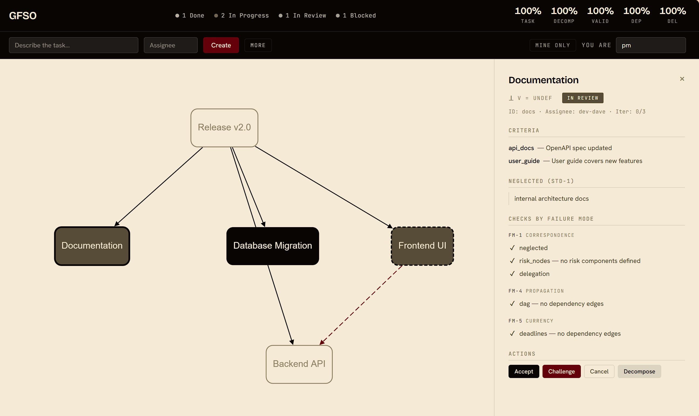

# GFSO (General Framework for Structured Operations)

**A formal language for the minimum a verifiable task-handoff transaction must carry — derived from two axioms and proven minimal.**

---

## What is GFSO?

GFSO is a **mathematically defined** structure (primitives, operations, laws), the **smallest possible** (nothing can be removed without losing expressiveness), describing **what must be present** in one handoff of a task from an issuer to an executor so that the handoff can be verified and composed. It is **not chosen** — it is **derived** from two simple statements: that goals are verifiable and that complex work decomposes. If those two statements hold for a domain, GFSO necessarily describes its handoffs. If they don't, GFSO doesn't apply, and that boundary is explicit.

The unit of analysis is **one handoff transaction**, not a project, process, or team. Hierarchy, multi-agent, organization — all are compositions of such transactions.

What a transaction must carry: a Spec, a finite set of decidable Criteria, a Deadline, an explicit NEGLECTED section, a Delegation, and (when decomposed) Dependencies plus a composition function. Drop any of these and a specific failure mode (of the seven proven exhaustive) becomes unavoidable.

**Analog:** TCP/IP for hierarchical work coordination, or Codd 1970 for relational databases — tractable math whose framing enables a domain, not a productivity tool.

**Foundations:** two axioms (A1 verifiability of goals, A2 decomposability of complex tasks), from which the entire protocol follows — including impossibility results that key constructions (binary validation, AND aggregation, 7 failure modes) admit no alternatives. 6 original theorems + 8 further results (propositions backed by classical theory, a corollary, and basis minimality).

**Theory-model layer (§18.10):** beyond a standard, GFSO *derives the agent* (human or LLM) as a necessary structural link rather than presuming it — the formal half cannot supply a decomposition's domain-correctness by itself (Lemma 1), nor can pure declaration ground it (Lemma 3), so an empirical-contact carrier is necessary. This lets GFSO *explain* pre-theoretic success (and the 7 FM) and *predict*, falsifiably, agent substitutability and the applicability boundary.

The theory-model has an **agent-free** core: an ontology of decomposition built on five structural links (the Ŝ/S correspondence axis), plus a methodology — the decomposition method, under which **stop-and-replan is the forced optimum**, not a heuristic. Positioning is honest about boundaries: standard planning [STD] (HTN/MDP/MPC) is taken as a genuinely formal substrate and is **absorbed as a sub-step** of GFSO [GFSO] — planning ⊂ GFSO, not a narrow layer bolted on top of planning. The value GFSO adds is **objectification**: making the otherwise-implicit correctness conditions of a handoff explicit, checkable, and composable.

---

## Key Results

**Original theorems:**

| # | Result | Claim | Proof type |
|---|--------|-------|------------|
| T1 | Compositionality | V(parent) = AND(V(children)) under correct D | Constructive |
| T2 | AND uniqueness | AND is the only non-trivial aggregation | Exhaustive enumeration |
| — | \|L\|=2 | Binary validation forced (injectivity from decision-relevance; \|A\|=2 architectural) | Pigeonhole |
| — | 7 FM completeness | Failure modes are exhaustive — proven as a basis, modulo a covering Axiom 1 (residue: single-clock) | Exhaustive case split |
| T10 | Self-measuring | Q computable from execution trace | Constructive |
| T11 | Structural transparency | Every decision has a record | From invariants |

**Propositions (supported by classical theory):**

| # | Result | Claim | Foundation |
|---|--------|-------|------------|
| P3 | Blackwell dominance | GFSO informationally dominates status quo | Blackwell 1953 |
| P4 | Constraint improvement | Constraints improve payoff when Δ > c | Simon 1955 |
| C5 | α-monotonicity | Quality ↑ with adherence | Corollary of P3 |
| P6 | Temporal monotonicity | Quality ↑ over time | Blackwell |
| P7 | Scale bounds | Cascade: errors ≤ (L·γ)ⁿ | Operator composition |
| P8 | Bayesian IC | Honesty optimal when cost(defect) > cost(signal) | Hurwicz 1960 |
| P9 | Decomposition quality | 4 independent improvement mechanisms | P3 + P7 + P4 + P6 |
| — | Minimality | Basis {T, D, Dep, Del} is minimal — each element necessary (uniqueness open, §18.9) | Constructive |

---

## Logical Chain

```
A1, A2 (axioms)
  → {T, D, Del, Dep, V} (minimal basis)
  → |L|=2 (impossibility), AND (uniqueness)
  → 7 failure modes (completeness proven)
  → Standards + 3 verification levels (CHECK-1–8)
  → Protocol: 12 P2P signals + timeout, 12 states (minimal)
  → Graph G + 5 metrics Q (minimal, self-measuring)
  → AI layer: Solver + LLM (capacity-necessity: Simon + info-volume)
  → Theory-model (§18.10): agent derived necessary, not presumed
                           (GFSO = standard + theory-model)
```

Every step is motivated by the previous. Design decisions are explicit.

---

## Documents

**Canon layer** — the framework itself.
| File | Purpose |
|------|---------|
| [`docs/applied_gfso_v3.md`](docs/applied_gfso_v3.md) | The canon (v3.7): axioms → primitives → theorems → protocol → metrics → theory-model. The single source of truth; everything else mirrors it. |
| [`docs/method_gfso.md`](docs/method_gfso.md) | The Constitution: the canon distilled into strict entities (definitions) + laws (rules) — the layer an agent/auditor operates on. |
| [`docs/falsifiability.md`](docs/falsifiability.md) | Falsifiability register: each canonical claim → what would falsify it (empirical / mathematical / conditional). |

**Companion layer** — onboarding & intuition.
| File | Purpose |
|------|---------|
| [`docs/CORE.md`](docs/CORE.md) | One-page primer: what GFSO is, what it uniquely provides, common-objection answers (read first). |
| [`docs/applied_gfso_vision.md`](docs/applied_gfso_vision.md) | Vision companion: applied FSM spec, per-metric epistemic analysis, audit/GAAP roadmap, theory-model intuition. |

**Internal layer** — derivation & evidence.
| File | Purpose |
|------|---------|
| [`docs/gfso_dependency_map.md`](docs/gfso_dependency_map.md) | Derivation DAG: how each canonical result depends on the axioms and on prior results. |
| [`docs/EVIDENCE_LOG.md`](docs/EVIDENCE_LOG.md) | Evidence journal: empirical anchors (E0/E1/E2), what is proven vs open. |

**Code layer.**
| File | Purpose |
|------|---------|
| [`docs/architecture.md`](docs/architecture.md) | Code architecture (mirror of the engine): FSM table, module structure, code↔canon sync notes. |

---

## Interface

One Engine (the single logic source), one action surface (`gfso/tools.py`), and
**four equivalent front-ends generated from it** — a **web UI**, an **HTTP API**
(`POST /api/run/{tool}` + WebSocket), a **CLI** (`gfso run`), and an **MCP server**
(`gfso mcp`, the agent surface) — so a new authoring verb is one edit, visible on
all four. An agent (via MCP) and a human (via the UI) operate the *same* graph; the
UI mirrors the agent's writes live. `gfso/decompose/` turns the E2 search↔audit method
into a callable — an agent requests a full decomposition rather than hand-building the
graph. The task graph, FSM states, validation outcomes `V(t)`, failure-mode checks and
the AND-composition `V(parent) = AND(V(children))` are all visible and operable.



> **Baseline interface.** A working reference UI for exercising the protocol —
> not a finished product. It translates the theory directly: status is rendered
> along the `{intervene, ¬intervene} × {pass, fail, ⊥}` axes, checks are grouped
> by failure mode, decomposition surfaces joint sufficiency. Visual design and
> role workflows are out of scope at this stage.

---

## Status

Theory:
- [x] Formal framework: 6 theorems + 8 further results (propositions + corollary + basis minimality)
- [x] Impossibility results on foundations (|L|=2, AND, 7 FM)
- [x] AI layer formalized (Solver + LLM, Chollet Level ≥ 2)
- [x] Vision document with practical illustrations
- [x] §17.1 adaptive stratification by horizons (derived from Dep coherence + A1 + stationarity)
- [x] §17.2 Scrum ⊂ GFSO — structural containment shown (behavioral derivation open)
- [x] §18.10 theory-model: agent derived as a necessary structural link (not presumed); claims calibrated
- [x] v3.6 agent-free theory-model: ontology of decomposition (5 links / Ŝ/S axis) + methodology (decomposition method, stop-and-replan = forced optimum); honest [STD]/[GFSO] positioning (planning ⊂ GFSO as an absorbed sub-step); value = objectification of handoff correctness conditions
- [x] Falsifiability register ([`docs/falsifiability.md`](docs/falsifiability.md)): every load-bearing claim typed by what would falsify it (empirical / mathematical / conditional-on-a-named-premise). 7-FM completeness is analytic — a derived case split over a derived covering axiom (§4.8); E1 (0/216 incidents need an 8th mode) corroborates that the derived categories are adequate to real failures rather than testing an empirical posit. The irreducibly empirical surface is two distinct loci sharing one root (where the world enters): domain membership (does A1∧A2 hold here) and faithfulness of the decomposition to the domain's real structure.
- [ ] English translation

Implementation:
- [x] Protocol engine: Level 1 (core) + Level 2 (engine)
- [x] Level 3: production adapters (SQLite, Claude API, FastAPI HTTP+WS server)
- [x] Web UI surfacing the protocol (V(t), NEGLECTED, AND-composition, FM-grouped checks)
- [x] Bench harness separated from core (`bench/` with provider abstraction)
- [x] Domain adapters: SubprocessVerifier (LCB) + UnittestVerifier (BCB)

Empirical:
- [x] E0 — measurement on BCB-Hard 148: explicit unit-test criteria
      (Issuer-side spec discipline) raises Haiku 4.5 solve rate from 29.1% to
      63.5% zero-shot, same compute. Illustrates §3.2 forced binary V on a
      current frontier-adjacent model.
- [x] E1 — 7 FM taxonomy validated on 216 public software postmortems:
      **0/216 need an 8th FM** (completeness-as-basis holds). FM-1 sub-typed
      (a/b/c/d), FM-3 shown two-sided; the 6 non-FM cases are in-framework
      (resilience-worked / delegated). Record: EVIDENCE_LOG §9/§9.1.
- [x] E2 — **how to converge a decomposition to a verified plan reliably and cheaply** (an
      optimality question, not "does a critic help"). Against a frozen, completeness-audited
      reference (a *target*, not "100%" — not a-priori derivable, Lemma 1): the **search ↔ audit**
      cycle works (78%→96% Opus, 74%→81% Sonnet), and — more decisively — **how the pass is framed
      matters more than how many passes you run**. The clean result is an architecture: **"bare vs
      GFSO" is a false dichotomy → bare SEARCH (recall) ⊕ gfso AUDIT (cast into the canonical basis),
      iterated** — and that `search+audit` pair *is* the reference-building method, so only it
      reproduces the reference (ansatz-and-verify, not circular). Productized as `gfso/decompose/` —
      an agent **calls** a full decomposition rather than building the graph by hand. (Coverage to a
      bare-built reference ranks *convergence strategies*; the method's execution-value is E3.)
      Record: EVIDENCE_LOG §11 / `experiments/e2_agent/CONVERGENCE.md`.
- [ ] E3 — Compositional validation theorem in multi-agent decomposition
- [ ] Long-horizon deployment validation (≥ 6 months)

---

## Citation

```bibtex
@article{shokhin2026gfso,
  title={GFSO: Formal Guarantees for Compositional Task Validation
         in Hierarchical Organizations},
  author={Shokhin, Kirill},
  year={2026},
  note={Preprint}
}
```

---

## License

MIT
