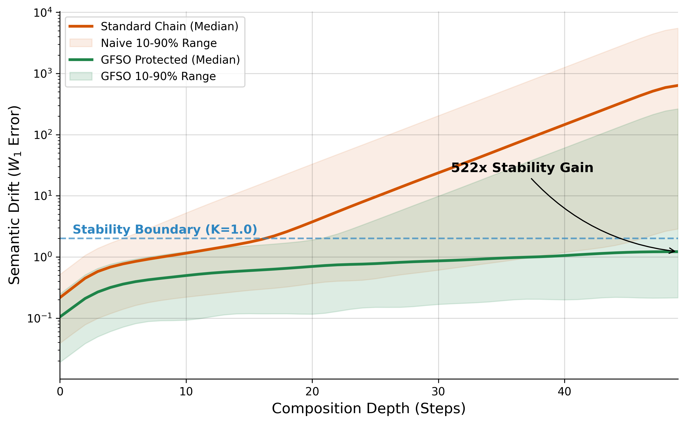

# General Framework for Structural Optimization (GFSO)

**Topological Reliability Theory for AI & Complex Systems**

  

---

## 🛑 The Control Crisis (The Universal Problem)

Whether it is a Chain-of-Thought in an LLM, a command chain in the military, or a global supply chain, hierarchical systems face the same enemy: **Signal Degradation**.

When information passes through multiple imperfect nodes, errors do not just add up — they **compound**. A small misunderstanding at the top of a bureaucracy becomes a catastrophe at the bottom. This is the **"Telephone Game" Effect** (Mathematically: Expansive Dynamics, $K > 1$).

---

## 🌍 Beyond AI: The Universal Physics of Control

GFSO proves that reliability is a topological property, independent of the substrate (silicon or biological). We unify diverse fields under one stability criterion ($K \cdot \gamma \le 1$). 

### The Universal Dictionary

| GFSO Concept | Math Symbol | **Generative AI** Context | **Corporate / Bureaucracy** Context | **Supply Chain** Context |
| :--- | :--- | :--- | :--- | :--- |
| **Morphism** | $f: A \to B$ | LLM Agent / Tool Call | Employee / Department | Factory / Supplier |
| **Expansiveness** | $K > 1$ | Hallucination Factor | Misinterpretation / Corruption | Bullwhip Effect |
| **Validator** | $\epsilon$-NatTrans | Prompt Assertion | Audit / KPI Check | Quality Control (QA) |
| **Composition** | $\circ$ | Sequential Chain | Hierarchy of Command | Logistics Pipeline |
| **Failure** | $W_1 \to \infty$ | Semantic Collapse | Management Failure | Stockout / Waste |

> **Thesis:** AI Agents are simply the fastest way to simulate and study these universal laws of failure.

---

## 🌊 The Solution: Topological Robustness

GFSO is the first framework to model AI reliability using **Metric Topology** instead of Discrete Logic.
We prove that enforcing local topological contracts (validators) acts as a **Contraction Map** on the error distribution, preventing the system from crossing the phase transition into chaos.

### ⚡ The 100x Stability Gap
We tested GFSO on the "Edge of Chaos" — a realistic dynamic model where agents are stable near the truth but hallucinate when they drift.


*(Note: While this plot shows AI error, the same curve applies to signal distortion in any hierarchical organization.)*

> **Typical Outcome (Median):** Standard chains collapse into chaos. GFSO chains stay stable, reducing drift by **>100x**.
> **Global Risk (Mean):** Even accounting for rare failures, GFSO reduces the aggregate system error by **16x**.
> **Survival Rate:** GFSO increases the probability of chain survival from **14%** to **71%**.

---

## ⚔️ Comparison with State-of-the-Art (2026)

| Feature | **GFSO** (This Work) | **AgentGuard / Sentinel** | **DSPy / LangChain** |
| :--- | :--- | :--- | :--- |
| **Core Paradigm** | **Topology** (Metric Spaces) | **Logic** (Temporal/Discrete) | **Optimization** (Heuristics) |
| **Verification Type** | Continuous Robustness ($W_1$) | Binary Correctness (True/False) | Empirical Evaluation |
| **Stability Guarantee** | **Lipschitz Criterion** ($L \le 1$) | Probabilistic Bounds | None |
| **Handling Hallucinations**| **Mode Stabilization** (Prevent) | Detection (Alert) | Retry (Hope) |

---

## 📐 The Theory: Lipschitz Stability

We model agents as morphisms in a **Wasserstein-Enriched Kleisli Category**.
The central theorem of GFSO states that a system is reliable if and only if the product of the **Agent's Expansiveness** ($K$) and the **Validator's Contraction** ($\gamma$) is non-expansive:

$$ K_{agent} \cdot \gamma(T) \le 1 $$

*   **$K_{agent} > 1$:** The natural tendency of agents (AI or Human) to add noise/entropy.
*   **$\gamma(T) < 1$:** The crushing power of a topological contract.
*   **Result:** Even if the agent is chaotic ($K=1.2$), a strong validator ($\gamma=0.5$) stabilizes the system ($1.2 \cdot 0.5 = 0.6 \le 1$).

---

## 🚀 Quick Start (Reproduce the Science)

Validate the "Manifold Stability" hypothesis yourself:

1.  **Clone:**
    ```bash
    git clone https://github.com/Kirill-Shokhin/GFSO.git
    cd GFSO
    ```

2.  **Install:**
    ```bash
    pip install numpy matplotlib scipy pandas
    ```

3.  **Run Simulation:**
    ```bash
    python gfso/experiments/theory_sim/sim_runner.py
    ```
    *Generates the plot above in `gfso/experiments/theory_sim/artifacts/`.*

---

## 📄 Citation

If you use the **Lipschitz Stability Criterion** or **$\\epsilon$-Natural Transformations** in your work, please cite:

```bibtex
@article{gfso2026,
  title={Compositional Error Bounds in Enriched Kleisli Categories for Stochastic Systems},
  author={Shokhin, Kirill},
  year={2026},
  journal={arXiv preprint},
  note={Foundation Paper for Topological Reliability Theory}
}
```

---

*GFSO: Turning the Chaos of Complexity into the Order of Topology.*
