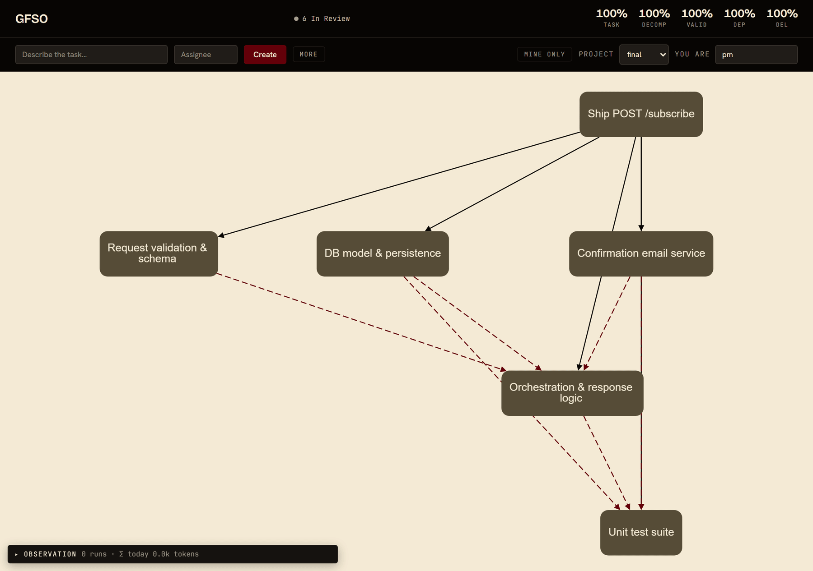
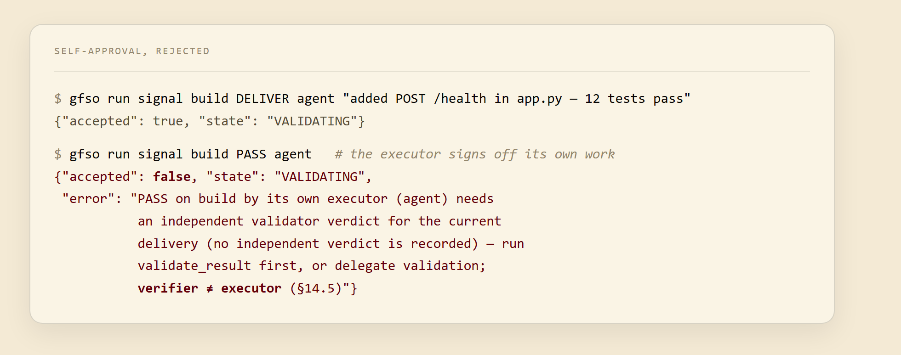

<div align="center">

# GFSO

**Make a plan falsifiable — so when it fails, you know exactly which part was wrong.**



<br>
<sub>A goal becomes a live graph; each node is driven through its states to <code>DONE</code> — the protocol as agents and humans operate the same graph. <em>(a short capture, not the full flow)</em></sub>

</div>

---

**A plan is usually an unfalsifiable story.** It fails, and no one can say which part was wrong — the estimate, the interface, a missed dependency, or the one subtask everyone assumed was trivial. The post-mortem argues. The plan offered nothing to check against.

GFSO turns a decomposition into **pre-registered, separately refutable claims** — every subtask a decidable pass/fail criterion with a named owner, every join between subtasks an explicit claim that *these children, together, make the parent*. Something breaks, and the structure points at the exact false claim and who made it — not at "the project."

Two properties carry that promise, and neither is a design choice you could tune away.

**Failure localizes.** A parent passes only when every child passes: `V(parent) = AND(V(children))`. One false leaf cannot hide behind a green parent; the failure pins to the node whose claim broke, at any depth.

**A claim cannot pass on its author's word.** Your agent reports its task done; the engine does not take its word. A `PASS` from a node's own executor is rejected at every **delegation seam** — and the result handed out of a scope is always one — until a separate validator has run every criterion against the real deliverable — here, live:

<p align="center"></p>

Self-approval is not discouraged. At a seam it is structurally impossible. Inside one scope an agent does check its own work — and stakes every bit of it on the single public verdict at that scope's edge (§14.5).

---

## Why those two properties hold

GFSO is not a good design. It is **derived** — from two axioms: that goals are verifiable (A1), and that complex tasks decompose (A2). Fix those, and almost none of the protocol is a choice.

**Why `AND`, and not a weighted score?** Enumerate the sixteen binary aggregations. Require commutativity, associativity, that one failed necessary child fails the parent, and that the result not be constant. `AND` is the sole survivor (§11.3). Localization is not a feature bolted on — it is the only aggregation the axioms allow: a passing parent cannot cover a failing leaf, and the failure has exactly one address.

**Why binary acceptance, and not a percentage?** Because A1 already says it: a criterion is a decidable predicate returning pass/fail, and a conjunction of two-valued things is two-valued — the scale is fixed by the axiom, with no appeal to what you do about it (§11.2). The familiar argument — a verdict that maps to no distinct action is not a verdict, so by pigeonhole the scale collapses to two — is the *defense* against a graded scale, not the source, and it rests on there being exactly two actions (an architectural choice: granularity lives in the tree). There is no "80% done" to shelter in; "in progress" lives in the state machine, not the scale.

**Why trust that you've listed every way it can break?** A decomposition's failures are not collected from experience — they are a proven basis. Compositional validation is a computation, characterized on two orthogonal axes: the function it evaluates, and the process in time that evaluates it. Split each, and you get **seven failure modes with no room for an eighth** (§12.2–§12.8). A study of 216 public post-mortems found 0 that needed one.

**Why can't the agent just game the protocol?** Because the protocol is minimal and incentive-compatible. One handoff runs as a peer-to-peer transaction over 12 signals and 12 states; remove any signal and a specific defect returns. Drop any incentive-critical rule and honesty stops being the dominant strategy for one named party (§14, §19.1). Honesty is made rational by the rules — not asked of people.

Two things then come for free. Quality is a five-vector read straight from the execution trace, so gaming a metric costs as much as gaming the work (§21). And every decision leaves a record by construction: the way double-entry bookkeeping structurally forbids an unbalanced ledger, GFSO forbids an unrecorded decision (§22).

---

## Where the guarantee stops

None of this proves your decomposition is *correct*. It proves only that the plan is checkable, and that failure localizes.

Whether these children truly compose into that parent in the real world, the framework cannot decide — by construction. Two domains with the same formal graph can obey different real laws (Lemma 1), so the axioms do not fix which decomposition is faithful, and no amount of declaring it so grounds it (Lemma 2). That knowledge comes only from contact with the domain.

That gap is where your agent — human or LLM — carries the weight. GFSO **derives** its necessity rather than assuming it: reliable domain knowledge cannot come from the apparatus, so an agent must supply it, and the exact thing it must supply is named (§2–3). A standard would stop at prescribing. This one also *explains* why competent work already succeeded — the agent carried enough tacit structure — and *predicts*, falsifiably, where the framework stops applying — and when an agent can be swapped, measured against a faithfulness proxy independent of the outcome, without which the test is one of the protocol's verifier-separation instead (§3.6).

The framework names exactly what it guarantees and exactly what it hands to the agent. Nothing in between is waved away.

---

## What it is, and is not

**Planning ⊂ GFSO.** Classical planning and control — STRIPS, MDPs, HTN, A\*, MPC, RL — enter as a single sub-step, rewritten in GFSO's own terms: search over the estimated structure is one link in a longer chain (§6.1). The new mechanics are a narrow delta.

The value is not novelty of mechanism. It is **making-explicit** — moving decomposition out of private intuition into one axiom-derived, checkable, faithfulness-graded discipline that holds at every level. That is what makes planning falsifiable (§6.2). Scrum, in turn, is a special case under a named set of restrictions (§25.2).

It is not a task tracker — Jira tracks tasks; GFSO tracks *decisions*: who split what, on what criteria, why. Not an ERP, not a chatbot, not an autopilot.

---

## The reference implementation

The two properties above are not a paper. They run.

A reference implementation exercises the protocol end-to-end — a way to run the theory, not a finished product. One engine holds the logic; three doors are generated from one shared tool registry — an HTTP+WS API, a CLI, and an MCP surface for agents — and a web UI rides the same API, so humans and agents drive the *same* graphs and every write is mirrored live.

```bash
git clone https://github.com/Kirill-Shokhin/GFSO.git && cd GFSO
pip install -e .

# register the MCP server — starts a shared engine + live UI at http://localhost:8000
claude mcp add gfso -- python -m gfso.mcp.connect
```

Or, without an agent, run just the web UI:

```bash
gfso serve
```

The verifier ≠ executor gate from the opening runs in both of the system's regimes:

- **Sequential** — one agent session structures a goal (`auto_decompose` runs the search↔audit method in one call), executes the frontier itself, and after each delivery gets a verdict from a fresh read-only validator that *runs* the criteria. Its own `PASS` is not enough; the gate demands the independent verdict.
- **Delegated** — register executor and validator roles once, and assignment *is* delegation: a node assigned to a registered executor is picked up automatically, its report wrapped into the canonical signals, the validator auto-runs on delivery, and a failed criterion re-enters a bounded rework loop with the failure as feedback. Humans are never registered — a node assigned to a person simply waits for *their* signals. Mixed human/agent graphs are the normal case.

The UI (shown at the top) surfaces every write live; visual design and role workflows are out of scope at this stage.

---

## Status — preliminary

This is a preliminary release. The theory is complete at v4.0; the thing that will make it fuller and stronger — the empirical base — is in progress.

**Theory.** Formal framework (6 theorems + 8 further results), the binary scale (sourced in A1) and the uniqueness of `AND` and the 7-mode basis (complete modulo one named covering axiom), the agent-free ontology of the five links (§4), and a falsifiability register are in place. The canon is English (v4.0); the Russian working draft it was re-authored from stays frozen as the provenance record. **v4.0 is the final statement of the theory**: what remains open in it is not unfinished work but named boundaries — results about what the axioms cannot deliver — and open problems filed as such, the two kept apart by a criterion the document states and applies entry by entry (§8). Its every load-bearing claim carries what would refute it in [`falsifiability.md`](docs/falsifiability.md); that register, not a roadmap, is what would reopen the canon. The formal spine is a Lean 4 development on the language kernel — no mathlib, no `sorry` — that audits the axiomatic surface rather than standing in for the arguments: exactly three covering axioms carry the "no further kind" results, every other postulate's placement is disclosed, and a fail-closed CI guard rejects any axiom outside that whitelist ([`formal/README.md`](formal/README.md)).

**Implementation.** Protocol engine, production adapters, the web UI, `auto_decompose`, independent execution validation with the verifier ≠ executor gate, delegation with auto-validation and bounded rework, multi-project isolation, and a shared multi-session server — all working, under 396 tests (6 of them exercise embedding the core into a foreign host and skip without one).

**Empirical.**
- **E0** — on 148 BCB-Hard tasks, explicit unit-test criteria raise Haiku 4.5's zero-shot solve rate from 29.1% to 63.5% — one attempt each, no rework loop; the spec-carrying prompt costs ×1.85 the tokens.
- **E1** — the 7-mode taxonomy against 216 public post-mortems: **0 / 216** need an eighth mode.
- **E2** — the search ↔ audit cycle raises coverage of a completeness-audited reference decomposition on 9 of 10 domains (74 → 81% average across ten diverse domains) and is productized as `auto_decompose`. Measured against a bare-built reference, this shows the cycle *converges* — not that the discipline itself pays off, which is **E3**.
- **E3** *(open)* — whether compositional validation holds on real multi-agent engineering, where a decomposition's *faithfulness* to its domain is exercised, not just its structure. Long-horizon deployment validation follows.

The permanent boundaries are stated, not buried: a domain-silent false-`pass` cannot be caught a priori by any discipline (Lemma 1); the causal correctness of a decomposition is a characterized boundary, not an open algorithm; uniqueness of the basis is open, while on the protocol side the same question is **settled negatively over bare adequacy** (it stays open only over a fully pinned design vector) — requirements pin which exits must exist, not where they go, so a nine-state skeleton is forced and the rest is free design (§26.9).

---

## Documents

**Canon** — [`applied_gfso_v4_en.md`](docs/applied_gfso_v4_en.md): the framework itself (the theory of directed action → axioms → theorems → protocol → metrics), the single source of truth. The superseded Russian working draft [`applied_gfso_v3.md`](docs/applied_gfso_v3.md) is kept frozen as the provenance record. Distilled for an operator in [`method_gfso.md`](docs/method_gfso.md); each load-bearing claim typed by what would refute it in [`falsifiability.md`](docs/falsifiability.md).

**Onboarding** — [`applied_gfso_vision.md`](docs/applied_gfso_vision.md): applied FSM, per-metric analysis, intuition **(in Russian)**.

**Derivation & evidence** — [`gfso_dependency_map.md`](docs/gfso_dependency_map.md) · [`EVIDENCE_LOG.md`](docs/EVIDENCE_LOG.md) · [`architecture.md`](docs/architecture.md).

**Machine-checked core** — [`formal/README.md`](formal/README.md): the Lean 4 audit of the axiomatic surface — what is checked, what is checked only modulo a named covering axiom, what is out of scope, and the code ↔ canon corners, with a per-result coverage table.

**Embedding & examples** — [`embeddability_acceptance.md`](docs/embeddability_acceptance.md): embedding the core as a library into your own host — the pre-registered acceptance suite that judges the claim, plus the embedder's wiring reference. [`examples/`](examples/): one working script per entry door (human-only · mixed · autonomous org · async precompute).

---

## Citation

```bibtex
@article{shokhin2026gfso,
  title  = {GFSO: Formal Guarantees for Compositional Task Validation
            in Hierarchical Organizations},
  author = {Shokhin, Kirill},
  year   = {2026},
  note   = {Preprint in preparation}
}
```

## License

MIT
