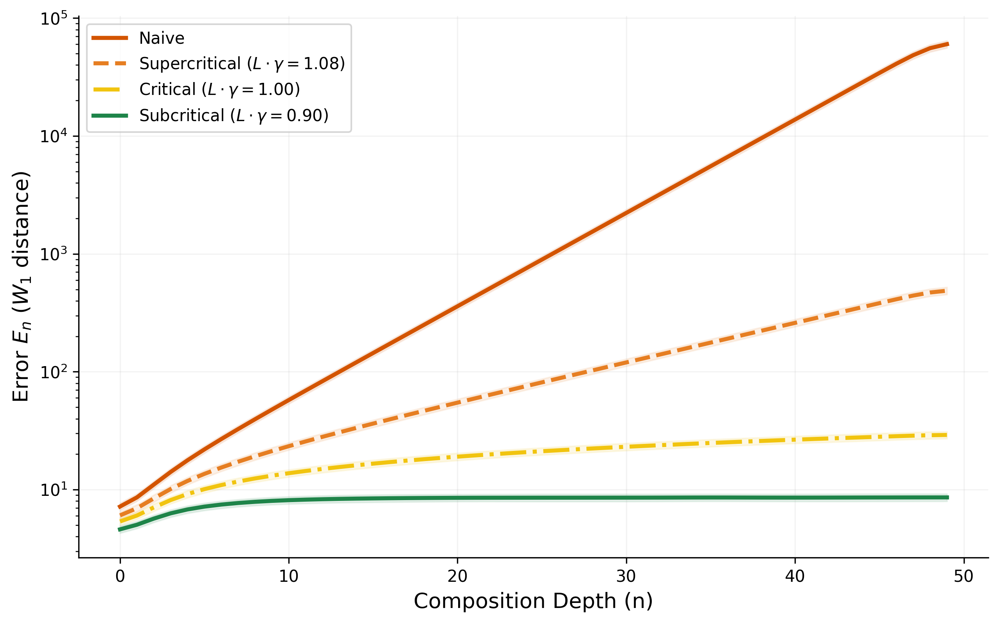

# General Framework for Structural Optimization (GFSO)

**A Universal Theory of Control for Hierarchical Stochastic Systems**

  

---

## 🛑 The Control Crisis (The Universal Problem)

Whether it is a Chain-of-Thought in an LLM, a command chain in the military, or a global supply chain, hierarchical systems face the same enemy: **Signal Degradation**.

When information passes through multiple imperfect nodes, errors do not just add up — they **compound**. A small misunderstanding at the top of a bureaucracy becomes a catastrophe at the bottom. This is the **"Telephone Game" Effect** (Mathematically: Expansive Dynamics, $L > 1$).

---

## 🌍 The Universal Physics of Control

GFSO proves that reliability is a **topological property**, independent of the substrate. Whether the system is organizational (human hierarchies), industrial (supply chains), or computational (AI agents), the same mathematical laws govern failure and stability. We unify diverse fields under one stability criterion: $L \cdot \gamma \le 1$.

### The Universal Dictionary

| GFSO Concept | Math Symbol | **Corporate Governance** | **Supply Chain** | **Generative AI** |
| :--- | :--- | :--- | :--- | :--- |
| **Morphism** | $f: A \to B$ | Department / Employee | Supplier / Manufacturer | LLM Call / Tool |
| **Expansiveness** | $L > 1$ | Bureaucratic Drift | Bullwhip Effect | Hallucination Factor |
| **Control** | $\epsilon$-NatTrans | SOP / Audit / KPI | Quality Control | Prompt Assertion |
| **Composition** | $\circ$ | Chain of Command | Logistics Pipeline | Sequential Reasoning |
| **Failure** | $W_1 \to \infty$ | Policy Collapse | Stockout / Waste | Semantic Collapse |

> **Thesis:** The mathematics of control is universal. GFSO provides the first rigorous compositional error bounds for arbitrary hierarchical systems.

---

## 🌊 The Solution: Topological Robustness

GFSO is the first framework to model hierarchical system reliability using **Metric Topology** instead of Discrete Logic.
We prove that enforcing local topological control mechanisms acts as a **Contraction Map** on the error distribution, preventing the system from crossing the phase transition into chaos.

### ⚡ Phase Transition at $L \cdot \gamma = 1$

We validate the stability criterion in $\mathbb{R}^{100}$ with uniform dynamics ($L=1.2$).

#### Figure 1: Theory Validation


> **Phase Transition:** At $L \cdot \gamma = 0.90$ error is **bounded**; at $L \cdot \gamma = 1.08$ error grows **exponentially**. The transition is sharp — 10% margin determines stability vs collapse.

#### Figure 2: Partial Observation Robustness


> **Complexity Asymmetry:** Observing only **10% of dimensions** achieves comparable containment to full observation. Sparse random probes suffice when error is isotropically distributed.

---

## ⚔️ Why GFSO? Comparison with Existing Approaches

| Feature | **GFSO** | **Probabilistic Model Checking** | **Contract-Based Design** | **AI-Specific Verification** |
| :--- | :--- | :--- | :--- | :--- |
| **Core Paradigm** | **Metric Topology** | Discrete Logic (MDPs) | Interface Algebra | Temporal Logic |
| **State Space** | Continuous ($W_1$ metric) | Discrete (Finite) | Abstract | Discrete Predicates |
| **Error Metric** | **Wasserstein Distance** | Probability Bounds | Boolean | Pass/Fail |
| **Compositional Guarantee** | **$L \cdot \gamma \le 1$** | PCTL Model Checking | Assume-Guarantee | Runtime Monitors |
| **Applicability** | **Universal** (Any hierarchy) | Software/Hardware | Cyber-Physical | GenAI only |

**GFSO's Unique Contribution:** First framework to provide *quantitative compositional error bounds* for continuous state spaces with *stability guarantees* applicable to organizational, industrial, and computational systems.

---

## 📐 The Theory: Lipschitz Stability

We model components as morphisms in a **Wasserstein-Enriched Kleisli Category**.
The central theorem of GFSO states that a system is reliable if and only if the product of the **Component's Expansiveness** ($L$) and the **Control's Contraction** ($\gamma$) is non-expansive:

$$ L \cdot \gamma \le 1 $$

*   **$L > 1$:** The natural tendency of stochastic processes to amplify noise (bureaucratic drift, demand fluctuation, hallucination).
*   **$\gamma < 1$:** The stabilizing power of topological control (audits, quality checks, validation).
*   **Result:** Even if the component is expansive ($L=1.2$), a strong control mechanism ($\gamma=0.75$) stabilizes the system ($1.2 \cdot 0.75 = 0.9 \le 1$).

---

## 🚀 Quick Start (Reproduce the Science)

Validate the stability criterion yourself:

1.  **Clone:**
    ```bash
    git clone https://github.com/Kirill-Shokhin/GFSO.git
    cd GFSO
    ```

2.  **Install:**
    ```bash
    pip install numpy matplotlib scipy
    ```

3.  **Run Simulation:**
    ```bash
    python gfso/experiments/theory_validation.py
    ```
    *Generates figures in `gfso/experiments/artifacts/`.*

---

## 📄 Citation

If you use the **Lipschitz Stability Criterion** or **$\\epsilon$-Natural Transformations** in your work, please cite:

```bibtex
@article{gfso2026,
  title={The General Framework for Structural Optimization: Compositional Error Bounds in Enriched Kleisli Categories},
  author={Shokhin, Kirill},
  year={2026},
  journal={arXiv preprint},
  note={Universal Theory of Control for Hierarchical Stochastic Systems}
}
```

---

*GFSO: Turning the Chaos of Complexity into the Order of Topology.*
