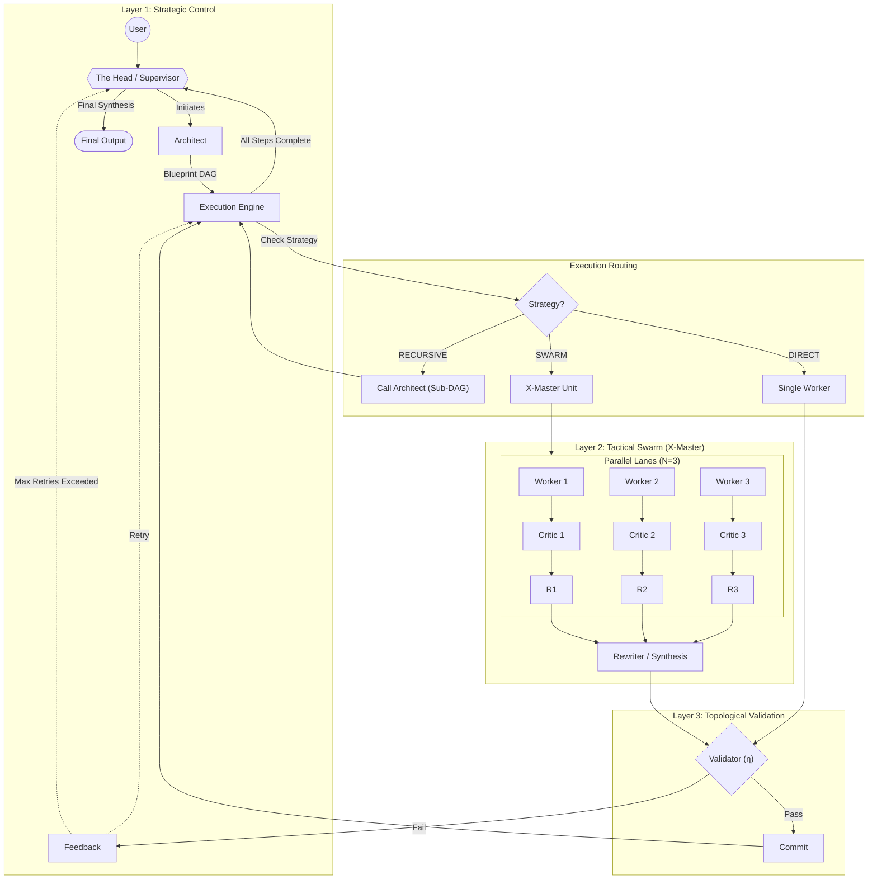

# GFSO v3.0: The Unified Architecture

**Version:** 3.5 (Tri-State Execution Strategy)
**Date:** January 2026
**Status:** **Single Source of Truth**

---

## 1. Conceptual Integration

*   **GFSO:** Strategic Control & Topology.
*   **X-Master:** Tactical Power (Swarm Intelligence).
*   **SGR:** Execution Protocol (Structured Reasoning).

---

## 2. The Integrated Topology

This graph illustrates the **Three Execution Strategies**: Direct, Swarm, and Recursive.

---

## 3. Critical Logic: The Execution Strategy

The Architect must classify each Node into one of three strategies. We replace the ambiguous `is_complex` flag with `execution_strategy`.

| Strategy | Definition | When to use? |
| :--- | :--- | :--- |
| **`DIRECT`** | **Atomic & Simple** | Mechanical tasks. No ambiguity. (e.g. "Parse JSON", "Sort list") |
| **`SWARM`** | **Atomic & Hard** | Tasks requiring **Search**, **Math**, or **Deep Reasoning** (HLE style). Result is one object, but finding it is hard. |
| **`RECURSIVE`** | **Composite / Large** | Tasks too big for one context. **Planned Lazy Decomposition**. (e.g. "Write Game Engine" -> decomposed into Physics, Rendering, Logic). |

### 3.1. Decision Logic (Architect Prompt)
The Architect prompt must be updated:
> "Analyze the node complexity.
> - If it is a large scope requiring multiple artifacts, use **RECURSIVE**.
> - If it is a specific hard problem (logic/math/code) requiring exploration, use **SWARM**.
> - If it is trivial, use **DIRECT**."

---

## 4. Component Roles

| Component | Role | Mechanism |
| :--- | :--- | :--- |
| **The Head** | **Manager & Finalizer** | Orchestrates the process and **synthesizes the final structured output**. |
| **Architect** | **Strategist** | Generates DAG, Strict Contracts, and selects **Strategy**. |
| **Worker** | **Proposer** | Uses **SGR Schema** (`think` -> `code` -> `verify`) to propose solutions. |
| **Local Critic** | **Fixer** | Checks code validity *before* synthesis. Prevents garbage-in. |
| **Rewriter** | **Synthesizer** | "Wisdom of the Crowd". Combines valid proposals into one. |
| **Validator** | **Judge** | Runs Architect's tests. Binary Pass/Fail. |

---

## 5. Implementation Roadmap

1.  **Tools:** Implement `PythonExecutor` (Sandbox).
2.  **Mechanisms:** 
    *   Update `Architect` schema to output `strategy` (enum).
    *   Update `Worker` (SGR).
    *   Implement `Rewriter` & `LocalCritic`.
3.  **Core:** 
    *   Rewrite `GFSOUnit` (or `Engine`) to handle the 3-way routing.
    *   Implement `asyncio.gather` for Swarm.
4.  **Head:** Implement `Supervisor` with Final Synthesis.
5.  **Test:** Validate on HLE Task #1 (Chess).

---

**This document is the Final Reference.**
