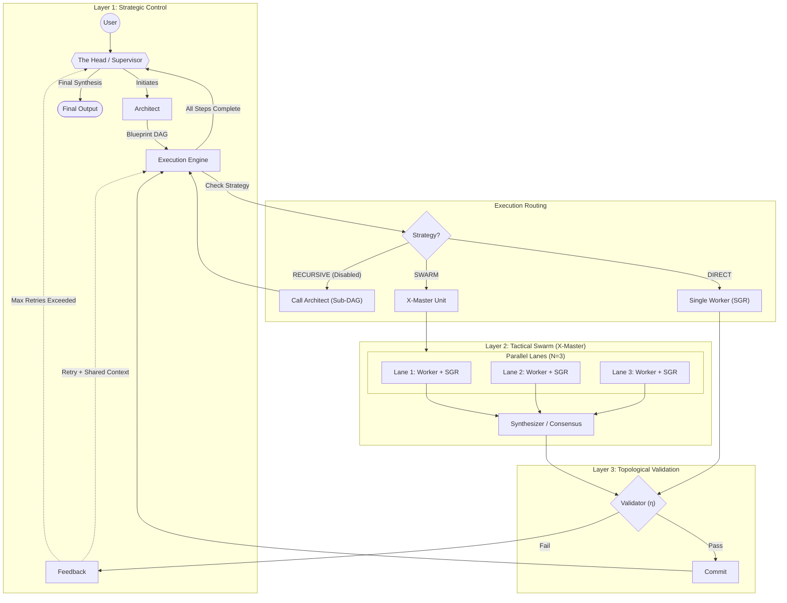

# GFSO Agent Architecture: Composite Swarm Unit

**Version:** 3.1 ("Unified Swarm")
**Last Updated:** January 5, 2026
**Role:** Primary context, architectural mandate, and historical record for the GFSO runtime.

---

## 1. The Core Architecture (v3.1)

The GFSO Agent integrates **Category Theory** (Topological Guarantees) with **Swarm Intelligence** (Tactical Depth).

### 1.1. The Integrated Topology

This diagram is the **Single Source of Truth** for the execution flow.



---

## 2. Evolution & Philosophy (DO NOT IGNORE)

The GFSO Agent has evolved through painful trial and error. These lessons are **IMMUTABLE**.

### 2.1. The Lesson of Version 2.1 (Mathematical Rigor):
Initially, we forced the LLM to "act like a mathematician" (Kleisli, Epsilon). This led to **"Bureaucratic Hallucination"**, where the Critic rejected functional code for lacking "categorical proof." 
*   **Verdict:** Mathematics stays in Python code. LLMs speak engineering English.

### 2.2. The Lesson of Version 2.3 (Strict Pragmatism):
We separated Structure from Language.
*   **Total Isomorphism:** Every node MUST produce a Computational Artifact (JSON/Code). No "Reasoning only" nodes.
*   **Fail-Fast:** If perception fails, stop immediately. Do not hallucinate a solution.

### 2.3. The Swarm Integration (v3.0 -> v3.1):
We attempted to integrate X-Master. 
*   **Mistake:** Implementing Swarm as a complex routing graph.
*   **Solution:** **Composite Swarm Unit**. Swarm is encapsulated inside the Functor F. It is invisible to the topology.
*   **Recursion:** The `RECURSIVE` strategy was cut due to complexity explosion. **Do not attempt to restore it.**

---

## 3. Core Components

### 3.1. Functor G (Architect)
*   **Role:** Decomposes tasks into a **Blueprint**.
*   **Constraint:** Must create a *Template*. No hardcoded data (except for Perception tasks).
*   **Swarm Strategy:** The Architect ITSELF operates as a Swarm to ensure high-quality planning.

### 3.2. Functor F (Implementation)
*   **DIRECT:** Single Worker + SGR. For deterministic tasks.
*   **SWARM:** N Workers + Synthesizer. For Search, Logic, and Perception.
    *   *Perception Exception:* For image tasks, Workers MUST extract data manually into hardcoded structures.

### 3.3. Natural Transformation $\eta$ (Validator)
*   **Role:** The Judge.
*   **Weak Perception Audit:** When checking image tasks, the Validator trusts the Swarm's consensus. It does **NOT** enforce pixel-perfect precision if semantic meaning is preserved.

---

## 4. IMMUTABLE LAWS (CRITICAL)

**1. ZERO-TOUCHING POLICY FOR PROMPTS:**
The System Prompts (`ARCHITECT_SYSTEM`, `ROOT_CONTRACT_SPEC`, `VALIDATOR_SYSTEM`) are highly tuned.
*   **FORBIDDEN:** Arbitrary rephrasing or "simplifying".
*   **REASON:** Small wording changes (e.g. adding specific library names) cause catastrophic degradation (model starts hardcoding or hallucinating).

**2. ABSTRACTION LAW:**
The Architect must NEVER solve the problem. It must only create the *Template*.

**3. NO REINVENTING THE WHEEL:**
Workers must use domain libraries (`python-chess`, `numpy`) and NOT write complex algorithms from scratch.

---

## 5. Session Handover (Quick Start)

**Current Status:**
- **Architecture:** v3.1 (Composite Swarm Unit).
- **Swarm Size:** `Params.SWARM_SIZE` (Default: 3. For debug: 1).
- **Logging:** Full verbosity (no truncation).

**Verification:**
To verify the system state, run the complex smoke test:
```bash
python smoke_test.py
```
*Expected Result:* A 3-node Blueprint is generated, executed, and verified.

**Real Execution:**
To run a real task with full logging:
```bash
python run_agent.py "Your task here" --verbose --log-file gfso.log
```

**HLE Benchmark:**
To run the Chess Logic task:
```bash
python experiments/debug_hle_task.py 0
```

**Common Pitfalls to Avoid:**
- Do NOT re-introduce "Visual Audit" for Blueprint phase.
- Do NOT add hardcoded library names to Prompts (it limits the agent).
- Do NOT try to fix "Perception" by asking the Worker to write OpenCV code. It fails. Use Swarm Manual Extraction.

**Artifacts:**
All generated code is saved to `output/`. This directory is git-ignored.