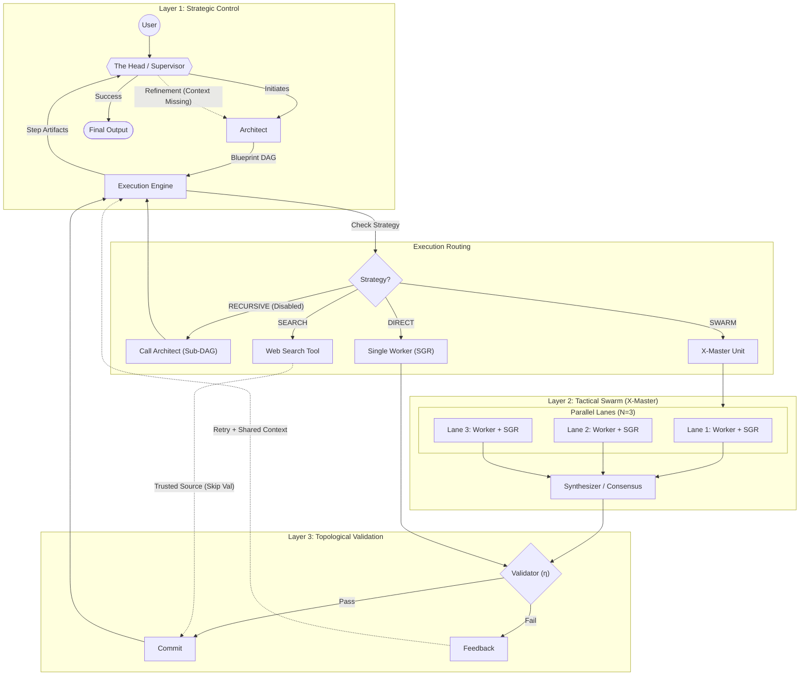

# GFSO Agent Architecture: Composite Swarm Unit

**Version:** 3.4 ("Recursive Refinement & Search")
**Last Updated:** January 11, 2026
**Role:** Primary context, architectural mandate, and historical record for the GFSO runtime.

---

## 1. The Core Architecture (v3.4)

The GFSO Agent integrates **Category Theory** (Topological Guarantees) with **Swarm Intelligence** (Tactical Depth).

### 1.1. The Integrated Topology

This diagram is the **Single Source of Truth** for the execution flow.



---

## 2. Evolution & Philosophy

### 2.1. The Lesson of Version 2.1 (Mathematical Rigor):
Initially, we forced the LLM to "act like a mathematician" (Kleisli, Epsilon). This led to **"Bureaucratic Hallucination"**, where the Critic rejected functional code for lacking "categorical proof." 
*   **Verdict:** Mathematics stays in Python code. LLMs speak engineering English.

### 2.2. The Lesson of Version 2.3 (Strict Pragmatism):
We separated Structure from Language.
*   **Total Isomorphism:** Every node MUST produce a Computational Artifact (JSON/Code). No "Reasoning only" nodes.
*   **Fail-Fast:** If perception fails, stop immediately. Do not hallucinate a solution.

### 2.3. The Swarm Integration (v3.0 -> v3.1):
We attempted to integrate X-Master. 
*   **Mistake:** Implementing Swarm as a complex routing graph.
*   **Solution:** **Composite Swarm Unit**. Swarm is encapsulated inside the Functor F. It is invisible to the topology.
*   **Recursion:** The `RECURSIVE` strategy was cut due to complexity explosion. **Do not attempt to restore it.**

### 3.2. The Robustness Update (v3.1 -> v3.2):
*   **Dynamic Data Structures:** Python classes (`NodeSpec`, `Contract`) are now agnostic containers. Schema definitions in `config.py` are the single source of truth. New fields propagate automatically.
*   **Global Meta-Context:** All agents share a `GLOBAL_SYSTEM_PROMPT` defining them as "mathematical functors" to suppress conversational filler.
*   **Verification Pipeline:** Standardized as `Normalize -> String Match -> LLM Judge`. We trust the LLM Judge to handle semantic equivalence (e.g. `1/2 == 0.5`).
*   **Execution Safety:** `PYTHONIOENCODING='utf-8'` enforced to prevent Windows Unicode crashes.

### 3.3. The External Grounding (v3.4):
*   **Search Strategy:** Added `SEARCH` as a first-class citizen. It allows the agent to fetch authoritative context (specs, facts) before coding. It bypasses the standard Validator, treating the Search Tool as a "Trusted Source".
*   **Head Refinement:** The global retry loop was refined. Instead of a generic "Try Again", the Head now produces a **Refinement**—a conceptual insight about missing domain context—which enriches the task for the next run.

---

## 3. Core Components

### 3.1. Functor G (Strategic Planner)
*   **Role:** Decomposes tasks into a **Blueprint**.
*   **Constraint:** "Ockham's Razor". Default to 1 Node. Split only for hard dependencies.
*   **Output:** JSON Blueprint. No answers allowed in the plan.

### 3.2. Functor F (Implementation)
*   **DIRECT:** Single Worker + SGR. For deterministic tasks.
*   **SWARM:** N Workers + Synthesizer. For Search, Logic, and Perception.
    *   *Perception Exception:* For image tasks, Workers MUST extract data manually into hardcoded structures.
*   **SEARCH:** Native Tool Use. Retrieves authoritative external context (web search) without code execution. Used to ground the DAG in reality.

### 3.3. Natural Transformation $\eta$ (Validator)
*   **Role:** The Judge.
*   **Protocol:** Strict Data Integrity check. Compares literals and formulas in Code vs Spec.
*   **Feedback:** Provides actionable critique used in the Retry loop.

---

## 4. IMMUTABLE LAWS (CRITICAL)

**1. DATA DRIVEN ARCHITECTURE:**
*   Do not hardcode field names in Python logic (except `description` and `strategy`).
*   The Schema in `config.py` drives the Prompt and the Validation.

**2. EXECUTION ROBUSTNESS:**
*   **Retries:** Workers see their *previous failed code* to perform diff-fixes.
*   **Output:** Core accepts *any* STDOUT with Exit Code 0. Strict JSON enforcement is delegated to the Architect's instructions.

**3. VERIFICATION INTEGRITY:**
*   Use **LLM Judge** for ambiguous comparisons. Do not rely on fragile Regex.

---

## 5. Session Handover (Quick Start)

**Current Status:**
- **Architecture:** v3.2.
- **Config:** `MAX_RETRIES = 2`.
- **Logging:** `prompts_debug.log` captures full roundtrips (System/User/Response).

**Verification:**
To verify the system state, run the complex smoke test:
```bash
python smoke_test.py
```

**Real Execution:**
To run a real task with full logging:
```bash
python run_agent.py "Your task here" --verbose --log-file gfso.log
```

**Benchmark:**
To run MATH dataset tasks with robust checking:
```bash
python experiments/run_benchmark.py --dataset math --start 0 --count 5
```

**Common Pitfalls to Avoid:**
- Do NOT re-introduce "Visual Audit" for Blueprint phase.
- Do NOT add hardcoded library names to Prompts (it limits the agent).
- Do NOT try to fix "Perception" by asking the Worker to write OpenCV code. It fails. Use Swarm Manual Extraction.

**Artifacts:**
All generated code is saved to `outputs/`. This directory is git-ignored.
`prompts_debug.log` is cleared on every session start.