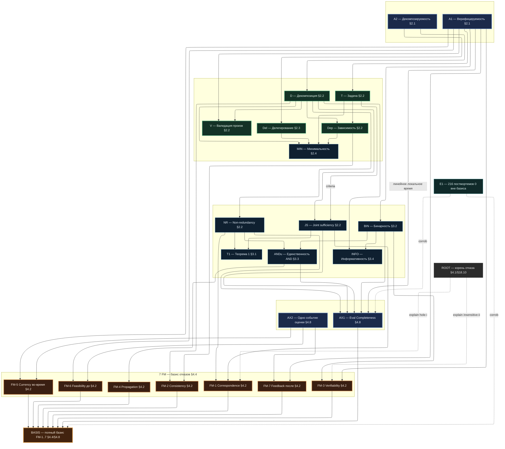
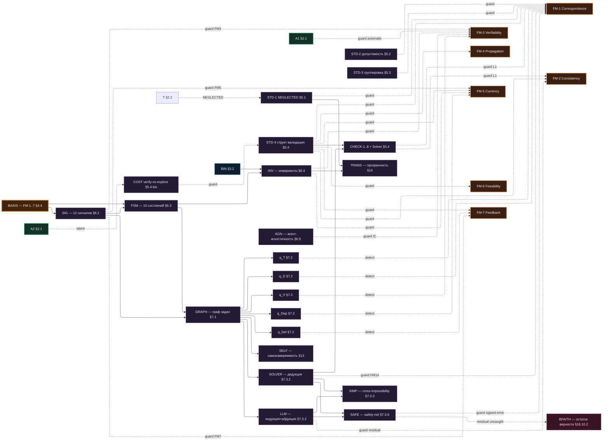
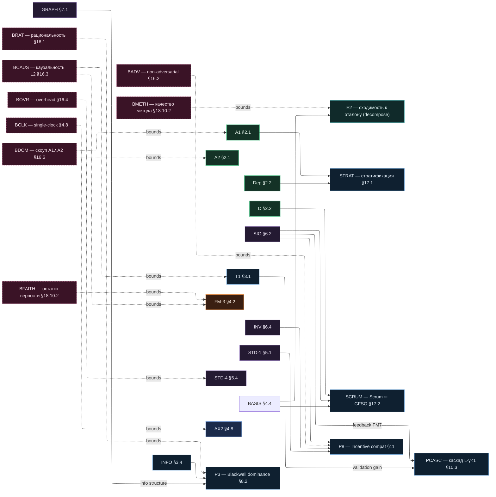
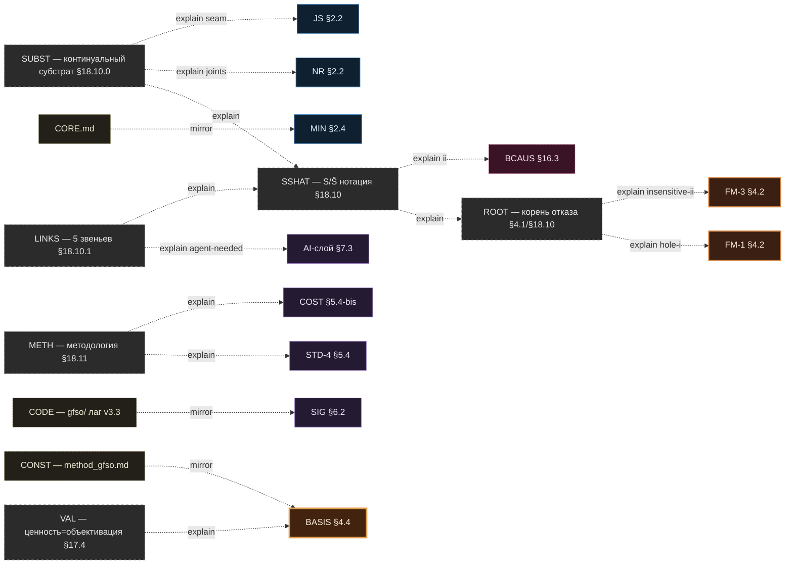

# GFSO — карта зависимостей (dependency map)

> Что из чего **следует**. Сплошная стрелка `A --> B` = «B выводится/зависит от A».
> Пунктир `A -.-> B` = вспомогательная связь (страж / детектор / объясняющий ракурс /
> эмпирическая корроборация), с подписью роли. Всё построено из канона `applied_gfso_v3.md`
> (§ указаны в узлах и в подписях рёбер; полный реестр — «Ledger рёбер» внизу).
>
> **Хребет полноты (то, ради чего карта):** аксиомы → 4 примитива → условия корректности (§2.2) →
> Теорема 1 (§3.1) → **покрывающая Аксиома (§4.8)** → **7 FM — полный независимый базис отказов (§4.4)**.
> Полнота чего-либо в GFSO замыкается **только здесь** (7 FM, доказано modulo Axiom-1, корроборировано E1).
> Стандарты (§5), протокол (§6), метрики (§7.2), AI-слой (§7.3) — это **стражи/детекторы**,
> навешенные на конкретные FM, **не** источник полноты.

## Легенда рёбер

| Ребро | Значение |
|---|---|
| `A --> B` сплошное | B **выводится / зависит** от A (несущая дедукция канона) |
| `A -.->\|guard\| B` | стандарт/инвариант/аксиома **исключает** этот FM (§5, §5.5, §6.4) — не источник полноты |
| `A -.->\|detect\| B` | метрика/механизм протокола **ловит** этот FM в runtime (§6.2, §7.2) |
| `A -.->\|corrob\| B` | эмпирическое подтверждение (E1: 0/216 вне базиса) |
| `A -.->\|explain\| B` | теормодель §18.10–§18.11: объясняющий ракурс (карта/территория), НЕ деривация аппарата |
| `A -.->\|mirror\| B` | проекция канона (Constitution / CORE / код) — рендеринг, не новый примитив |

> **Дисциплина грунтования (жёсткая).** Каждое ребро = реальное утверждение канона с §.
> Теормодель (§18.10) — **overlay**: она *объясняет* протокол, она **не** меняет T1 / 7-FM /
> минимальность (§18.10 преамбула: «Формальные результаты не меняются»). Поэтому из теормодели
> рисуются только пунктирные `explain`-рёбра, и ни одно framework-ребро не «выводит» теормодель.

> Карта разбита на **4 фокусных ракурса** (каждый читается сам по себе; узел/ребро может
> повторяться в нескольких ракурсах — это намеренно). Полный граф — внизу, под спойлером.
> classDef-стили общие для всех ракурсов.

---

## Ракурс 1 — СПИНА ПОЛНОТЫ (hero)

*Что показывает: единственная замкнутая цепочка полноты — аксиомы → примитивы → корректность → покрывающая аксиома → 7 FM → базис; E1 корроборирует, корень отказа объясняет FM-1/FM-3.*

---

## Ракурс 2 — СТРАЖИ И ДЕТЕКТОРЫ

*Что показывает: 7 FM как якоря, на которые навешаны стандарты (§5), протокол (§6), метрики (§7.2), AI-слой (§7.3) — стражи и runtime-детекторы, построенные из BASIS.*

---

## Ракурс 3 — РЕЗУЛЬТАТЫ ЧАСТИ II И ГРАНИЦЫ

*Что показывает: несущие результаты Part II (P3/P8/каскад), производные (стратификация, Scrum) и 8 границ-узлов, привязанных к тому, что именно они ограничивают.*

---

## Ракурс 4 — ТЕОРМОДЕЛЬ-OVERLAY + ЗЕРКАЛА

*Что показывает: теормодель §18.10–§18.11 (только пунктир `explain`) и зеркала канона (`mirror`) — оба объясняют/проецируют аппарат, ни одно ребро его не выводит.*

## Как читать (ключевые цепочки)

- **Хребет полноты** (Ракурс 1). `A1 + §2.2 + §3.2 + §3.3` грунтуют обе оси Axiom-1 (§4.8) → `{FM-1..7}`
  полны. Это **единственный** замкнутый результат полноты в GFSO; `E1` его корроборирует
  (пунктир `corrob`, 0/216 вне базиса). Всё ниже базиса — реализация, не источник полноты.
- **Денотационная ось** (что проверяем): аргументы→FM-1/FM-2, значения→FM-3, правило→FM-4
  (§4.2). **Операционная ось** (когда): до→FM-6, во время→FM-5, после→FM-7 — трихотомия
  линейного времени из A1, цена — единые часы Axiom-2 (§4.8).
- **Стандарты (§5)** (Ракурс 2) висят НА FM как стражи (§5.5-таблица): STD-1/2/3 операционализируют
  joint-sufficiency FM-1; STD-4 + CHECK-1..8 покрывают FM-1/2/4/5/6/7; FM-3 закрыт
  **аксиоматически** A1 (только структурно — половина (ii) остаётся, см. границы).
- **Протокол (§6)** (Ракурс 2) строится из базиса: каждый из 12 сигналов отвечает на конкретный FM
  (§6.2: CHALLENGE→FM-7, BLOCK→FM-5/7, ACCEPT_CHALLENGE→FM-5, CANCEL→FM-5, FAIL→FM-3); FSM даёт
  конечность; инварианты (§6.4) тянут бинарность (§3.2), прозрачность отказа (FM-3), immutability
  (FM-5). Агент-агностичность (§6.5) — интерфейсная, самопроверка ломает IC (страж FM-3).
- **Метрики (§7.2)** (Ракурс 2) — runtime-детекторы: граф `G` (из сигналов) → q_T/q_D ловят FM-1, q_V ловит
  FM-3 (только false-PASS, §16.5), q_Dep ловит FM-5, q_Del ловит FM-7. Самоизмеряемость (§13)
  даёт cost=0; прозрачность (§14) — запись `R(d)` из инвариантов + STD-1.
- **AI-слой (§7.3)** (Ракурс 2) — стражи остаточных FM: Solver (дедукция) питает CHECK-7/8 → FM-1.d/FM-2;
  LLM (индукция+абдукция) закрывает семантический residual FM-2; cross-impossibility (§7.3.3) —
  почему оба нужны; safety-net (§7.3.6) ловит ошибки с формальной сигнатурой, **но**
  доменно-молчаливый false-PASS остаётся (→ граница верности §18.10.2).
- **Производные (§17.1, §17.2)** (Ракурс 3): стратификация = Dep-coherence + A1 (+ эмпирическая
  стационарность среды, шаг 4); Scrum⊂GFSO = спец-случай при ослабленных ограничениях.
- **Результаты Part II (§8–§12)** (Ракурс 3): несущие деривации над аппаратом. **P3 Blackwell (§8.2)** —
  info-структура `I(α)` из графа сигналов + §3.4 информативность ⟹ Blackwell-доминирование
  (garbling-проекция). **P8 IC (§11)** — честность = равновесие протокола (сигналы + прозрачность
  инвариантов + NEGLECTED-mandatory STD-1). **Каскад (§10.3)** — validation-gain γ из Теоремы 1 +
  feedback-канал FM-7 (CHALLENGE/BLOCK) ⟹ `(L·γ)ⁿ` vs `Lⁿ` при `L·γ<1`.
- **Границы (§16, §18.10.2)** (Ракурс 3) — пунктирные `bounds`-узлы, привязанные к тому, что ограничивают:
  рациональность (§16.1) ограничивает **P3/Blackwell**; non-adversarial (§16.2) — **P8/IC**;
  каузальная правильность L2 (§16.3/§18.1) ограничивает T1 и FM-3; single-clock — Axiom-2;
  A1∧A2 — скоуп; остаток верности и качество-метода — перманентные границы / блокер E3 (метод порождения закрыт E2).
- **Теормодель (§18.10–§18.11) = OVERLAY** (Ракурс 4). Все её рёбра — пунктир `explain`. Она *объясняет*
  протокол (корень `Ŝ∖S` расщеплён на FM-1 / FM-3; субстрат объясняет суставы=non-redundancy и
  шов=joint-sufficiency; 5 звеньев объясняют необходимость агента/AI-слоя; методология объясняет
  STD-4 + verify-vs-explore; value=objectification объясняет, зачем базис обязателен на каждом
  уровне). Она **не** выводит T1/7-FM/минимальность — это явная дисциплина канона (§18.10
  преамбула).
- **Зеркала** (Ракурс 4) — проекции канона (`mirror`): Constitution, CORE, код `gfso/` (лаг на v3.3). Не
  новые примитивы, рендеринги.
- **E2** (Ракурс 3) наследует полноту отсюда: эталон = декомпозиция, исключающая все 7 FM; «полнота
  корзин» доказана §4.4, «полнота внутри корзины» = faithfulness, добирается циклом (§18.10). **E2 показал
  сходимость этого цикла** (bare-SEARCH ⊕ gfso-AUDIT → `decompose()`); верность реальному домену остаётся (E3).

## Ledger рёбер (грунтование — для критика)

> Очевидные хребет-рёбра (A1→T, JS→T1, FM-i→BASIS и т.п.) опущены — они дословно в §2–§4.
> Ниже — нетривиальные / добавленные рёбра, каждое со своим §.

| Ребро | § | Обоснование (одна строка) |
|---|---|---|
| A1 → STRAT | §17.1 шаг 2 | criteria проверяемы в пределах горизонта ⟹ конкретнее на коротком |
| Dep → STRAT | §17.1 шаг 1 | Dep-coherence deadline(parent)>deadline(child) ⟹ горизонт убывает с глубиной |
| BIN → INFO, D → INFO | §3.4 / Утв.-инф.A | бинарность+декомпозиция строго информативнее непрерывной без D |
| T → STD1 (NEGLECTED) | §5.1 | STD-1 = явные допущения NEGLECTED в пакете задачи |
| STD1/STD2/STD3 -.guard.-> FM1 | §5.5 | STD-1/3 операционализируют joint-suff; STD-2 = критерий допустимости пропуска |
| STD4 -.guard.-> FM1/2/4/5/6/7 | §5.4 / §5.5 | STD-4 структурная валидация = CHECK-1..6 покрывает эти FM |
| CHK -.guard L1.-> FM1, FM2 | §5.5 | CHECK-7 formal sufficiency → FM-1.d; CHECK-8 consistency → FM-2 |
| COST -.guard.-> STD4 | §5.4-bis | verify-vs-explore: глубина FORM-чека по ставкам c_check |
| A1 -.guard axiomatic.-> FM3 | §5.5 | FM-3 закрыт аксиоматически (criteria = разрешимые предикаты); только структурно |
| BASIS → SIG, BASIS → FSM | §6 преамбула / §4.7 | протокол операционализирует FM; каждый сигнал — ответ на FM |
| SIG -.guard FM7.-> FM7 | §6.2 | CHALLENGE→FM-7; BLOCK→FM-7 (обратная связь при дефекте/блокировке) |
| SIG -.guard FM5.-> FM5 | §6.2 | BLOCK / ACCEPT_CHALLENGE / CANCEL / RESOLVE_BLOCK → FM-5 (currency) |
| SIG -.guard FM3.-> FM3 | §6.2 | FAIL(criteria) → FM-3 (указать failed_criteria; запрет auto-pass) |
| BIN → INV, FSM → INV | §6.4 | инвариант 2 (бинарность) из §3.2; инвариант 5/6 (конечность/детерминизм) из FSM |
| INV -.guard.-> FM3 | §6.4 инв.3 | прозрачность отказа: FAIL ⇒ failed_criteria≠∅ |
| INV -.guard.-> FM5 | §6.4 инв.1 | immutability criteria после ASSIGN ⟹ предотвращает устаревание контракта |
| AGN -.guard IC.-> FM3 | §6.5 | самопроверка нарушает IC; разные инстансы Issuer/Executor сохраняют валидацию |
| SIG → GRAPH, FSM → GRAPH | §7.1 | каждый P2P-сигнал = детерминированная мутация графа G |
| GRAPH → q_* | §7.2 / §13 | каждая q-метрика = запрос к G по уникальным данным сигналов |
| QT/QD -.detect.-> FM1 | §7.2 / §5.5 | q_T (criteria) и q_D (декомпозиция) ловят FM-1 в runtime |
| QV -.detect.-> FM3 | §7.2 / §16.5 | q_V ловит FM-3 — **только false-PASS** (счётчик false-FAIL не построен) |
| QDEP -.detect.-> FM5 | §7.2 | q_Dep (declared vs discovered) ловит currency через зависимости |
| QDEL -.detect.-> FM7 | §7.2 | q_Del (reassignment) ловит feedback через делегирование |
| GRAPH → SELF | §13 Теорема 10 | Q вычислимо из trace, cost=0 |
| INV → TRANS, STD1 → TRANS | §14 Теорема 11 | R(d) из инвариантов (ASSIGN, immutability, FAIL) + STD-1 NEGLECTED |
| GRAPH → SOLVER, GRAPH → LLM | §7.3.1 | AI-слой питается графом; ёмкостная необходимость (Simon) |
| SOLVER → CHK | §7.3.2 | Solver реализует CHECK-7/8 (SMT, constraint propagation) |
| SOLVER -.guard FM1d.-> FM1 | §5.5 / §7.3.4 | formal sufficiency check → FM-1.d insufficient-entailment |
| LLM -.guard residual.-> FM2 | §5.5 | семантический residual FM-2 закрывается LLM-review |
| SOLVER+LLM → XIMP | §7.3.3 | cross-impossibility: ни один не заменяет другого |
| SAFE -.guard signed-error.-> FM1 | §7.3.6 | safety-net ловит ошибки с формальной сигнатурой (плохая D → q_D) |
| SAFE -.residual uncaught.-> BFAITH | §7.3.6 / §18.10.2 | доменно-молчаливый false-PASS **не** ловится — граница верности |
| SIG/D/BASIS → SCRUM | §17.2 | Scrum = спец-случай при depth≤2, NEGLECTED=∅, CHECK-7/8 off |
| GRAPH →\|info structure\| P3 | §8.1–§8.2 | info-структура I(α) = сигналы графа; E_{α₂}≥_B E_{α₁} (garbling-проекция) |
| INFO → P3 | §3.4 / §8.2 | бинарность+декомпозиция — Blackwell-сравнение информативности (Утв.-инф.B → Утв.3) |
| SIG → P8, INV → P8, STD1 → P8 | §11 Утв.8 | честность оптимальна per-сигнал: CHALLENGE/BLOCK/FAIL + прозрачность + NEGLECTED-mandatory |
| T1 →\|validation gain\| PCASC | §10.3 Утв.7 | gain γ<1 от валидации (Теорема 1) ⟹ (L·γ)ⁿ vs Lⁿ |
| SIG →\|feedback FM7\| PCASC | §10.3 Замечание | CHALLENGE/BLOCK = upward feedback; стоп-реплан вставляет демпфер γ (small-gain) |
| A2 -.latent.-> COST | §5.4-bis / §18.11 | c_check латентна в A2 («превышает ёмкость» = стоимостная граница) |
| Dep → FM2, D → FM2 | §4.2 / §4.8 C2 | FM-2 = совместимость criteria детей (D) + межзадачные отношения = Dep |
| BRAT -.bounds.-> P3 | §16.1 | Blackwell (Утв.3) предполагает рациональность — граница висит на самом результате |
| BADV -.bounds.-> P8 | §16.2 | IC (Утв.8) предполагает non-adversarial; threat-model открыта |
| BCAUS -.bounds.-> T1, FM3 | §16.3 / §18.1 | каузальная правильность L2 = половина (ii) A1; FM-3 false-PASS остаётся |
| BOVR -.bounds.-> STD4 | §16.4 | overhead формализации criteria/NEGLECTED/CHECK |
| BCLK -.bounds.-> AX2 | §4.8 | single-clock: конкурентное время ослабляет трихотомию |
| BDOM -.bounds.-> A1, A2 | §2.1 / §16.6 | модель применима ⟺ A1 ∧ A2 (границы скоупа) |
| BFAITH -.bounds.-> FM3 | §18.10.2 | остаток верности: доменно-молчаливый false-PASS, перманентен |
| BMETH -.bounds.-> E2 | §18.10.2 | качество метода декомпозиции — метод закрыт E2 (decompose); верность-шва — блокер E3 |
| ROOT -.explain hole-i.-> FM1 | §4.1 (i) / §18.10 | дыра покрытия (забытый клей) = FM-1, не FM-3 |
| ROOT -.explain insensitive-ii.-> FM3 | §4.1 (ii) | нечувствительное ребро Ŝ\S = FM-3 false-PASS |
| SSHAT -.explain.-> ROOT | §2.1 / §18.10 | корень любого отказа = ребро Ŝ_used ⊆ S нарушено |
| SUBST -.explain joints.-> NR | §18.10.0 | non-redundancy = сепаратор: x₀∉Capt_{S∖B}(G) |
| SUBST -.explain seam.-> JS | §18.10.0 / §3.1 | joint-sufficiency = AND-состоятельность сцепки бассейнов |
| LINKS -.explain agent-needed.-> AI | §18.10 D6 / §7.3.7 | агент необходим как носитель доменного K̂ (Лемма 1) |
| METH -.explain.-> STD4, COST | §18.11 | стоп-реплан + front-load FORM = вынужденный оптимум; verify-vs-explore |
| VAL -.explain.-> BASIS | §17.4–§17.5 | value=objectification: базис обязателен на каждом уровне; план фальсифицируем |
| SSHAT -.explain ii.-> BCAUS | §18.10 / §18.1 | половина (ii) A1 = каузальная правильность, аппаратно несертифицируема |
| CONST/CORE/CODE -.mirror.-> канон | MEMORY mirrors | проекции канона; код gfso/ лаг на v3.3 |

```mermaid
flowchart TD
  classDef axiom fill:#1b2a4a,stroke:#7da2d9,color:#eaf0fb,stroke-width:2px;
  classDef prim fill:#143226,stroke:#5fbf8f,color:#e9f7ef,stroke-width:2px;
  classDef derived fill:#0f2030,stroke:#5b9bd5,color:#e6f0fa;
  classDef fm fill:#3a1f12,stroke:#d98a4a,color:#fbeee2,stroke-width:2px;
  classDef basis fill:#42230f,stroke:#e0a050,color:#fdf1e2,stroke-width:3px;
  classDef guard fill:#241a32,stroke:#9b7fc4,color:#efe9f7;
  classDef overlay fill:#2b2b2b,stroke:#8a8a8a,color:#e8e8e8,stroke-dasharray:5 4;
  classDef emp fill:#102a2a,stroke:#4fb0b0,color:#e3f5f5;
  classDef bound fill:#3a1326,stroke:#c46a93,color:#f6e3ec,stroke-dasharray:3 3;
  classDef mirror fill:#222018,stroke:#9a8f5a,color:#f1edda,stroke-dasharray:2 3;

  subgraph AX["Аксиомы (§2.1)"]
    A1["A1 — Верифицируемость<br/>конечный набор разрешимых<br/>предикатов pass/fail за конечное время"]
    A2["A2 — Декомпозируемость<br/>некоторые цели больше ёмкости агента<br/>и требуют разбиения"]
  end
  class A1,A2 axiom

  subgraph PR["Примитивы (§2.2–2.4) — базис T D Dep Del; V производна"]
    T["T — Задача<br/>(spec, criteria, deadline, NEGLECTED)"]
    D["D — Декомпозиция<br/>T → P(T), DAG"]
    Del["Del — Делегирование<br/>T → A (ось кто, ортогональна)"]
    Dep["Dep — Зависимость<br/>criteria(t_β) ссылается на выход t_α"]
    V["V — Валидация (ПРОИЗВОДНА)<br/>V(t) = AND(criteria)"]
    MIN["§2.4 Минимальность базиса<br/>убрать любой ⟹ потеря; 6-й не найден"]
  end
  class T,D,Del,Dep,V prim
  class MIN derived

  subgraph CMP["Корректность и композиция (§2.2–§3.4)"]
    JS["Joint sufficiency<br/>все дети pass ⟹ каждый criterion родителя"]
    NR["Non-redundancy<br/>нет удалимой подзадачи"]
    BIN["§3.2 Бинарность |L|=2<br/>excluded middle на intervene"]
    ANDu["§3.3 Единственность AND<br/>коммут + ассоц + поглощающий fail"]
    T1["Теорема 1 (§3.1)<br/>V(parent) = AND(V(children))"]
    INFO["§3.4 Информативность<br/>бинарность+декомпозиция строго<br/>информативнее непрерывной без D"]
  end
  class JS,NR,BIN,ANDu,T1,INFO derived

  subgraph COV["Покрывающая аксиома (§4.8)"]
    AX1["Axiom 1 — Evaluation Completeness<br/>вычисление = денотационная ⊕ операционная<br/>3-й независимой оси нет (ПОКРЫТИЕ)"]
    AX2["Axiom 2 — одно событие оценки<br/>единый локальный таймер ⟹ трихотомия времени"]
  end
  class AX1,AX2 axiom

  subgraph FMS["7 Failure Modes (§4) — денотационная ось (функция f)"]
    FM1["FM-1 Correspondence<br/>аргументы: состав (joint-suff + non-redund)<br/>суб: a b c d e (§4.2)"]
    FM2["FM-2 Consistency<br/>аргументы: отношения (criteria детей совместимы)"]
    FM3["FM-3 Verifiability<br/>значения: истинность (false-PASS ∧ false-FAIL)"]
    FM4["FM-4 Propagation<br/>правило: AND пропагирует fail"]
  end
  subgraph FMO["7 Failure Modes (§4) — операционная ось (фазы времени)"]
    FM6["FM-6 Feasibility [до]<br/>D ещё не определима"]
    FM5["FM-5 Currency [во время]<br/>spec изменилась, D не обновлена"]
    FM7["FM-7 Feedback [после]<br/>дефект найден, нет канала сообщить"]
  end
  class FM1,FM2,FM3,FM4,FM5,FM6,FM7 fm

  BASIS["§4.4 / §4.8 — {FM-1..7}<br/>ПОЛНЫЙ НЕЗАВИСИМЫЙ БАЗИС отказов<br/>CVC ≡ C1∧C2∧C3∧C4∧C5∧C6∧C7<br/>(базис, не разбиение)"]
  class BASIS basis

  ROOT["Корень отказа (§4.1 / §18.10)<br/>использованное ребро Ŝ∖S<br/>(карта обещает проход, реальность отрицает)"]
  class ROOT overlay

  subgraph STD["Стандарты и проверки (§5) — СТРАЖИ FM"]
    STD1["STD-1 — явный NEGLECTED (§5.1)"]
    STD2["STD-2 — предсказуемость / допустимость пропуска (§5.2)"]
    STD3["STD-3 — группировка рисков (§5.3)"]
    STD4["STD-4 — структурная валидация (§5.4)"]
    CHK["CHECK-1..8 + Solver (§5.4)<br/>L0 топологический / L1 семантический"]
    COST["§5.4-bis verify-vs-explore<br/>стоимость проверки c_check по ставкам"]
  end
  class STD1,STD2,STD3,STD4,CHK,COST guard

  subgraph PROTO["Протокол §6 — транзакция Issuer/Executor"]
    SIG["12 сигналов (§6.2)<br/>ASSIGN ACCEPT DELIVER PASS<br/>CHALLENGE BLOCK FAIL CANCEL<br/>ACCEPT_CHALLENGE REJECT_CHALLENGE<br/>RESOLVE_BLOCK CANCEL_ACK"]
    FSM["10-state FSM (§6.3)<br/>IDLE REVIEW CHALLENGED EXECUTING<br/>BLOCKED VALIDATING REWORK DONE<br/>TIMEOUT ESCALATED + system timeout"]
    INV["Инварианты протокола (§6.4)<br/>immutability · бинарность · прозрачность отказа<br/>симметрия · конечность · детерминизм"]
    AGN["Агент-агностичность (§6.5)<br/>любой агент за интерфейсом;<br/>самопроверка нарушает IC"]
  end
  class SIG,FSM,INV,AGN guard

  subgraph MET["Метрики и прозрачность (§7.2, §13, §14)"]
    GRAPH["Граф задач G (§7.1)<br/>сигнал = мутация графа"]
    QT["q_T (§7.2) ← CHALLENGE/criteria-changed"]
    QD["q_D (§7.2) ← child/parent pass-patterns"]
    QV["q_V (§7.2) ← pass→later-fail (только false-PASS, §16.5)"]
    QDEP["q_Dep (§7.2) ← declared vs discovered Dep"]
    QDEL["q_Del (§7.2) ← reassignment events"]
    SELF["Самоизмеряемость §13<br/>Q вычислимо из trace, cost=0"]
    TRANS["Структурная прозрачность §14<br/>R(d)=(author,spec,criteria,NEGLECTED,ts)"]
  end
  class GRAPH,QT,QD,QV,QDEP,QDEL,SELF,TRANS guard

  subgraph AI["AI-слой (§7.3)"]
    SOLVER["Solver — дедукция (§7.3.2)<br/>CHECK-7/8, SMT; sound+complete; S-независим"]
    LLM["LLM — индукция+абдукция (§7.3.2)<br/>Chollet Level ≥2; Bayesian-оптимально при prior"]
    XIMP["Cross-impossibility (§7.3.3)<br/>Solver без доменных аксиом / LLM P(error)>0"]
    SAFE["Safety-net (§7.3.6)<br/>ловит ошибки с формальной сигнатурой;<br/>доменно-молчаливый false-PASS НЕ ловит"]
  end
  class SOLVER,LLM,XIMP,SAFE guard

  subgraph DER["Производные результаты (§3.4, §17.1, §17.2)"]
    STRAT["Адаптивная стратификация §17.1<br/>freq_challenge ↑ с глубиной<br/>(Dep-coherence + A1 + стационарность среды)"]
    SCRUM["Scrum ⊂ GFSO §17.2<br/>спец-случай: depth≤2, NEGLECTED=∅,<br/>CHECK-7/8 off, audit informal"]
  end
  class STRAT,SCRUM derived

  subgraph RES["Результаты Part II (§8–§12) — несущие деривации"]
    P3["P3 — Blackwell dominance (§8.2 Утв.3)<br/>больше criteria/тоньше партиция ⟹<br/>Blackwell-информативнее (garbling-проекция)"]
    P8["P8 — Incentive compatibility (§11 Утв.8)<br/>честность = равновесие при<br/>NEGLECTED-mandatory · бинарном V · прозрачности"]
    PCASC["Каскадная граница (§10.3 Утв.7)<br/>стоп-реплан локально ⟹ (L·γ)ⁿ vs Lⁿ<br/>small-gain L·γ<1"]
  end
  class P3,P8,PCASC derived

  subgraph BND["Границы и допущения (§16, §2.1, §18.10.2)"]
    BRAT["§16.1 Рациональность (Blackwell-посылка)"]
    BADV["§16.2 Non-adversarial (IC; threat-model открыта)"]
    BCAUS["§16.3 / §18.1 Каузальная правильность L2<br/>= половина (ii) A1; FM-3 false-PASS остаётся"]
    BOVR["§16.4 Overhead формализации"]
    BCLK["Axiom-2 single-clock (§4.8)<br/>конкурентное время ослабляет трихотомию"]
    BDOM["§2.1 / §16.6 Границы скоупа<br/>модель применима ⟺ A1 ∧ A2"]
    BFAITH["§18.10.2 Остаток верности<br/>доменно-молчаливый false-PASS, перманентная граница"]
    BMETH["§18.10.2 Качество метода декомпозиции<br/>метод закрыт E2 (decompose); верность-шва — открыто (E3)"]
  end
  class BRAT,BADV,BCAUS,BOVR,BCLK,BDOM,BFAITH,BMETH bound

  subgraph TM["Теормодель §18.10–§18.11 — OVERLAY (объясняет, не выводит аппарат)"]
    SSHAT["S / Ŝ нотация (§2.1, §18.10)<br/>S реально-не-дано; Ŝ построено агентом;<br/>верность Ŝ_used ⊆ S"]
    SUBST["§18.10.0 Континуальный субстрат<br/>ẋ=f(x,u); бассейны Capt_S; сепараторы;<br/>дискретное (t,{tⱼ})∈S = тень сцепки"]
    LINKS["§18.10.1 Пять конститутивных звеньев<br/>цель · строить Ŝ · план D · исполнение · контакт<br/>агент = эмерджентный scope-bundle"]
    METH["§18.11 Вынужденная методология<br/>front-load FORM + СТОП-разметить-перевывести;<br/>оптимум над c_check+E_FORM+E_FAITH"]
    VAL["§17.4–§17.5 Ценность = объективация<br/>планирование ⊂ GFSO; дельта механики узка;<br/>план становится фальсифицируемым"]
  end
  class SSHAT,SUBST,LINKS,METH,VAL overlay

  subgraph EXP["Эмпирика и эксперименты"]
    E1["E1 — 216 реальных постмортемов<br/>0 требуют 8-го FM (NONE in-framework)"]
    E2["E2 — сходимость декомпозиции к эталону (bare-SEARCH ⊕ gfso-AUDIT → decompose)<br/>эталон = полнота по 7 FM"]
  end
  class E1,E2 emp

  subgraph MIR["Зеркала канона (проекции, не примитивы)"]
    CONST["Constitution method_gfso.md"]
    CORE["CORE.md (одностраничник)"]
    CODE["код gfso/ (лаг на v3.3)"]
  end
  class CONST,CORE,CODE mirror

  %% --- аксиомы → примитивы ---
  A1 --> T
  A1 --> V
  A2 --> D
  A2 --> Del
  T --> Dep
  D --> Dep
  D --> V
  T --> MIN
  D --> MIN
  Dep --> MIN
  Del --> MIN

  %% --- примитивы → корректность/композиция ---
  T -->|criteria| JS
  D --> JS
  D --> NR
  A1 --> BIN
  BIN --> ANDu
  NR --> ANDu
  JS --> T1
  NR --> T1
  BIN --> INFO
  D --> INFO

  %% --- что грунтует покрывающую аксиому ---
  JS --> AX1
  NR --> AX1
  BIN --> AX1
  ANDu --> AX1
  A1 -->|линейное локальное время| AX1

  %% --- вывод каждого FM из upstream-результата ---
  JS --> FM1
  NR --> FM1
  Dep --> FM2
  D --> FM2
  BIN --> FM3
  A1 --> FM3
  ANDu --> FM4
  A1 --> FM6
  A1 --> FM5
  A1 --> FM7
  AX2 --> FM5
  AX2 --> FM6
  AX2 --> FM7

  %% --- 7 FM образуют доказанный базис ---
  AX1 --> BASIS
  FM1 --> BASIS
  FM2 --> BASIS
  FM3 --> BASIS
  FM4 --> BASIS
  FM5 --> BASIS
  FM6 --> BASIS
  FM7 --> BASIS

  %% --- E1 корроборирует покрывающую аксиому ---
  E1 -.->|corrob| AX1
  E1 -.->|corrob| BASIS

  %% --- стандарты = стражи конкретных FM (§5.5) ---
  T -.->|NEGLECTED| STD1
  STD1 -.->|guard| FM1
  STD2 -.->|guard| FM1
  STD3 -.->|guard| FM1
  STD4 -.->|guard| FM1
  STD4 -.->|guard| FM2
  STD4 -.->|guard| FM4
  STD4 -.->|guard| FM5
  STD4 -.->|guard| FM6
  STD4 -.->|guard| FM7
  A1 -.->|guard axiomatic| FM3
  STD4 --> CHK
  CHK -.->|guard L1| FM1
  CHK -.->|guard L1| FM2
  COST -.->|guard| STD4
  A2 -.->|latent| COST

  %% --- протокол: BASIS строит сигналы; каждый сигнал отвечает на FM (§6.2) ---
  BASIS --> SIG
  BASIS --> FSM
  SIG --> FSM
  SIG -.->|guard FM7| FM7
  SIG -.->|guard FM5| FM5
  SIG -.->|guard FM3| FM3
  INV -.->|guard| FM3
  INV -.->|guard| FM5
  BIN --> INV
  FSM --> INV
  AGN -.->|guard IC| FM3

  %% --- метрики: граф из протокола, q-метрики детектят FM (§7.2, §5.5) ---
  SIG --> GRAPH
  FSM --> GRAPH
  GRAPH --> QT
  GRAPH --> QD
  GRAPH --> QV
  GRAPH --> QDEP
  GRAPH --> QDEL
  QT -.->|detect| FM1
  QD -.->|detect| FM1
  QV -.->|detect| FM3
  QDEP -.->|detect| FM5
  QDEL -.->|detect| FM7
  GRAPH --> SELF
  INV --> TRANS
  STD1 --> TRANS

  %% --- AI-слой: guard остаточных FM (§7.3) ---
  GRAPH --> SOLVER
  GRAPH --> LLM
  SOLVER --> CHK
  SOLVER -.->|guard FM1d| FM1
  LLM -.->|guard residual| FM2
  SOLVER --> XIMP
  LLM --> XIMP
  SOLVER --> SAFE
  LLM --> SAFE
  SAFE -.->|guard signed-error| FM1
  SAFE -.->|residual uncaught| BFAITH

  %% --- производные результаты ---
  Dep --> STRAT
  A1 --> STRAT
  SIG --> SCRUM
  D --> SCRUM
  BASIS --> SCRUM

  %% --- результаты Part II: деривация из графа/протокола/T1 ---
  GRAPH -->|info structure| P3
  INFO --> P3
  SIG --> P8
  INV --> P8
  STD1 --> P8
  T1 -->|validation gain| PCASC
  SIG -->|feedback FM7| PCASC

  %% --- границы навешены на то, что ограничивают ---
  BRAT -.->|bounds| P3
  BADV -.->|bounds| P8
  BCAUS -.->|bounds| T1
  BCAUS -.->|bounds| FM3
  BOVR -.->|bounds| STD4
  BCLK -.->|bounds| AX2
  BDOM -.->|bounds| A1
  BDOM -.->|bounds| A2
  BFAITH -.->|bounds| FM3
  BMETH -.->|bounds| E2

  %% --- теормодель = OVERLAY: объясняет, не выводит аппарат ---
  ROOT -.->|explain hole-i| FM1
  ROOT -.->|explain insensitive-ii| FM3
  SSHAT -.->|explain| ROOT
  SUBST -.->|explain| SSHAT
  SUBST -.->|explain joints| NR
  SUBST -.->|explain seam| JS
  LINKS -.->|explain agent-needed| AI
  LINKS -.->|explain| SSHAT
  METH -.->|explain| STD4
  METH -.->|explain| COST
  VAL -.->|explain| BASIS
  SSHAT -.->|explain ii| BCAUS

  %% --- E2 берёт 7-FM как рамку полноты эталона ---
  BASIS --> E2

  %% --- зеркала: проекции канона ---
  CONST -.->|mirror| BASIS
  CORE -.->|mirror| MIN
  CODE -.->|mirror| SIG
```

Полный граф (для зума)

