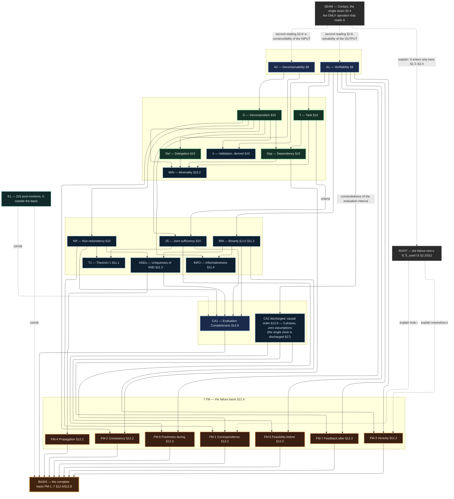
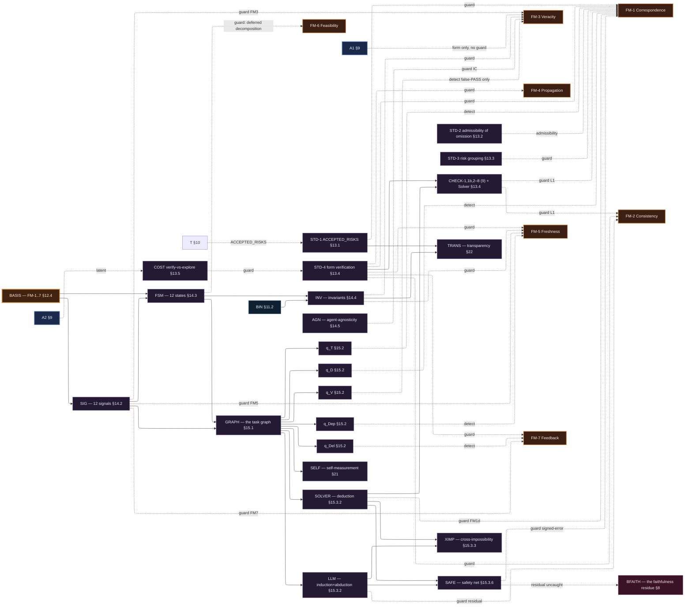
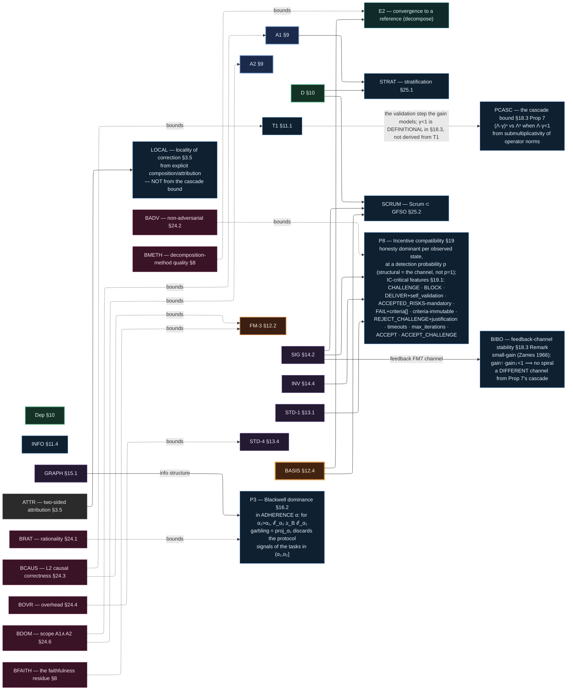
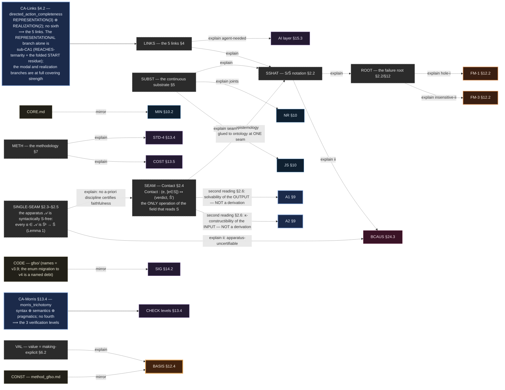

# GFSO — the dependency map

> What follows from what. A solid arrow `A --> B` = "B is derived from / depends on A".
> A dashed one `A -.-> B` = an auxiliary link (guard / detector / explanatory view / empirical
> corroboration), labelled with its role. Everything is built from the canon `applied_gfso_v4_en.md`
> (§ given in the nodes and on the edge labels; the full register — "Edge ledger" at the bottom).
>
> **The completeness spine (what the map exists for):** axioms → 4 primitives → the correctness
> conditions (§10) → Thm 1 (§11.1) → **the covering axiom CA1 (§12.8)** → **the 7 FM: a complete
> independent basis of failures (§12.4)**.
> This is **one of three** completeness closures in v4 — each under its own covering axiom (§1.4, §27):
> the 7 FM (CA1, §12.8) · the three verification levels (CA-Morris, §13.4) · the five links
> (CA-Links, §4.2). The map unfolds the first in full and carries the other two as nodes on the
> foundation view (E1 corroborates the first, 0/216).
> The standards (§13), the protocol (§14), the metrics (§15.2) and the AI layer (§15.3) are
> **guards/detectors** hung on specific FMs — **not** a source of completeness.

## Edge legend

| Edge | Meaning |
|---|---|
| `A --> B` solid | B is **derived from / depends on** A (a load-bearing deduction of the canon) |
| `A -.->\|guard\| B` | a standard/invariant/axiom **excludes** this FM (§13, §13.6, §14.4) — not a source of completeness |
| `A -.->\|detect\| B` | a metric/protocol mechanism **catches** this FM at runtime (§14.2, §15.2) |
| `A -.->\|corrob\| B` | empirical corroboration (E1: 0/216 outside the basis) |
| `A -.->\|explain\| B` | the theory-model §2–§3 + §7: the grounding view (map/territory) — the canon derives the apparatus from it (Part II), but its edges do not re-prove T1 / the 7 FM / minimality |
| `A -.->\|second reading\| B` | §2.6: a **status change** (postulate → interface condition of Contact), **NOT** a derivation — the axiomatic status of A1/A2 stays primary. Drawn dashed on purpose: a solid arrow here would assert exactly the laundering §2.6 forbids |
| `A -.->\|mirror\| B` | a projection of the canon (Constitution / CORE / code) — a rendering, not a new primitive |

> **The grounding discipline (strict).** Every edge = a real claim of the canon, with a §.
> The theory-model (§2–§3) is the **foundation**: the canon leads with it and derives the apparatus as
> its consequence (Part II — "the apparatus as consequence"). What it does **not** do: it does not change
> T1 / the 7 FM / minimality — those stand exactly as proved (§1.5: "the theory-model does not change
> the formal results; it grounds them"). Hence its edges here are dashed `explain`: they carry
> justification, not re-proof; and no framework edge "derives" the theory-model — the direction is
> one-way.

> The map is split into **4 focus views** (each readable on its own; a node/edge may repeat across
> views — that is deliberate). The full graph is at the bottom, under a spoiler.
> The classDef styles are shared by all views.

---

## View 1 — THE COMPLETENESS SPINE (hero)

*What it shows: the closed completeness chain of the 7 FM — axioms → primitives → correctness → the covering axiom CA1 → 7 FM → basis (one of v4's three closures; the other two, CA-Morris §13.4 and CA-Links §4.2, are named here and carried on View 4); E1 corroborates; the failure root explains FM-1/FM-3.*

> **Reading the two `second reading` edges (anti-laundering, §2.6 — hold this louder than the recast).**
> They are dashed, and they point *at* A1/A2 rather than *from* them, for one reason: §2.6 is a
> **status change** (postulate → interface condition of Contact), **not** a derivation of A1/A2 from an
> empty field. The residue is ≈ the axioms themselves (A1's clause (ii) is apparatus-uncertifiable; κ
> is a cost premise about the actor; the decomposability clause is ≈ A2 moved). **The axiomatic status
> of A1/A2 (§9) remains primary.** A solid arrow into A1/A2 here would encode exactly the claim the
> canon spends a paragraph forbidding.

---

## View 2 — GUARDS AND DETECTORS

*What it shows: the 7 FM as anchors, with the standards (§13), the protocol (§14), the metrics (§15.2) and the AI layer (§15.3) hung on them — guards and runtime detectors, built out of BASIS.*

---

## View 3 — THE PART-III RESULTS AND THE BOUNDARIES

*What it shows: the load-bearing results of Part III (Prop 3 / Prop 8 / the cascade), the derivatives (stratification, Scrum), and the boundary nodes tied to exactly what each bounds.*

---

## View 4 — THE THEORY-MODEL FOUNDATION + MIRRORS

*What it shows: the theory-model §2–§3 + §7 (dashed `explain` = grounding), the single contact seam and the two other covering axioms, and the canon's mirrors (`mirror`) — the foundation the canon derives the apparatus from, and its projections; no re-proof of T1 / the 7 FM / minimality happens here.*

## How to read it (the key chains)

- **The completeness spine** (View 1). `A1 + §10 + §11.2 + §11.3` ground the **denotational** axis of CA1 (§12.8; the operational axis is derived from the strict causal order — asymmetry + excluded middle — which these do not supply) →
  `{FM-1..7}` are complete. This is one of three completeness closures (CA-Morris — the three levels
  §13.4; CA-Links — the five links §4.2; both are nodes on View 4); the map unfolds this one, and `E1`
  corroborates it (dashed `corrob`, 0/216 outside the basis). Everything below the basis is
  implementation, not a source of completeness.
- **The single seam** (Views 1 and 4). `Contact` is the **only** operation of the whole field that
  reads `S` (§2.3–§2.4): the apparatus 𝒜 is syntactically S-free, every `α ∈ 𝒜` is `Ŝᵏ → Ŝ` (Lemma 1).
  That is why faithfulness is opened by nothing but execution, and why the failure root `Ŝ_used∖S` is
  where every mode bites. **The two `second reading` edges into A1/A2 are dashed and must stay dashed:**
  §2.6 reads A1 as the solvability of Contact's *output* and A2 as the κ-constructibility of its
  *input*, but that is a **status change** (postulate → interface condition), **not** a derivation —
  the residue is ≈ the axioms themselves, and the axiomatic status of A1/A2 (§9) stays primary.
  Reading those edges as derivations is exactly the laundering §2.6 exists to forbid.
- **The denotational axis** (what is checked): arguments→FM-1/FM-2, values→FM-3, rule→FM-4 (§12.2).
  **The operational axis** (when): before→FM-6, during→FM-5, after→FM-7 — the trichotomy of the strict
  causal order by excluded middle, with no assumptions about the shape of time; the single clock (CA2)
  is a discharged hypothesis, the linear special case (under concurrency FM-5 generalizes into a
  read/write race — it does not weaken) (§12.8/§27).
- **The standards (§13)** (View 2) hang ON the FMs as guards (the §13.6 table): STD-1/3 operationalize
  FM-1's joint-sufficiency clause, while STD-2 is the ADMISSIBILITY criterion for omission (not
  coverage: it adds no children); STD-4 + the nine CHECKs cover FM-1/2/4/5/7. **FM-6 is guarded by the
  PROTOCOL** (deferred decomposition, §13.6), and **FM-3 by no structural guard at all — A1 fixes only the verdict's form** (§13.6/§27) — those two have no
  structural CHECK (§27), and FM-3's half (ii) stays open (see the boundaries).
- **The protocol (§14)** (View 2) is built out of the basis: four of the 12 signals answer an FM
  (§14.2: CHALLENGE→FM-7, BLOCK→FM-5/7, CANCEL→FM-5, FAIL→FM-3), the other
  eight closing FSM deadlocks (4), IC seams (3 — ACCEPT, REJECT_CHALLENGE and ACCEPT_CHALLENGE, whose
  removal costs the dispute's positive closure, the spec update being carried by re-ASSIGN under Inv-1)
  and initiating (1); the FSM
  gives finiteness; the invariants (§14.4) pull in binarity (§11.2), failure transparency (FM-3) and
  immutability (FM-5). Agent-agnosticity (§14.5) is interface-level; self-checking at a **seam** breaks
  IC (an FM-3 guard).
- **The metrics (§15.2)** (View 2) are runtime detectors: the graph `𝒢` (from the signals) → q_T/q_D
  catch FM-1, q_V catches FM-3 (the **false-PASS direction only**, by design — §24.5), q_Dep catches
  FM-5, q_Del catches FM-7. Self-measurement (§21) makes the cost 0; transparency (§22) is the record
  `R(d)` from the invariants + STD-1.
- **The AI layer (§15.3)** (View 2) guards the residual FMs: the Solver (deduction) feeds CHECK-7/8 →
  FM-1.d/FM-2; the LLM (induction+abduction) closes the semantic residual of FM-2; cross-impossibility
  (§15.3.3) is why both are needed; the safety net (§15.3.6) catches errors with a formal signature,
  **but** the domain-silent false-PASS remains (→ the faithfulness boundary §8).
- **The derivatives (§25.1, §25.2)** (View 3): stratification = deadline coherence along D (§3.4 item 6) + A1 (+ the empirical
  stationarity premise, step 4); Scrum ⊂ GFSO = a special case under relaxed restrictions.
- **The Part III results (§16–§22)** (View 3): load-bearing derivations over the apparatus.
  **P3 Blackwell (§16.2)** — the information structure `ℐ(α)` from the graph of signals ⟹ dominance
  **in adherence α** (`ℰ_{α₂} ≥_B ℰ_{α₁}` for `α₂ > α₁`), the garbling being the projection `proj_{α₁}`
  that discards the protocol signals of the tasks in `(α₁, α₂]`. *(§11.4's Inf-B is NOT an input to
  Prop 3: it is Blackwell running the other way — a continuous scale over the same tree is strictly
  MORE informative, and Inf-B rescues binarity by decision-irrelevance. §16.2 derives Prop 3 from the
  α-projection kernel alone and never cites §11.4. There is no `INFO → P3` edge — it would assert a derivation the
  canon does not run.)*
  **Prop 8 IC (§19)** — honesty is a DOMINANT strategy (not merely an equilibrium), and the canon states
  it **per observed state** under a state-contingent honest policy; the `ℙ(defect) > 0` form is the
  ex-ante corollary. Dominance carries a **detection probability `p`**: structural names the channel's
  independence of the counterparty's strategy, not `p = 1` — `p = 1` on the rows whose consequence the
  FSM forces, and `p = 1 − ∏(1 − p_j)` over the §26.3 validation cone on the acceptance row, whose
  `p → 0` limit is the Pragmatic-level boundary. The IC-critical set is the §19.1 enumeration (11 features — ACCEPT and ACCEPT_CHALLENGE included, both IC rows of §14.2).
  **The cascade (§18.3 Prop 7)** — `(Λ·γ)ⁿ` vs `Λⁿ` when `Λ·γ < 1`, from submultiplicativity of operator
  norms. *(Two things the canon keeps apart and this map now keeps apart too: **small-gain** (Zames) is
  a separate Remark about the **feedback channel** (CHALLENGE/BLOCK), not Prop 7's condition; and the
  **locality** of correction is derived from explicit composition/attribution (§3.5), **not** from the
  cascade bound.)*
- **The boundaries (§24, §8)** (View 3) are dashed `bounds` nodes tied to exactly what they bound:
  rationality (§24.1) bounds **P3/Blackwell** and non-adversarial (§24.2) bounds **P8/IC** — both are
  *assumption* nodes of Ch. 24, not Ch. 8 boundaries: neither carries an impossibility argument from
  A1 ∧ A2 (the §8 criterion), and the same holds of §24.4's formalization overhead, which the canon
  calls an empirical question; L2 causal
  correctness (§24.3/§8) bounds T1 and FM-3; A1∧A2 is the scope; the faithfulness residue is a permanent
  boundary, while method-quality is a **SPLIT** (§8): its *faithfulness* half is a boundary (Lemma 1),
  its *generation-procedure* half an OPEN PROBLEM closed as a procedure by E2 (`decompose()`) — the
  seam's faithfulness remains the E3 blocker.
- **The two uniqueness verdicts (§26.9)** are OPPOSITE and must not be read as one: **(a) the basis** —
  uniqueness open, with a positive partial result (σ-canonicity over the Beth class, the wall pinned to the
  FO-frame stipulation); **(b) the protocol** — the bi-interpretation currency does not transport, the
  working currency is behavioural equivalence, and over bare adequacy the answer is **negative**
  (machine-witnessed: a VALIDATING-timeout→ESCALATED variant is adequate and behaviourally distinct;
  `max_iterations` is a second free cell). What IS canonical there is the nine-state minimality-forced
  skeleton; OVERDUE and ESCALATED are free decorations and REWORKING ≡ EXECUTING is an attribution label.
- **The theory-model (§2–§3 + §7) = the FOUNDATION** (View 4). All its edges are dashed `explain`. It
  *grounds* the protocol (the root `Ŝ∖S` split into FM-1 / FM-3; the substrate explains joints =
  non-redundancy and the seam = joint-sufficiency; the five links explain the necessity of the
  agent/AI layer; the methodology explains STD-4 + verify-vs-explore; value = making-explicit explains
  why the basis is mandatory at every level). What it does **not** do: it does not change or re-prove
  T1 / the 7 FM / minimality — their proofs live in the apparatus tiers (§11–§12), and the canon derives
  the apparatus itself from the theory-model (§1.5, §2.1).
- **The mirrors** (View 4) are projections of the canon (`mirror`): the Constitution, CORE, the code
  `gfso/` (which carries the v3.9 names — the enum migration to v4 is a named debt, `architecture.md`).
  Not new primitives — renderings.
- **E2** (View 3) inherits its completeness from here: the reference = a decomposition that excludes all
  7 FM; "completeness of the buckets" is proved by §12.4, "completeness inside a bucket" = faithfulness,
  reached by the cycle (§2–§3). **E2 showed that cycle converges** (bare-SEARCH ⊕ gfso-AUDIT →
  `decompose()`); faithfulness to the real domain remains (E3).

## Edge ledger (the grounding — for the critic)

> The obvious spine edges (A1→T, JS→T1, FM-i→BASIS etc.) are omitted — they are verbatim in §9–§12.
> Below: the nontrivial / added edges, each with its §.

| Edge | § | Grounding (one line) |
|---|---|---|
| SEAM -.explain.-> SSHAT | §2.3–§2.4 | Contact is the only operation reading S; before it, any Ŝ is a projection without ground |
| SINGLE -.explain.-> SEAM | §2.3–§2.5 | the apparatus 𝒜 is syntactically S-free (every α ∈ 𝒜 is Ŝᵏ → Ŝ) ⟹ no a-priori discipline certifies faithfulness (Lemma 1) |
| SEAM -.second reading.-> A1 | §2.6 | A1 = solvability of Contact's OUTPUT. **A status change (postulate → interface condition), NOT a derivation:** clause (ii) stays apparatus-uncertifiable; the axiomatic status of A1 (§9) stays primary |
| SEAM -.second reading.-> A2 | §2.6 | A2 = κ-constructibility of Contact's INPUT. Same status: κ is a cost premise about the actor, and the decomposability clause is ≈ A2 itself moved out of the field's definitions — **not** derived from bare dynamics |
| SINGLE -.explain ii.-> BCAUS | §2.3–§2.5 / §8 | S enters only through Contact ⟹ domain-correctness is not supplied by the apparatus = the L2 boundary |
| AXM → CHK | §13.4 | CA-Morris (`morris_trichotomy`): syntax ⊕ semantics ⊕ pragmatics, no fourth ⟹ exactly three verification levels |
| AXL → LINKS | §4.2 | CA-Links (`directed_action_completeness`): REPRESENTATION(3) ⊕ REALIZATION(2) ⟹ five links; the REPRESENTATIONAL branch alone is sub-CA1 (REACHES-ternarity + the folded START residue) — the modal and realization branches are derived to full covering-axiom strength |
| A1 → STRAT | §25.1 step 2 | criteria must be checkable within the horizon ⟹ more concrete on a short one |
| D → STRAT | §25.1 step 1 | deadline coherence along D (§3.4 item 6): deadline(child) < deadline(parent) ⟹ the horizon shrinks with depth (Ch. 10's Dep coherence is the horizontal rule) |
| BIN → INFO, D → INFO | §11.4 / Inf-A | binarity + decomposition is strictly more informative than a continuous score without D |
| T → STD1 (ACCEPTED_RISKS) | §13.1 | STD-1 = the explicit ACCEPTED_RISKS assumptions in the task packet |
| STD1/STD2/STD3 -.guard.-> FM1 | §13.6 | STD-1/3 operationalize joint-sufficiency; STD-2 = the admissibility criterion for omission |
| STD4 -.guard.-> FM1/2/4/5/7 | §13.4 / §13.6 | STD-4 form verification covers these FMs; FM-6 is answered by the PROTOCOL (deferred decomposition), FM-3 only by A1's form requirement: neither has a structural CHECK (§27) |
| FSM -.guard.-> FM6 | §13.6 / §14.3 | FM-6 (D not definable at the start) is answered by the protocol's deferred decomposition — the node stays open, not silently declared covered |
| CHK -.guard L1.-> FM1, FM2 | §13.6 | CHECK-7 formal sufficiency → FM-1.d; CHECK-8 consistency → FM-2 |
| COST -.guard.-> STD4 | §13.5 | verify-vs-explore: the depth of the FORM check by the stakes on `c_check` |
| A1 -.form only, no guard.-> FM3 | §13.6 / §27 | A1 fixes the verdict's FORM (decidable, binary), not its truth — FM-3 has NO structural guard; runtime q_V, false-PASS only |
| Q/𝒢 → TRIAGE | §15.4 | triage order over the graph: repair first the failing node whose dependency cone (E_D upward by Thm 1, E_Dep forward) blocks the most, nearest binding deadline as tie-break — derivable; ranking by *how badly* a node failed is the cardinal-severity boundary (§8) |
| BASIS → SIG, BASIS → FSM | §14 preamble / §12.7 | the protocol operationalizes the FMs; the 12 signals split 4 FM / 4 FSM-deadlock / 3 IC / 1 operation (§14.2) |
| SIG -.guard FM7.-> FM7 | §14.2 | CHALLENGE→FM-7; BLOCK→FM-7 (feedback on a defect/blocker) |
| SIG -.guard FM5.-> FM5 | §14.2 | BLOCK / CANCEL / RESOLVE_BLOCK → FM-5 (freshness); the spec update after an accepted challenge is re-ASSIGN's, Inv-1 |
| SIG -.guard FM3.-> FM3 | §14.2 | FAIL(criteria) → FM-3 (name the failed_criteria; no auto-pass) |
| BIN → INV, FSM → INV | §14.4 | Inv-2 (binarity) from §11.2; Inv-5/6 (finiteness/determinism) from the FSM |
| INV -.guard.-> FM3 | §14.4 Inv-3 | failure transparency: FAIL ⇒ failed_criteria ≠ ∅ |
| INV -.guard.-> FM5 | §14.4 Inv-1 | immutability of criteria after ASSIGN ⟹ prevents silent contract staleness |
| AGN -.guard IC.-> FM3 | §14.5 | self-checking at a seam breaks IC; distinct Issuer/Executor instances preserve validation |
| SIG → GRAPH, FSM → GRAPH | §15.1 | every P2P signal = a deterministic mutation of the graph 𝒢 |
| GRAPH → q_* | §15.2 / §21 | each q-metric = a query over 𝒢 on data unique to it |
| QT/QD -.detect.-> FM1 | §15.2 / §13.6 | q_T (criteria) and q_D (decomposition) catch FM-1 at runtime |
| QV -.detect.-> FM3 | §15.2 / §24.5 | q_V catches the **acceptance** (false-PASS) direction of FM-3 by design; false-FAIL is guarantee-safe, its share an optional diagnostic |
| QDEP -.detect.-> FM5 | §15.2 | q_Dep (declared vs discovered) catches freshness through the dependencies |
| QDEL -.detect.-> FM7 | §15.2 | q_Del (reassignment) catches feedback through delegation |
| GRAPH → SELF | §21 Thm 10 | Q is computable from the trace, cost = 0 |
| INV → TRANS, STD1 → TRANS | §22 Thm 11 | R(d) from the invariants (ASSIGN, immutability, FAIL) + STD-1 ACCEPTED_RISKS |
| GRAPH → SOLVER, GRAPH → LLM | §15.3.1 | the AI layer feeds on the graph; the capacity necessity (Simon) |
| SOLVER → CHK | §15.3.2 | the Solver realizes CHECK-7/8 (SMT, constraint propagation) |
| SOLVER -.guard FM1d.-> FM1 | §13.6 / §15.3.4 | the formal sufficiency check → FM-1.d insufficient-entailment |
| LLM -.guard residual.-> FM2 | §13.6 | the semantic residual of FM-2 is closed by LLM review |
| SOLVER+LLM → XIMP | §15.3.3 | cross-impossibility: neither replaces the other |
| SAFE -.guard signed-error.-> FM1 | §15.3.6 | the safety net catches errors with a formal signature (a bad D → q_D) |
| SAFE -.residual uncaught.-> BFAITH | §15.3.6 / §8 | the domain-silent false-PASS is **not** caught — the faithfulness boundary |
| SIG/D/BASIS → SCRUM | §25.2 | Scrum = the special case at depth ≤ 2, ACCEPTED_RISKS = ∅, CHECK-7/8 off |
| GRAPH →\|info structure\| P3 | §16.1–§16.2 | the info structure ℐ(α) = the graph's signals; ℰ_{α₂} ≥_B ℰ_{α₁} via the garbling projection proj_{α₁} |
| ~~INFO → P3~~ **(removed)** | §11.4 / §16.2 | **the canon does not run this edge.** §16.2 derives Prop 3 from the α-projection kernel alone and never cites §11.4; and Inf-B is Blackwell running AGAINST binarity (a continuous scale is strictly more informative), rescued by decision-irrelevance — not an input to Prop 3 |
| SIG → P8, INV → P8, STD1 → P8 | §19 Prop 8 | honesty optimal per signal AND per observed state: CHALLENGE/BLOCK/FAIL + the invariants' transparency + ACCEPTED_RISKS-mandatory. (The IC-critical set is the §19.1 enumeration; binarity of V is **not** a member) |
| T1 -.the validation step.-> PCASC | §18.3 Prop 7 | validation is the step whose gain γ < 1 damps the cascade ⟹ (Λ·γ)ⁿ vs Λⁿ. **Dashed on purpose:** §18.3 introduces γ **definitionally** (the induced operator norm of the validation step); it does not derive γ from Thm 1 |
| SIG →\|feedback FM7 channel\| BIBO | §18.3 Remark | CHALLENGE/BLOCK = the upward feedback channel; the **small-gain theorem** (Zames 1966) applies to **that channel** (gain-up · gain-down < 1 ⟹ BIBO) — it is **not** Prop 7's condition, which is submultiplicativity of norms |
| ATTR → LOCAL | §3.5 / §18.3 Remark | the **locality** of correction (a correct upper node survives) is derived from explicit composition/attribution — the canon states explicitly that it is **not** derived from the cascade bound |
| A2 -.latent.-> COST | §13.5 / §7 | `c_check` is latent in A2 ("exceeds capacity" = a cost boundary) |
| Dep → FM2, D → FM2 | §12.2 / §12.8 (the FM-2 condition) | FM-2 = compatibility of the children's criteria (D) + cross-task relations = Dep |
| BRAT -.bounds.-> P3 | §24.1 | Blackwell (Prop 3) presumes rationality — the boundary hangs on the result itself |
| BADV -.bounds.-> P8 | §24.2 | IC (Prop 8) presumes non-adversarial; a characterized *stratification* (survives/imports). By the §8 criterion the incentivized core is an OPEN PROBLEM (§26.3), not a boundary — hardness is not impossibility from A1∧A2; only its `p = 0` limit is the Pragmatic-level boundary |
| BCAUS -.bounds.-> T1, FM3 | §24.3 / §8 | L2 causal correctness = half (ii) of A1; the FM-3 false-PASS remains |
| BOVR -.bounds.-> STD4 | §24.4 | the overhead of formalizing criteria/ACCEPTED_RISKS/CHECK |
| BDOM -.bounds.-> A1, A2 | §9 / §24.6 | the model applies ⟺ A1 ∧ A2 (the scope boundaries) |
| BFAITH -.bounds.-> FM3 | §8 | the faithfulness residue: the domain-silent false-PASS, permanent |
| BMETH -.bounds.-> E2 | §8 | decomposition-method quality — a **SPLIT** (§8): the faithfulness half is a boundary (Lemma 1), the generation-procedure half an open problem, closed as a PROCEDURE by E2 (`decompose()`); the seam's faithfulness is the E3 blocker |
| ROOT -.explain hole-i.-> FM1 | §2.2 (i) / §12.2 | a coverage hole (forgotten glue) = FM-1 — tagged FM-1.f, Pragmatic level, no a-priori CHECK: it breaks the DOMAIN face of the correspondence condition while the apparatus face passes — not FM-3 |
| ROOT -.explain insensitive-ii.-> FM3 | §2.2 (ii) / §12 | an insensitive edge of Ŝ∖S = the FM-3 false-PASS |
| SSHAT -.explain.-> ROOT | §2.2 | the root of any failure = a violated edge of `Ŝ_used ⊆ S` |
| SUBST -.explain joints.-> NR | §5 | non-redundancy = a separator: x₀ ∉ Capt_{S∖B}(G) |
| SUBST -.explain seam.-> JS | §5 / §11.1 | joint-sufficiency = the AND-soundness of basin chaining |
| LINKS -.explain agent-needed.-> AI | §3.2 d6 / §15.3.7 | the agent is necessary as the carrier of domain Ŝ-content (Lemma 1) |
| METH -.explain.-> STD4, COST | §7 | stop-and-replan + front-loaded FORM = a forced optimum; verify-vs-explore |
| VAL -.explain.-> BASIS | §6.1–§6.2 | value = making-explicit: the basis is mandatory at every level; the plan becomes falsifiable |
| SSHAT -.explain ii.-> BCAUS | §3.1 / §8 | half (ii) of A1 = causal correctness, uncertifiable by the apparatus |
| CONST/CORE/CODE -.mirror.-> the canon | MEMORY mirrors | projections of the canon; the code `gfso/` carries the v3.9 names — the enum migration to v4 is a named debt (architecture.md) |

```mermaid
flowchart TD
  classDef axiom fill:#1b2a4a,stroke:#7da2d9,color:#eaf0fb,stroke-width:2px;
  classDef prim fill:#143226,stroke:#5fbf8f,color:#e9f7ef,stroke-width:2px;
  classDef derived fill:#0f2030,stroke:#5b9bd5,color:#e6f0fa;
  classDef fm fill:#3a1f12,stroke:#d98a4a,color:#fbeee2,stroke-width:2px;
  classDef basis fill:#42230f,stroke:#e0a050,color:#fdf1e2,stroke-width:3px;
  classDef guard fill:#241a32,stroke:#9b7fc4,color:#efe9f7;
  classDef ground fill:#2b2b2b,stroke:#8a8a8a,color:#e8e8e8,stroke-dasharray:5 4;
  classDef emp fill:#102a2a,stroke:#4fb0b0,color:#e3f5f5;
  classDef bound fill:#3a1326,stroke:#c46a93,color:#f6e3ec,stroke-dasharray:3 3;
  classDef mirror fill:#222018,stroke:#9a8f5a,color:#f1edda,stroke-dasharray:2 3;

  subgraph AX["Axioms (§9) — A1, A2; the three covering axioms are the COV group (§1.4)"]
    A1["A1 — Verifiability<br/>a finite set of decidable pass/fail<br/>predicates, each in finite time"]
    A2["A2 — Decomposability<br/>some goals exceed one agent's capacity<br/>and require splitting"]
  end
  class A1,A2 axiom

  subgraph PR["Primitives (§10–§10.2) — the basis T D Dep Del; V is derived"]
    T["T — Task<br/>(spec, criteria, deadline)"]
    D["D — Decomposition<br/>T → P(T), a DAG"]
    Del["Del — Delegation<br/>T → A (the WHO axis, orthogonal)"]
    Dep["Dep — Dependency<br/>criteria(t_β) references the output of t_α"]
    V["V — Validation (DERIVED)<br/>V(t) = AND(criteria)"]
    MIN["§10.2 Basis minimality<br/>remove any ⟹ a loss; no sixth found<br/>§26.9(a) uniqueness OPEN — σ-canonicity holds over the Beth class"]
  end
  class T,D,Del,Dep prim
  class V derived
  class MIN derived

  subgraph CMP["Correctness and composition (§10–§11.4)"]
    JS["Joint sufficiency<br/>all children pass ⟹ every parent criterion"]
    NR["Non-redundancy<br/>no removable subtask"]
    BIN["§11.2 Binarity |L|=2<br/>SOURCE: A1 — V is a conjunction of<br/>2-valued predicates. The excluded-middle<br/>argument on intervene (|Act|=2, pigeonhole)<br/>is the DEFENCE against a graded scale"]
    ANDu["§11.3 Uniqueness of AND<br/>commutative + associative + absorbing fail"]
    T1["Theorem 1 (§11.1)<br/>V(parent) = AND(V(children))"]
    INFO["§11.4 Informativeness<br/>binarity+decomposition is strictly more<br/>informative than a continuous score without D"]
  end
  class JS,NR,BIN,ANDu,T1,INFO derived

  subgraph COV["Covering: CA1 + the causal order (§12.8)"]
    AX1["CA1 — Evaluation Completeness<br/>a computation = denotational ⊕ operational<br/>no third independent axis (COVERING)"]
    AX2["Causal order of events (§12.8/§27)<br/>3 phases before/concurrent/after by excluded middle —<br/>zero assumptions; the single clock (CA2) is discharged,<br/>the linear special case; under concurrency FM-5 generalizes"]
    AXM["CA-Morris (§13.4) — morris_trichotomy<br/>syntax ⊕ semantics ⊕ pragmatics; no fourth<br/>⟹ the 3 verification levels"]
    AXL["CA-Links (§4.2) — directed_action_completeness<br/>REPRESENTATION(3) ⊕ REALIZATION(2); no sixth<br/>⟹ the 5 links; the REPRESENTATIONAL branch alone is sub-CA1<br/>(REACHES-ternarity, the folded START residue)"]
  end
  class AX1,AXM,AXL axiom
  class AX2 derived

  subgraph FMS["7 Failure Modes (§12) — the denotational axis (the function f)"]
    FM1["FM-1 Correspondence<br/>arguments: membership (joint-suff + non-redund)<br/>sub: a b c d e f (§12.2)"]
    FM2["FM-2 Consistency<br/>arguments: relations (the children's criteria are compatible)"]
    FM3["FM-3 Veracity<br/>values: truth (both directions: false-PASS ∧ false-FAIL)"]
    FM4["FM-4 Propagation<br/>rule: AND propagates fail"]
  end
  subgraph FMO["7 Failure Modes (§12) — the operational axis (time phases)"]
    FM6["FM-6 Feasibility [before]<br/>D not yet definable"]
    FM5["FM-5 Freshness [during]<br/>the spec changed, D not updated"]
    FM7["FM-7 Feedback [after]<br/>a defect found, no channel to report it"]
  end
  class FM1,FM2,FM3,FM4,FM5,FM6,FM7 fm

  BASIS["§12.4 / §12.8 — {FM-1..7}<br/>a COMPLETE INDEPENDENT BASIS of failures<br/>CVC ≡ the conjunction of the seven conditions (by FM)<br/>(a basis, not a partition)"]
  class BASIS basis

  ROOT["The failure root (§2.2 / §12)<br/>a used edge Ŝ∖S<br/>(the map promises a passage, reality denies it)"]
  SEAM["Contact — the single seam (§2.4)<br/>Contact : (e, [e∈S]) ↦ (verdict, Ŝ′)<br/>the ONLY operation of the field that reads S"]
  SINGLE["SINGLE-SEAM (§2.3–§2.5)<br/>the apparatus 𝒜 is syntactically S-free:<br/>every α ∈ 𝒜 is Ŝᵏ → Ŝ (Lemma 1)"]
  class ROOT,SEAM,SINGLE ground

  subgraph STD["Standards and checks (§13) — FM GUARDS"]
    STD1["STD-1 — explicit ACCEPTED_RISKS (§13.1)"]
    STD2["STD-2 — predictability / admissibility of omission (§13.2)"]
    STD3["STD-3 — risk grouping (§13.3)"]
    STD4["STD-4 — form verification (§13.4)"]
    CHK["CHECK-1,1b,2–8 = 9 + Solver (§13.4)<br/>Syntactic (L0) / Semantic (L1)"]
    COST["§13.5 verify-vs-explore<br/>the checking cost c_check by the stakes"]
  end
  class STD1,STD2,STD3,STD4,CHK,COST guard

  subgraph PROTO["Protocol §14 — the Issuer/Executor transaction"]
    SIG["12 signals (§14.2)<br/>ASSIGN ACCEPT DELIVER PASS<br/>CHALLENGE BLOCK FAIL CANCEL<br/>ACCEPT_CHALLENGE REJECT_CHALLENGE<br/>RESOLVE_BLOCK CONFIRM_CANCEL"]
    FSM["12-state FSM (§14.3)<br/>IDLE OFFERED CHALLENGED EXECUTING<br/>BLOCKED VALIDATING REWORKING CANCELLING<br/>DONE ABANDONED OVERDUE ESCALATED + system timeout"]
    INV["Protocol invariants (§14.4)<br/>immutability (revision ≠ refusal) · binarity · failure transparency<br/>symmetry · finiteness · determinism · node-id stability"]
    AGN["Agent-agnosticity (§14.5)<br/>any agent behind the interface;<br/>self-checking AT A SEAM breaks IC"]
  end
  class SIG,FSM,INV,AGN guard

  subgraph MET["Metrics and transparency (§15.2, §21, §22)"]
    GRAPH["The task graph 𝒢 (§15.1)<br/>a signal = a graph mutation"]
    QT["q_T (§15.2) ← CHALLENGE/criteria-changed"]
    QD["q_D (§15.2) ← child/parent pass-patterns"]
    QV["q_V (§15.2) ← pass→later-fail (false-PASS only, §24.5)"]
    QDEP["q_Dep (§15.2) ← declared vs discovered Dep"]
    QDEL["q_Del (§15.2) ← reassignment events"]
    SELF["Self-measurement §21<br/>Q computable from the trace, cost = 0"]
    TRANS["Structural transparency §22<br/>R(d) = (author, spec, criteria, ACCEPTED_RISKS, ts)"]
  end
  class GRAPH,QT,QD,QV,QDEP,QDEL,SELF,TRANS guard

  subgraph AI["AI layer (§15.3)"]
    SOLVER["Solver — deduction (§15.3.2)<br/>CHECK-7/8, SMT; sound+complete; S-independent"]
    LLM["LLM — induction+abduction (§15.3.2)<br/>Chollet Level ≥ 2; Bayes-optimal given the prior"]
    XIMP["Cross-impossibility (§15.3.3)<br/>the Solver has no domain axioms / the LLM has P(error) > 0"]
    SAFE["Safety net (§15.3.6)<br/>catches errors with a formal signature;<br/>does NOT catch the domain-silent false-PASS"]
  end
  class SOLVER,LLM,XIMP,SAFE guard

  subgraph DER["Derivative results (§11.4, §25.1, §25.2)"]
    STRAT["Adaptive stratification §25.1<br/>freq_challenge ↑ with depth<br/>(deadline coherence along D + A1 + environment stationarity)"]
    SCRUM["Scrum ⊂ GFSO §25.2<br/>a special case: depth ≤ 2, ACCEPTED_RISKS = ∅,<br/>CHECK-7/8 off, audit informal"]
  end
  class STRAT,SCRUM derived

  subgraph RES["Part III results (§16–§22) — load-bearing derivations"]
    P3["P3 — Blackwell dominance (§16.2 Prop 3)<br/>in ADHERENCE α: for α₂ &gt; α₁, ℰ_α₂ ≥_B ℰ_α₁<br/>garbling = proj_α₁, which discards the protocol<br/>signals of the tasks in (α₁, α₂]"]
    P8["Prop 8 — Incentive compatibility (§19)<br/>honesty = a DOMINANT strategy, per observed state<br/>(state-contingent policy; ℙ(defect)&gt;0 is the ex-ante corollary)<br/>at a detection probability p: p=1 on the FSM-forced rows,<br/>1−∏(1−p_j) over the §26.3 cone on acceptance; p→0 = the L2 boundary<br/>IC-critical set = the §19.1 enumeration (11 features)"]
    PCASC["The cascade bound (§18.3 Prop 7)<br/>(Λ·γ)ⁿ vs Λⁿ when Λ·γ &lt; 1<br/>from submultiplicativity of operator norms"]
    BIBO["Feedback-channel stability (§18.3 Remark)<br/>small-gain (Zames 1966): gain↑ · gain↓ &lt; 1 ⟹ BIBO<br/>a DIFFERENT channel from Prop 7's cascade"]
    LOCAL["Locality of correction (§3.5)<br/>a correct upper node survives —<br/>from composition/attribution, NOT from the bound"]
  end
  class P3,P8,PCASC,BIBO,LOCAL derived

  subgraph BND["Boundaries and assumptions (§24, §9, §8)"]
    BRAT["§24.1 Rationality (the Blackwell premise)"]
    BADV["§24.2 Non-adversarial (IC; a characterized STRATIFICATION,<br/>survives/imports; the incentivized core is an OPEN PROBLEM §26.3,<br/>only its p=0 limit is a boundary)"]
    BCAUS["§24.3 / §8 L2 causal correctness<br/>= half (ii) of A1; the FM-3 false-PASS remains"]
    BOVR["§24.4 Formalization overhead"]
    BDOM["§9 / §24.6 Scope boundaries<br/>the model applies ⟺ A1 ∧ A2"]
    BFAITH["§8 The faithfulness residue<br/>the domain-silent false-PASS, a permanent boundary"]
    BMETH["§8 Decomposition-method quality — a SPLIT<br/>faithfulness half = boundary (Lemma 1);<br/>generation-procedure half = open problem,<br/>closed as a PROCEDURE by E2 (decompose); the seam's faithfulness = the E3 blocker"]
  end
  class BRAT,BADV,BCAUS,BOVR,BDOM,BFAITH,BMETH bound

  subgraph TM["Theory-model §2–§3 + §7 — the FOUNDATION (the canon derives the apparatus from it; it does not re-prove T1 / the 7 FM)"]
    SSHAT["S / Ŝ notation (§2.2, §9)<br/>S real-but-not-given; Ŝ built by the agent;<br/>faithfulness Ŝ_used ⊆ S"]
    SUBST["§5 The continuous substrate<br/>ẋ = f(x,u); the basins Capt_S; separators;<br/>the discrete (t,{tⱼ}) ∈ S = the shadow of chaining"]
    LINKS["§4 The five constitutive links<br/>goal · build-Ŝ · plan D · execution · contact<br/>the agent = an emergent scope-bundle"]
    METH["§7 The forced methodology<br/>front-load FORM + STOP-MARK-RE-DERIVE;<br/>the optimum over c_check + E_FORM + E_FAITH"]
    VAL["§6.1–§6.2 Value = making-explicit<br/>planning ⊂ GFSO; the machinery delta is narrow;<br/>the plan becomes falsifiable"]
    ATTR["§3.5 Two-sided attribution<br/>forward = the cascade; backward = to the node<br/>with the broken compositional claim"]
  end
  class SSHAT,SUBST,LINKS,METH,VAL,ATTR ground

  subgraph EXP["Empirics and experiments"]
    E1["E1 — 216 real post-mortems<br/>0 require an 8th FM<br/>(the residual NONEs are out of domain §9/§24, not an uncovered FM)"]
    E2["E2 — convergence of decomposition to a reference (bare-SEARCH ⊕ gfso-AUDIT → decompose)<br/>the reference = completeness over the 7 FM"]
  end
  class E1,E2 emp

  subgraph MIR["Canon mirrors (projections, not primitives)"]
    CONST["Constitution method_gfso.md"]
    CORE["CORE.md (the one-pager)"]
    CODE["the code gfso/ (names = v3.9; the enum migration to v4 is a debt)"]
  end
  class CONST,CORE,CODE mirror

  %% --- axioms → primitives ---
  A1 --> T
  A1 --> V
  A2 --> D
  A2 --> Del
  T --> Dep
  D --> Dep
  D --> V
  T --> MIN
  D --> MIN
  Dep --> MIN
  Del --> MIN

  %% --- primitives → correctness/composition ---
  T -->|criteria| JS
  D --> JS
  D --> NR
  A1 --> BIN
  BIN --> ANDu
  NR --> ANDu
  JS --> T1
  NR --> T1
  BIN --> INFO
  D --> INFO

  %% --- what grounds the covering axiom ---
  JS --> AX1
  NR --> AX1
  BIN --> AX1
  ANDu --> AX1
  A1 -->|connectedness of the evaluation interval| AX2

  %% --- the other two closures ---
  AXM --> CHK
  AXL --> LINKS

  %% --- each FM derived from its upstream result ---
  JS --> FM1
  NR --> FM1
  Dep --> FM2
  D --> FM2
  BIN --> FM3
  A1 --> FM3
  ANDu --> FM4
  A1 --> FM6
  A1 --> FM5
  A1 --> FM7
  AX2 --> FM5
  AX2 --> FM6
  AX2 --> FM7

  %% --- the 7 FM form a proved basis ---
  AX1 --> BASIS
  FM1 --> BASIS
  FM2 --> BASIS
  FM3 --> BASIS
  FM4 --> BASIS
  FM5 --> BASIS
  FM6 --> BASIS
  FM7 --> BASIS

  %% --- E1 corroborates the covering axiom ---
  E1 -.->|corrob| AX1
  E1 -.->|corrob| BASIS

  %% --- standards = guards of specific FMs (§13.6) ---
  T -.->|ACCEPTED_RISKS| STD1
  STD1 -.->|guard| FM1
  STD2 -.->|admissibility| FM1
  STD3 -.->|guard| FM1
  STD4 -.->|guard| FM1
  STD4 -.->|guard| FM2
  STD4 -.->|guard| FM4
  STD4 -.->|guard| FM5
  STD4 -.->|guard| FM7
  A1 -.->|form only, no guard| FM3
  STD4 --> CHK
  CHK -.->|guard L1| FM1
  CHK -.->|guard L1| FM2
  COST -.->|guard| STD4
  A2 -.->|latent| COST

  %% --- protocol: BASIS builds the signals; 4 of the 12 answer an FM, the rest close deadlocks/IC seams (§14.2) ---
  BASIS --> SIG
  BASIS --> FSM
  SIG --> FSM
  SIG -.->|guard FM7| FM7
  SIG -.->|guard FM5| FM5
  SIG -.->|guard FM3| FM3
  FSM -.->|guard: deferred decomposition| FM6
  INV -.->|guard| FM3
  INV -.->|guard| FM5
  BIN --> INV
  FSM --> INV
  AGN -.->|guard IC| FM3

  %% --- metrics: the graph from the protocol, the q's detect FMs (§15.2, §13.6) ---
  SIG --> GRAPH
  FSM --> GRAPH
  GRAPH --> QT
  GRAPH --> QD
  GRAPH --> QV
  GRAPH --> QDEP
  GRAPH --> QDEL
  QT -.->|detect| FM1
  QD -.->|detect| FM1
  QV -.->|detect false-PASS only| FM3
  QDEP -.->|detect| FM5
  QDEL -.->|detect| FM7
  GRAPH --> SELF
  INV --> TRANS
  STD1 --> TRANS

  %% --- AI layer: guards of the residual FMs (§15.3) ---
  GRAPH --> SOLVER
  GRAPH --> LLM
  SOLVER --> CHK
  SOLVER -.->|guard FM1d| FM1
  LLM -.->|guard residual| FM2
  SOLVER --> XIMP
  LLM --> XIMP
  SOLVER --> SAFE
  LLM --> SAFE
  SAFE -.->|guard signed-error| FM1
  SAFE -.->|residual uncaught| BFAITH

  %% --- derivative results ---
  D --> STRAT
  A1 --> STRAT
  SIG --> SCRUM
  D --> SCRUM
  BASIS --> SCRUM

  %% --- Part III results ---
  GRAPH -->|info structure| P3
  SIG --> P8
  INV --> P8
  STD1 --> P8
  T1 -.->|the validation step whose gain γ&lt;1 is DEFINITIONAL in §18.3, not derived from T1| PCASC
  SIG -->|feedback FM7 channel| BIBO
  ATTR --> LOCAL

  %% --- boundaries hung on what they bound ---
  BRAT -.->|bounds| P3
  BADV -.->|bounds| P8
  BCAUS -.->|bounds| T1
  BCAUS -.->|bounds| FM3
  BOVR -.->|bounds| STD4
  BDOM -.->|bounds| A1
  BDOM -.->|bounds| A2
  BFAITH -.->|bounds| FM3
  BMETH -.->|bounds| E2

  %% --- the seam: the single place S enters; the second reading of the axioms (§2.6) ---
  SEAM -.->|explain: epistemology glued to ontology at ONE seam| SSHAT
  SINGLE -.->|explain: no a-priori discipline certifies faithfulness| SEAM
  SEAM -.->|second reading §2.6: solvability of the OUTPUT — a STATUS CHANGE, not a derivation| A1
  SEAM -.->|second reading §2.6: κ-constructibility of the INPUT — a STATUS CHANGE, not a derivation| A2
  SINGLE -.->|explain ii: apparatus-uncertifiable| BCAUS

  %% --- the theory-model = the FOUNDATION: it grounds; the canon derives the apparatus from it (Part II) ---
  ROOT -.->|explain hole-i| FM1
  ROOT -.->|explain insensitive-ii| FM3
  SSHAT -.->|explain| ROOT
  SUBST -.->|explain| SSHAT
  SUBST -.->|explain joints| NR
  SUBST -.->|explain seam| JS
  LINKS -.->|explain agent-needed| AI
  LINKS -.->|explain| SSHAT
  METH -.->|explain| STD4
  METH -.->|explain| COST
  VAL -.->|explain| BASIS
  SSHAT -.->|explain ii| BCAUS

  %% --- E2 takes the 7 FM as the reference's completeness frame ---
  BASIS --> E2

  %% --- mirrors: projections of the canon ---
  CONST -.->|mirror| BASIS
  CORE -.->|mirror| MIN
  CODE -.->|mirror| SIG
```

The full graph (for zooming)

