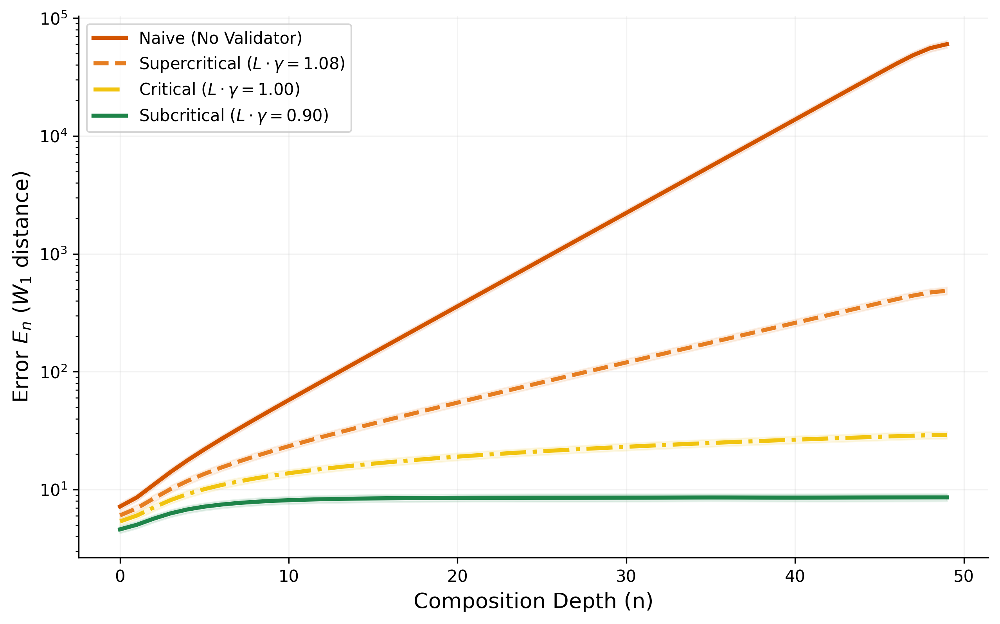
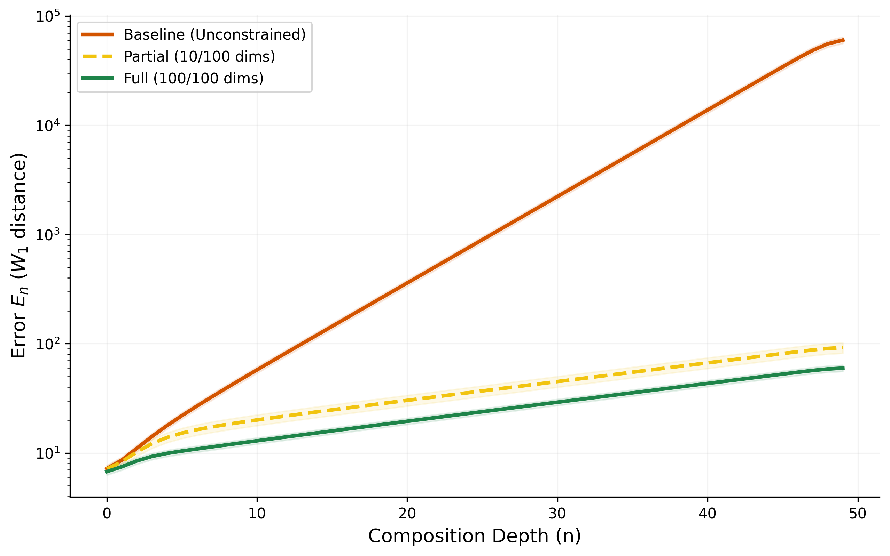
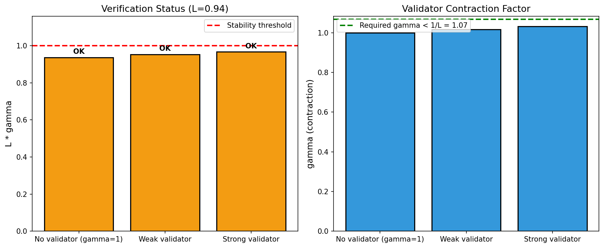

# General Framework for Structural Optimization: ε-Natural Transformations in Metric-Equipped Kleisli Categories

**Target Venue:** CAV 2026
**Status:** Draft v7.0

**Author:** Kirill Shokhin ([kashokhin@gmail.com](mailto:kashokhin@gmail.com))
**Repository:** [github.com/Kirill-Shokhin/GFSO](https://github.com/Kirill-Shokhin/GFSO)

---

## Abstract

**Problem:** Compositional stochastic systems rely on runtime validators to control error propagation. When is validation *sufficient*? What guarantees can we derive compositionally?

**Contribution:** We introduce **$\epsilon$-natural transformations ($\epsilon$-NT)**—a categorical formalization of validators as morphism families in the Kleisli category of the Kantorovich monad. A validator is an $\epsilon$-NT if the implementation-specification diagram commutes up to $\epsilon$ in Wasserstein distance:
$$W_1(\eta \circ F(f),\; G(f) \circ \eta) \leq \epsilon$$

This abstraction enables compositional analysis: local validator properties yield global error bounds.

**Results:**
- Error growth $O(L^n)$ derived from enriched Kleisli composition (Corollary 3.4)
- Stability Criterion $L \cdot \gamma \leq 1$: necessary and sufficient for bounded errors (Corollary 5.3)
- Extension to DAGs with explicit recursive bounds (§5.6)

**Novelty:** The criterion $L \cdot \gamma \leq 1$ is classical (cf. small-gain theorem). The contribution is formalizing validators as $\epsilon$-NT—enabling compositional verification of stochastic hierarchical systems where validators were previously treated ad hoc.

**Scope:** The framework applies to structurally contractive validators (rejection sampling, consensus, deterministic checks) where $\gamma < 1$ by construction.

---

## 1. Introduction: Control Challenges in Hierarchical Systems

### 1.1. The Telephone Game in Hierarchical Systems
Hierarchical composition is ubiquitous: a corporate directive flows from CEO through middle management to front-line employees; a supply order propagates from retailer through distributors to manufacturers; a reasoning task decomposes from high-level intent through intermediate steps to executable actions in AI agents. In each case, **information passes through a chain of imperfect processors**, and a fundamental question arises: *Does the output preserve the semantic intent of the input?*

Analysis reveals that without structural safeguards, fidelity loss is mathematically inevitable. This is the "Telephone Game" phenomenon, formalized in control theory as **expansive dynamics** ($L > 1$): each processing step introduces noise that amplifies downstream. In organizational hierarchies, this manifests as **bureaucratic drift**—a small policy misinterpretation compounds into catastrophic implementation failure. In supply chains, it appears as the **bullwhip effect**—minor demand fluctuations create exponential inventory swings upstream. In generative AI, it emerges as **semantic collapse**—cumulative hallucinations destroy reasoning chain coherence.

The common thread is *topological*: when morphisms in a compositional structure are expansive ($d(f(x), f(y)) > d(x,y)$), error propagation follows a pattern that we will **derive** (not assume) from categorical structure. As we show in Section 3, viewing metrics through Lawvere's enriched category lens, the exponential bound $\mathcal{O}(L^n)$ emerges as a **theorem** about composition of Lipschitz degrees—not a postulate about geometric progressions. Traditional approaches treat each domain separately; our categorical formulation reveals a unified structure.

### 1.2. The Discretization Gap
Existing verification methods—whether probabilistic model checking for software, audit protocols for bureaucracies, or quality assurance in manufacturing—share a common paradigm: **discrete logical verification**. They map continuous state spaces to binary decisions (Pass/Fail, True/False, Compliant/Non-Compliant).

This creates a "Discretization Gap": logical predicates are too brittle to capture *proximity* in high-dimensional spaces. A supply chain state that is "close" to optimal may still fail a binary threshold check, triggering unnecessary interventions. An AI reasoning step that is "nearly correct" gets rejected identically to a catastrophically wrong one, discarding valuable partial progress.

Reliability in hierarchical stochastic systems is not a binary property, but a **continuous metric property**. The question is not "Is the state correct?" but "How far has the distribution drifted from specification?"

### 1.3. The GFSO Paradigm: Controlling $\epsilon$ Compositionally

The core problem is **local error $\epsilon$**: each step in a hierarchical system deviates from specification by some amount $\epsilon$ (measured in Wasserstein distance $W_1$). The question is not "Is the state correct?" but "**How do we keep $\epsilon$ bounded across the entire composition?**"

**Intuitive Example.** Consider an LLM agent chain tasked with research:
```
Step 1: Search → Step 2: Summarize → Step 3: Conclude
```
Each step has a specification G ("preserve all relevant facts") and an execution F (what the LLM actually outputs). A **validator** η checks conformance—e.g., a fact-checker.

The validator η is an **$\epsilon$-NT** if checking *before* vs *after* each step differs by at most $\epsilon$:
```
[validate then execute] ≈ε [execute then validate]
```
This **coherence condition** ensures the validator works consistently across the entire chain—not just locally.

**The Abstraction.** Formally, an $\epsilon$-natural transformation is a morphism family where:
$$W_1(\eta \circ F(f), G(f) \circ \eta) \leq \epsilon$$
for every step $f$. This is the first categorical formalization of runtime conformance.

**What's New.** Approximate natural transformations exist in category theory. **The novelty is applying them to validators**—audits, guardrails, quality checks. This application did not exist before GFSO. We unify these mechanisms under one abstraction with compositional guarantees.

**The parameters:**
- **$L$ (expansion degree):** How much each component amplifies incoming error
- **$\gamma$ (contraction degree):** How much each validator reduces error
- **$\epsilon$ (local error):** The per-step deviation we measure and control

**The criterion (a consequence, not the contribution):** When $L \cdot \gamma \leq 1$, local errors $\epsilon$ remain bounded globally. This follows from the structure—it is not the insight. The insight is $\epsilon$-NT.

**Practical workflow:**
1. **Define Plans $G$:** Tasks with specifications, each with error tolerance $\epsilon_i$
2. **Execute via $F$:** Implementations introduce local errors
3. **Validate via $\epsilon$-NT:** Ensure each step satisfies $W_1(F, G) \leq \epsilon$
4. **Guarantee:** If $L \cdot \gamma \leq 1$, the system remains stable despite local deviations

### 1.4. Why Now?
Each domain has developed heuristics for controlling error propagation: audits in bureaucracies, demand smoothing in supply chains, guardrails in AI systems. These mechanisms share a common intuition ("more control helps") but lack a quantitative criterion for sufficiency.

GFSO addresses this gap by providing a **unified stability criterion** ($L \cdot \gamma \le 1$) that answers a precise engineering question: given component drift $L$ and validator strength $\gamma$, will the system remain stable? The framework enables diagnosis of instability before cascading failures occur and quantifies the trade-off between control cost and system reliability.

### 1.5. Practical Insight: Why Imperfect Validation Works

Real-world validation is inherently imperfect. A senior engineer reviewing code misses bugs. A peer reviewer overlooks methodological flaws. An audit finds some violations but not all. Yet systems with validation work better than systems without—this is empirically obvious but theoretically ungrounded.

**GFSO formalizes this observation.** The key insight is that validators need not be perfect ($\gamma = 0$) to be useful. A validator with $\gamma = 0.7$ (missing 70% of errors) still reduces error accumulation—provided $L \cdot \gamma < 1$.

**Example: The CEO's Dilemma.** A CEO cannot personally verify every decision. They rely on senior managers who themselves rely on team leads. Each validator in this chain is imperfect ($\gamma > 0$). The question is not "Is the validator perfect?" but "Is the validation *sufficient* given the component's expansion $L$?"

**Why peer review works.** Scientific peer review chains multiple imperfect validators:
- Reviewer 1: $\gamma_1 = 0.8$ (catches only 20% of errors)
- Reviewer 2: $\gamma_2 = 0.8$
- Reviewer 3: $\gamma_3 = 0.8$

Combined: $\gamma = 0.8^3 = 0.51$. Each validator contracts by $\gamma$; composition contracts by the product. GFSO makes this quantitative: $L \cdot \gamma_1 \cdot \gamma_2 \cdot \gamma_3 < 1$ determines whether the review process is sufficient.

**The practical value.** For edge cases where no single authority knows the ground truth—complex engineering systems, novel scientific claims, organizational decisions under uncertainty—GFSO provides:
1. A **criterion** to determine if validation is sufficient ($L \cdot \gamma < 1$)
2. A **bound** on residual error after validation ($\epsilon_\infty \leq \epsilon_0 / (1 - L\gamma)$)
3. A **design rule** for how many validators are needed ($n$ validators with $\gamma^n < 1/L$)

This transforms the intuition "more review helps" into a quantitative framework. The goal is not to compute exact bounds, but to keep errors within acceptable norms—GFSO provides the criterion for "sufficient" validation.

### 1.6. Contributions

1. **$\epsilon$-NT formalization of validators** (§4) — the main contribution
2. **$L^n$ error growth derived** from enriched Kleisli structure (Corollary 3.4)
3. **Stability criterion $L \cdot \gamma \leq 1$** — necessary and sufficient (Corollary 5.3)
4. **Design calculus:** strength ($\gamma \leq 1/L$), frequency ($\gamma \leq L^{-k}$), composition ($\gamma_1 \cdot \gamma_2$)
5. **DAG generalization** with explicit recursive bounds (§5.6)
6. **Experimental validation:** phase transition at $L \cdot \gamma = 1$ confirmed (§6)

### 1.7. Addressing the Skeptic

*"The criterion $L \cdot \gamma \leq 1$ is just geometric series. The category theory is decoration."*

This misunderstands both the problem and the contribution.

**The problem:** Stochastic maps $f: X \to \mathcal{D}(Y)$ do not compose like functions. You cannot write $g \circ f$ when $f$ outputs a distribution. The question "how do errors propagate through a stochastic chain?" is *undefined* without specifying:
1. How stochastic maps compose
2. What metric measures divergence between distributions
3. How Lipschitz bounds behave under this composition

**The Kleisli answer:** The Kantorovich monad provides the *unique* structure where (1) composition is the monadic bind, (2) the metric is Wasserstein $W_1$, and (3) Lipschitz bounds multiply (Lemma 3.3). This is not a choice—it is the canonical framework for compositional metric analysis of stochastic systems.

**The contribution:** We apply this framework to validators. The $\epsilon$-NT formalization captures runtime conformance mechanisms—audits, guardrails, quality checks—as coherent morphism families with quantitative bounds. The criterion $L \cdot \gamma \leq 1$ is then a *theorem* about enriched composition, not a postulate about geometric series.

The mathematics (Kleisli, Wasserstein, enrichment) is established. **Applying it to validators with compositional stability guarantees is new.** If this were obvious, it would already exist.

---

## 2. Related Work

GFSO synthesizes four research traditions: behavioral metrics from concurrency theory, categorical probability, contraction-based stability from control theory, and compositional verification. We position our contribution as a **categorical synthesis** that unifies these perspectives.

### 2.1. Behavioral Metrics and Optimal Transport
The study of quantitative behavioral equivalence originated with **probabilistic bisimulation metrics** [Desharnais et al., 2002], which measure how "close" two states are behaviorally. Van Breugel & Worrell [2005] established that such metrics arise naturally from the **Kantorovich lifting** of the underlying state metric—connecting behavioral equivalence to optimal transport.

This connection was systematized coalgebraically by **Baldan et al. [2014]**, who showed how to derive Wasserstein-style behavioral metrics via **functor lifting**. Recent work [Bacci et al., 2018] provides an algebraic axiomatization of Markov processes with quantitative equational logic. A breakthrough result [Calo et al., 2024] proves that bisimulation metrics *are* optimal transport distances and can be computed efficiently via Sinkhorn iteration [Cuturi, 2013].

**GFSO's position:** We adopt the Wasserstein metric as our semantic distance, following this established tradition. Our contribution is not the metric itself, but its application to **validator design** via the stability criterion.

**Distinction from Baldan et al.:** Baldan's functor lifting provides a *characterization*—showing that behavioral metrics arise from Kantorovich lifting. GFSO provides a *design criterion*—given $L$-expansive components, what contraction $\gamma$ suffices for stability? This yields: (i) the explicit criterion $L \cdot \gamma \le 1$, (ii) finite-$n$ transient bounds, (iii) sparse validation trade-offs ($L^k \cdot \gamma \le 1$). These operational results do not follow from the lifting construction alone.

### 2.2. Categorical Probability
**Markov Categories** [Fritz, 2020] axiomatize probability synthetically, enabling diagrammatic reasoning about stochastic processes. String diagram techniques for Bayesian inference [Cho & Jacobs, 2019] provide intuitive compositional calculi. The **Kantorovich/Wasserstein monad** on metric spaces [Perrone, 2021] and its interaction with deterministic submonads [Moss & Perrone, 2022] form the categorical foundation for our Kleisli construction.

**GFSO's position:** We work in the Kleisli category of the Kantorovich monad, instantiating the abstract Markov category framework with concrete Wasserstein bounds.

### 2.3. Contraction Theory and Small-Gain Stability
The study of stability via **contraction mappings** was systematized by **Lohmiller & Slotine [1998]**, who established that systems with uniformly contracting dynamics exhibit exponential convergence. The **small-gain theorem** [Jiang et al., 1996; Sontag, 2008] provides the classical stability criterion for cascaded systems: if $L_1 \cdot L_2 < 1$ for two interconnected systems with gains $L_1, L_2$, the cascade is stable. This has been extended to networks [Dashkovskiy et al., 2010] and recently connected to learning-based control [Tsukamoto et al., 2021].

**GFSO's position:** While both GFSO and small-gain involve "product of gains < 1", they address **fundamentally different problems**:

| Aspect | Small-Gain Theorem | GFSO |
| :--- | :--- | :--- |
| **Topology** | Feedback loops (closed-loop) | Sequential chains (open-loop) |
| **Metric** | $L^p$, $L^\infty$ norms | Wasserstein $W_1$ |
| **Systems** | Deterministic (classically) | Stochastic (Markov kernels) |
| **Key concept** | Interconnection gains | Validators as ε-natural transformations |
| **Goal** | Analyze stability of given system | **Design** validators for given components |

The shared intuition ("contraction compensates expansion") is classical. The inequality $L \cdot \gamma \leq 1$ is not novel. **What differs is the direction:** small-gain *analyzes* whether a given system is stable; GFSO *designs* validators to make a system stable. Given $L$-expansive components, we derive the required $\gamma$—this is a design criterion, not stability analysis.

GFSO's contribution is **not** a new stability theorem. Rather, we provide:
1. A **categorical formalization** (Kleisli categories, ε-NT) enabling compositional reasoning about stochastic systems
2. A **design framework**: given $L$-expansive components, what $\gamma$ suffices? Where to place validators? How many?
3. **Non-obvious consequences**: sparse validation ($\gamma \leq L^{-k}$), optimal placement (uniform), validator composition ($\gamma_1 \cdot \gamma_2$)

### 2.4. Compositional Probabilistic Verification
**Probabilistic Model Checking** (PRISM [Kwiatkowska et al., 2011]) verifies properties of finite-state MDPs. Compositional extensions via **assume-guarantee reasoning** [Kwiatkowska et al., 2010] enable modular verification but remain discrete. Recent work on **string diagrams for MDPs** [Watanabe et al., 2023] brings categorical compositionality to probabilistic model checking.

For neural networks, **Lipschitz certification** [Fazlyab et al., 2019] computes tight bounds on network sensitivity, while tools like **Marabou** [Katz et al., 2019] verify properties via SMT solving. In AI agents, runtime verification (**AgentGuard** [Koohestani, 2025]) and empirical optimization (**DSPy** [Khattab et al., 2024]) address error propagation heuristically.

**GFSO's position:** We provide a metric-space framework that complements discrete verification. Where PRISM asks "does the system satisfy $\phi$?", GFSO asks "how far can the system drift from specification?"

### 2.5. Contract-Based Design
**Design by Contract** [Meyer, 1992] specifies component behavior via pre/postconditions. **Assume-Guarantee contracts** [Benveniste et al., 2018] extend this to concurrent systems. We formalize contracts as **$\epsilon$-Natural Transformations**—families of validators ensuring approximate commutativity of the implementation-specification diagram.

### 2.6. Positioning Summary

| Capability | PRISM | Assume-Guarantee | Small-Gain | AgentGuard | **GFSO** |
|:-----------|:-----:|:----------------:|:----------:|:----------:|:--------:|
| Stochastic + continuous | ✗ | ✗ | ✗ | ✗ | ✅ |
| Compositional metric bounds | ✗ | ✗ | ✅ | ✗ | ✅ |
| Validator formalization (ε-NT) | ✗ | ✗ | ✗ | ✗ | ✅ |
| Sequential chains | ✅ | ✅ | ✗ | ✅ | ✅ |

**No existing framework formalizes validators with compositional ε-bounds.** GFSO fills this gap.

---

## 3. Preliminaries: Enriched Kleisli Categories

### 3.1. Lawvere's Insight: Metrics as Categorical Enrichment

Following Lawvere [1973], we view metric spaces as categories **enriched** over the monoidal category $\mathbf{Cost} = ([0,\infty], \geq, +, 0)$. In this perspective:
*   **Objects** are points of the space
*   **Hom-object** $d(x,y) \in [0,\infty]$ is the "cost" of transitioning $x \to y$
*   **Composition** is subadditive: $d(x,z) \leq d(x,y) + d(y,z)$ (triangle inequality)
*   **Identity** has zero cost: $d(x,x) = 0$

This perspective is not merely notational—it transforms metric properties into **categorical structure**. A Lipschitz map $f: X \to Y$ with constant $L$ is precisely an **enriched functor** that scales hom-objects:
$$d_Y(f(x), f(x')) \leq L \cdot d_X(x, x')$$

The constant $L$ is not an external parameter imposed on the analysis—it is the **Lipschitz degree** of $f$, a categorical invariant measuring how much $f$ expands the metric structure. This distinction is crucial: we do not *assume* that errors grow as $L^n$; we *derive* it from the multiplicativity of enriched composition.

### 3.2. The Base Category $\mathbf{PolMet}$

Let $\mathbf{PolMet}$ be the category where:
*   **Objects:** Polish metric spaces $(X, d_X)$
*   **Morphisms:** Lipschitz continuous maps $f: X \to Y$
*   **Enriched hom:** For morphisms $f, g: X \to Y$, define $d(f,g) = \sup_{x \in X} d_Y(f(x), g(x))$

We equip $\mathbf{PolMet}$ with the **Kantorovich Monad** $\mathcal{D}$, a metric refinement of the classical Giry monad [Giry, 1982] studied by Perrone [2021]:
*   **Functor:** $\mathcal{D}(X) = \mathcal{P}_1(X)$, the space of Borel probability measures with finite first moment, metrized by $W_1$
*   **Unit:** $\eta_X: X \to \mathcal{D}(X)$ maps $x \mapsto \delta_x$ (Dirac measure)
*   **Multiplication:** $\mu_X: \mathcal{D}(\mathcal{D}(X)) \to \mathcal{D}(X)$ is marginalization

**Lemma 3.1 (Kantorovich Lifting Preserves Lipschitz Degree):**
If $f: X \to Y$ has Lipschitz degree $L$, then its lifted action $\mathcal{D}(f): \mathcal{D}(X) \to \mathcal{D}(Y)$ also has Lipschitz degree $L$:
$$W_1(\mathcal{D}(f)(\mu), \mathcal{D}(f)(\nu)) \leq L \cdot W_1(\mu, \nu)$$
*Proof:* Follows from Kantorovich-Rubinstein duality. See Perrone [2021], Theorem 5.1. $\square$

This is not accidental—it follows from the enriched structure of $\mathcal{D}$ over $\mathbf{Cost}$.

### 3.3. The Stochastic Category $\mathbf{Kl}(\mathcal{D})$

Our working category is the **Kleisli category** of the monad $\mathcal{D}$, denoted $\mathbf{Kl}(\mathcal{D})$. This structure is inspired by the synthetic approach to probability via **Markov Categories** [Fritz, 2020].
*   **Objects:** Same as in $\mathbf{PolMet}$
*   **Morphisms:** A morphism $f: X \to Y$ in $\mathbf{Kl}(\mathcal{D})$ corresponds to a Markov kernel $f: X \to \mathcal{D}(Y)$
*   **Composition:** For $f: X \to Y$ and $g: Y \to Z$, the Kleisli composition $g \circ_K f: X \to Z$ is:
    $$ (g \circ_K f)(x)(B) = \int_Y g(y)(B) \, f(x)(dy) $$
*   **Enriched hom:** $d(f, g) = \sup_x W_1(f(x), g(x))$

### 3.4. Lipschitz Degree and Multiplicativity

**Definition 3.2 (Lipschitz Degree of a Morphism):**
A morphism $f: X \to Y$ in $\mathbf{Kl}(\mathcal{D})$ has **Lipschitz degree $L$** if:
$$W_1(f(x), f(x')) \leq L \cdot d_X(x, x') \quad \forall x, x' \in X$$

**Lemma 3.3 (Multiplicativity of Lipschitz Degree):**
For morphisms $f: X \to Y$ with Lipschitz degree $L_f$ and $g: Y \to Z$ with Lipschitz degree $L_g$:
$$\mathrm{Lip}(g \circ_K f) \leq L_g \cdot L_f$$
*Proof:* By Lemma 3.1 (Kantorovich Lifting) and functoriality of $\mathcal{D}$. $\square$

**Corollary 3.4 (Exponential Bound from Enriched Structure):**
A chain of $n$ morphisms with uniform Lipschitz degree $L$ has composite Lipschitz degree $\leq L^n$.

*This bound is not postulated—it is derived from the multiplicativity of enriched composition.*

### 3.5. Contraction Degree

**Definition 3.5 (Contraction Degree):**
A morphism $\eta: \mathcal{D}(X) \to \mathcal{D}(X)$ has **contraction degree $\gamma$** if:
$$W_1(\eta(\mu), \eta(\nu)) \leq \gamma \cdot W_1(\mu, \nu) \quad \forall \mu, \nu \in \mathcal{D}(X)$$

When $\gamma < 1$, we say $\eta$ is **contractive**. When $\gamma > 1$, we say $\eta$ is **expansive**.

**Remark (Categorical Invariants, Not External Parameters):**
In much of the literature, $L$ and $\gamma$ appear as "given constants" whose origin is unspecified. In our enriched framework, they are **derived quantities**:
*   $L$ measures the **expansion degree** of a functor—how much it stretches the metric structure
*   $\gamma$ measures the **contraction degree** of a natural transformation—how much it shrinks distances

The Stability Criterion $L \cdot \gamma \leq 1$ (Corollary 5.3) is then a **theorem about enriched composition**: the product of expansion and contraction degrees determines whether the composite converges or diverges. This is not a postulate about geometric progressions—it is a consequence of the multiplicative structure of enriched categories.

### 3.6. Why Kleisli Structure is Necessary

*"Can't this be done without category theory?"*

No. Compositional analysis of stochastic systems requires three components:

1. **Composition rule:** How do stochastic maps $f: X \to \mathcal{D}(Y)$ and $g: Y \to \mathcal{D}(Z)$ combine?
2. **Compatible metric:** How do we measure distance between stochastic processes in a way that respects composition?
3. **Multiplicativity:** How do Lipschitz bounds behave under composition?

**The problem:** Stochastic maps are not functions—you cannot compose $f: X \to \mathcal{D}(Y)$ with $g: Y \to \mathcal{D}(Z)$ by ordinary function composition. The types don't match.

**The Kleisli solution:** The monad structure provides canonical composition:
$$(g \circ_K f)(x) = \int_Y g(y) \, f(x)(dy)$$
This is the *only* composition that satisfies associativity with the monad laws. Without it, "composing stochastic maps" is undefined.

**Why Kantorovich, not Giry:** The Giry monad captures measure-theoretic structure but is *metrically blind*—it says nothing about distances between distributions. The Kantorovich monad internalizes the Wasserstein metric $W_1$ into the monad structure. This is why Lemma 3.1 (Kantorovich Lifting) holds: the functor $\mathcal{D}$ preserves Lipschitz degrees *because* the monad is defined via $W_1$.

With Giry + external $W_1$, you could prove the same results, but you would be manually verifying metric compatibility for each composition. The Kantorovich monad makes this *automatic*.

**What you would reinvent:** Without the Kleisli framework, analyzing a stochastic chain requires:
- Defining composition of Markov kernels (reinventing Kleisli bind)
- Choosing a metric on $\mathcal{D}(X)$ and proving it respects composition (reinventing Kantorovich lifting)
- Proving $\mathrm{Lip}(g \circ f) \leq \mathrm{Lip}(g) \cdot \mathrm{Lip}(f)$ for this composition (reinventing Lemma 3.3)

The categorical structure is not decoration—it is the *unique* framework that makes compositional Lipschitz analysis of stochastic systems well-defined. The contribution of GFSO is applying this established machinery to a new domain: **validators as ε-natural transformations with quantitative stability guarantees**.

---

## 4. The GFSO Framework

### 4.1. From Plans to Functors: The GFSO Ontology

GFSO is a **practical framework** for building and monitoring hierarchical systems—whether organizational workflows, supply chains, or AI agent pipelines. The user works with **plans** and **executions**; the categorical machinery operates behind the scenes.

#### The User's View

| What the user creates | What it contains | Example |
| :--- | :--- | :--- |
| **Plan $G$** | Tasks with descriptions, specifications (contracts), resources, deadlines, dependencies | "Build walls (height ≥ 2m) → Build roof (coverage = 100%)" |
| **Execution $F$** | Actual implementations attempting to satisfy $G$'s specs | Workers/LLMs performing tasks |
| **Validators $\eta$** | Checks verifying $F$ meets $G$'s contracts | Quality inspections, unit tests, fact-checkers |

The user defines $G$ directly—specifying what should happen, what success looks like, and which tasks depend on which. The **dependency structure is implicit** in the plan itself: when you say "roof depends on walls", you've defined both the dependency and the tasks.

#### The Mathematical View

For theoretical analysis, we extract an **index category** $\mathcal{I}$ from the plan's structure:

| Concept | Symbol | Role |
| :--- | :--- | :--- |
| **Index** | $\mathcal{I}$ | Abstract dependency structure (DAG). Objects are task slots; morphisms are dependencies. Contains no specs, no resources, no deadlines—just topology. |
| **Plan** | $G: \mathcal{I} \to \mathbf{Kl}(\mathcal{D})$ | The "plan with content"—specs, contracts, expected behavior for each task |
| **Execution** | $F: \mathcal{I} \to \mathbf{Kl}(\mathcal{D})$ | Actual stochastic implementation |
| **Validator** | $\eta: F \Rightarrow G$ | ε-natural transformation ensuring $F$ approximates $G$ |

**Assumption 4.0 (Object Agreement):** $F$ and $G$ share the same state spaces: $F(i) = G(i) = X_i$ for each task $i$. They differ on morphisms—capturing the gap between specification and reality.

#### The Mathematical Relationship

Formally, $\mathcal{I}$ is a small category and $G: \mathcal{I} \to \mathbf{Kl}(\mathcal{D})$ is a functor. The plan $G$ is defined **on** $\mathcal{I}$, not the other way around. This separation enables:
1. **Compositional reasoning:** Bounds on subchains lift to bounds on the whole system
2. **Natural transformations:** Validators form coherent families, not ad-hoc checks
3. **Stability theorems:** The enriched structure (§3) guarantees bounds compose correctly

**Remark (Practical Interpretation):**
In practice, users think of $G$ and $\mathcal{I}$ together—when you specify "Task B depends on Task A", you're simultaneously defining structure (a morphism in $\mathcal{I}$) and content (specs in $G$). The mathematical separation is conceptual: $\mathcal{I}$ captures *topology* (what depends on what), $G$ captures *semantics* (what each task means). For simple plans, $\mathcal{I}$ remains implicit; for complex systems, explicitly sketching $\mathcal{I}$ first can help organize the design.

#### Practical Workflow

1. **Design $G$:** Define tasks with specs/contracts (implicitly defining $\mathcal{I}$)
2. **Execute $F$:** Implementations attempt to satisfy specs
3. **Validate:** Check $W_1(F(f), G(f)) \leq \epsilon$ for each task $f$
4. **Monitor:** Tasks satisfying specs → green; failing → red, trigger retry or feedback
5. **Guarantee:** If $L \cdot \gamma \leq 1$, the system converges despite local failures

This workflow applies identically to:
- **Organizations:** Manager defines $G$ (goals), employees execute $F$, audits validate
- **LLM Agents:** Planner defines $G$ (reasoning steps), executor runs $F$, guardrails validate
- **Supply Chains:** Headquarters defines $G$ (orders), suppliers execute $F$, QA validates

**Remark (Necessity of Categorical Structure):** The categorical formulation is not decoration—it is the *unique* framework for compositional analysis of stochastic systems (see §3.6):
1. **Kleisli composition** is the only well-defined way to compose stochastic maps $f: X \to \mathcal{D}(Y)$
2. **Kantorovich monad** makes Lipschitz bounds compose correctly (Lemma 3.3)—this fails for the Giry monad
3. **Functors $F, G$** capture implementation-specification parallelism, making their divergence a natural transformation problem
4. **Natural transformations** formalize validators as coherent families with compositional guarantees

Without this structure, one must reprove metric compatibility for each system. The category provides it generically.

### 4.2. Validators: Operational Definition

**Definition 4.1 (Operational Validator):**
A validator is a map $\mathcal{V}: \mathcal{D}(X) \to \mathcal{D}(X)$ satisfying:

**(4.1a) Lipschitz Property:** $W_1(\mathcal{V}(\mu), \mathcal{V}(\nu)) \le \gamma \cdot W_1(\mu, \nu)$ for all $\mu, \nu \in \mathcal{D}(X)$

**(4.1b) Contractivity:** $W_1(\mathcal{V}(\mu), G_{chain}(x_0)) \le \gamma \cdot W_1(\mu, G_{chain}(x_0))$ for all $\mu$

where $x_0$ is the fixed initial input and $G_{chain}(x_0)$ is the specification's target distribution.

**Lemma 4.3 (Sufficiency):** Property (4.1a) combined with Specification Invariance (Assumption 4.3) implies (4.1b).
*Proof:* $W_1(\mathcal{V}(\mu), G_{chain}(x_0)) = W_1(\mathcal{V}(\mu), \mathcal{V}(G_{chain}(x_0))) \le \gamma W_1(\mu, G_{chain}(x_0))$.

**Remark (Local Realizability):** Lemma 4.3 resolves a potential circularity: (4.1b) references the global target $G_{chain}(x_0)$, but the validator need not compute it at runtime. The construction is *local*: a rejection-sampling validator $\mathcal{V}_T$ with threshold $T$ satisfies (4.1a) by Proposition 5.2. Assumption 4.3 then requires only that $\text{supp}(G_{chain}(x_0)) \subseteq [-T, T]$—a *design-time* constraint on the threshold, not runtime oracle access. The implementer chooses $T$ to accommodate the specification's expected output range; no knowledge of $G_{chain}$ is needed during execution.

**Assumption 4.3 (Specification Invariance):**
The validator $\mathcal{V}$ fixes the target distribution: $\mathcal{V}(G_{chain}(x_0)) = G_{chain}(x_0)$.
*Justification:* The specification $G$ represents the ideal plan. A well-designed validator should not alter distributions that already match the target—it only corrects deviations.

**Remark (Relaxation):** If exact invariance is unattainable, a weaker condition suffices: $W_1(\mathcal{V}(G_{chain}(x_0)), G_{chain}(x_0)) \le \delta_V$. This adds a per-step bias term $\delta_V$ to the error bound, yielding $E'_\infty = \frac{\gamma(\epsilon_0 + \delta_F) + \delta_V}{1 - L\gamma}$ for $L\gamma < 1$. The stability criterion remains $L \cdot \gamma \le 1$; only the steady-state bound increases.

**Remark:** Properties (4.1a) and (4.1b) are logically independent. In practice, we verify (4.1a) and Assumption 4.3, then apply Lemma 4.3 to obtain (4.1b). The Stability Criterion (Corollary 5.3) uses (4.1b).

**Remark (Practical Interpretation):** The contraction factor $\gamma$ represents the fraction of error that *passes through* validation. A validator with $\gamma = 0.7$ removes 30% of the deviation from specification; the remaining 70% propagates downstream. Perfect validation ($\gamma = 0$) is neither required nor realistic—the criterion $L \cdot \gamma \le 1$ shows that even imperfect validators suffice when their contraction compensates for component expansiveness.

#### Categorical Motivation: ε-Natural Transformations

The operational definition above (4.1) is what we verify and use in proofs. Its categorical origin is the following:

**Definition 4.2 ($\epsilon$-Natural Transformation):**
Let $F, G: \mathcal{I} \to \mathcal{Kl}(\mathcal{D})$ be functors. An **$\epsilon$-natural transformation** $\eta: F \Rightarrow G$ is a family of morphisms $\eta_X: F(X) \to \mathcal{D}(G(X))$ such that for each morphism $f: X \to Y$ in $\mathcal{I}$:
$$ W_1( (\eta_Y \circ_K F(f))(x), (G(f) \circ_K \eta_X)(x) ) \le \epsilon \quad \forall x \in X $$

This is the categorical notion: "validate-then-execute ≈ execute-then-validate" for each step.

**Assumption 4.4 (Validator-Specification Naturality):**
The validator $\eta$ is an **exact** natural transformation for $G$:
$$\eta_Y \circ_K G(f) = G(f) \circ_K \eta_X \quad \text{for all } f: X \to Y$$
*Interpretation:* Validating before vs after executing the *specification* yields identical results. This is natural for well-designed validators: if the output already matches the spec, validation should not alter it. This generalizes Assumption 4.3 (Specification Invariance) from outputs to the entire execution.

**Constructive Criterion:** For rejection-sampling validator $\mathcal{V}_T$ with threshold $T$, Assumption 4.4 holds if **$G$ preserves the acceptance region:**
$$\text{supp}(G(f)(x)) \subseteq [-T, T] \quad \forall f, x$$
Then $\mathcal{V}_T$ acts as identity on $G$'s outputs, and commutativity is immediate. For the common case $G = \delta_0$ (specification targets zero), this holds automatically for any $T > 0$.

**Lemma 4.5 (Operational ⟹ Categorical):**
Let $\eta$ satisfy:
1. Assumption 4.4 (exact NT for $G$)
2. $\gamma$-Lipschitz property (4.1a)
3. Component compliance: $W_1(F(f)(x), G(f)(x)) \leq \epsilon_0$ for all $f, x$

Then $\eta$ is a $(\gamma \epsilon_0)$-natural transformation for $F$ (Definition 4.2).

*Proof:*
$$W_1(\eta_Y \circ_K F(f), G(f) \circ_K \eta_X)$$
$$= W_1(\eta_Y \circ_K F(f), \eta_Y \circ_K G(f)) \quad \text{[by Assumption 4.4]}$$
$$\leq \gamma \cdot W_1(F(f), G(f)) \quad \text{[by Lipschitz, Lemma A.0]}$$
$$\leq \gamma \cdot \epsilon_0 \quad \square$$

**Significance:** This lemma closes the gap between Definitions 4.1 and 4.2. The operational conditions (Lipschitz + naturality for $G$) **imply** the categorical condition (ε-NT for $F$). The Lipschitz constant $\gamma$ controls how much the implementation-specification gap $\epsilon_0$ propagates into the naturality defect.

**Lemma 4.4 (Canonical Construction):**
In the GFSO framework, the validator map $\mathcal{V}: \mathcal{D}(X) \to \mathcal{D}(X)$ is defined as the **Kleisli extension** of the stochastic kernel $\eta_X: X \to \mathcal{D}(X)$:
$$ \mathcal{V}(\mu)(B) := \hat{\eta_X}(\mu)(B) = \int \eta_X(x)(B) \, \mu(dx) $$
If the kernel $\eta_X$ satisfies the metric Lipschitz property on points ($W_1(\eta_X(x), \eta_X(y)) \le \gamma \cdot d(x,y)$), then $\mathcal{V}$ satisfies (4.1a) by Lemma A.0. Combined with Specification Invariance (Assumption 4.3), Lemma 4.3 yields (4.1b).

---

## 5. Main Theorems

**Assumption 5.0 (Strict Specification):**
The specification $G: \mathcal{I} \to \mathcal{Kl}(\mathcal{D})$ is a **strict functor**: $G(g \circ f) = G(g) \circ_K G(f)$ for all composable morphisms. This reflects that the plan is internally consistent—the specification for a composite task equals the composition of specifications. We treat strict functoriality as a *normative ideal*: a coherent plan assumes compositionality. In practice (bureaucracies, supply chains), high-level plans may not perfectly decompose; such deviation appears as specification laxity $\delta_G$, which effectively increments the modularity tax $\delta_F$ in the global bounds.

**Definition 5.0 (Stability Classes):**
We classify sequential systems by their error growth $E_n = W_1(F_{chain}(x), G_{chain}(x))$:
- **Bounded:** $E_n = O(1)$ — error converges to a finite steady-state (achieved when $L \cdot \gamma < 1$)
- **Linearly Degrading:** $E_n = O(n)$ — error grows linearly (marginal stability, $L \cdot \gamma = 1$)
- **Exponentially Divergent:** $E_n = O(L^n)$ — error explodes (unstable, $L \cdot \gamma > 1$ or no validation)

A system is **Stable** if it is Bounded or Linearly Degrading, contrasting with the default exponential divergence.

**Definition 5.1 (Chain Composition):**
For a sequence of **composable** morphisms $f_1, \dots, f_n$ in $\mathcal{I}$ (with $F(f_i): X_{i-1} \to X_i$ in $\mathcal{Kl}(\mathcal{D})$), we define the implementation and specification chains as:
*   $F_{chain} = F(f_n) \circ_K \dots \circ_K F(f_1)$
*   $G_{chain} = G(f_n) \circ_K \dots \circ_K G(f_1)$

Under **Assumption 5.0**, $G_{chain} = G(f_n \circ \dots \circ f_1) = G(h_n)$ where $h_n$ is the composite morphism.

**Lemma 5.1.1 (Chain-Functor Discrepancy):**
For an approximate functor $F$ satisfying Assumption 5.2b with $L$-Lipschitz components, the discrepancy between $F_{chain}$ and $F(h_n)$ is bounded:
$$ W_1(F_{chain}(x), F(h_n)(x)) \le \delta_F \cdot \frac{L^{n-1} - 1}{L - 1} \quad (L > 1) $$
*Proof:* Each composition step introduces error $\le \delta_F$, which is then amplified by factor $L$ at each subsequent step. Summing the geometric series: $\delta_F(1 + L + \dots + L^{n-2}) = \delta_F \frac{L^{n-1}-1}{L-1}$. $\square$

**Corollary (Explicit Bound for $F_{chain}$):** Combining Theorem 5.1 and Lemma 5.1.1 via triangle inequality:
$$ W_1(F_{chain}(x), G_{chain}(x)) \le L^{n-1}\epsilon_0 + (\epsilon_0 + 2\delta_F) \frac{L^{n-1} - 1}{L - 1} = O(L^n) $$
The chain-functor discrepancy adds a factor of 2 to $\delta_F$ but does not change the asymptotic behavior.

**Assumption 5.1 (Component Compliance):**
We assume the implementation complies with the plan locally. For each morphism $f \in \mathcal{I}$:
$$ W_1(F(f)(x), G(f)(x)) \le \epsilon_0 \quad \forall x $$
This assumption bounds the local implementation error.

**Remark (Probabilistic Relaxation):** The uniform bound $\sup_x \le \epsilon_0$ is a strong condition, typical for formal verification but often violated by LLMs (e.g., adversarial prompts). In such cases, we interpret the inequality in terms of **Expected Risk**: $\mathbb{E}_{x \sim \mathcal{D}_{in}}[W_1(F(f)(x), G(f)(x))] \le \epsilon_0$. The theorems then bound the *expected* drift of the system over the input distribution, rather than the worst-case divergence.

**Assumption 5.2a (Approximate Functoriality):**
We model the Implementation $F: \mathcal{I} \to \mathcal{Kl}(\mathcal{D})$ as satisfying **Approximate Functoriality**. This implies that while strict functoriality ($F(g \circ f) = F(g) \circ_K F(f)$) may not hold, the deviation is bounded metrically.

**Assumption 5.2b (Bounded Deviation):**
We assume the deviation from strict functoriality is metrically bounded by $\delta_F$:
$$ \sup_x W_1( (F(g) \circ_K F(f))(x), F(g \circ f)(x) ) \le \delta_F $$
$\delta_F$ quantifies the **Modularity Tax**: the additional error introduced by decomposition.

**Remark (Depth-Dependent Modularity Tax):** Assumption 5.2b posits uniform $\delta_F$ across all compositions. In practice, $\delta_F$ may grow with chain depth (e.g., accumulated context in LLM chains). If $\delta_F(k) \le \delta_0 \cdot k^\alpha$ for depth $k$, the bounds in Theorem 5.1 remain valid with $\delta_F$ replaced by the worst-case $\max_k \delta_F(k)$, yielding a more pessimistic but still finite bound under the Stability Criterion.

**Theorem 5.1 (Exponential Divergence from Enriched Composition):**
Let $f_1, \dots, f_n$ be a chain of morphisms with Lipschitz degree $L > 1$ (Definition 3.2). Under **Assumption 5.1 (Component Compliance)** with local error $\epsilon_0$ and **Assumption 5.2b (Bounded Deviation)** with modularity tax $\delta_F$, the global error satisfies:
$$ E_n \le L^{n-1}\epsilon_0 + (\epsilon_0 + \delta_F) \frac{L^{n-1} - 1}{L - 1} = O(L^n) $$

**Remark (Derivation, Not Postulate):**
The exponential factor $L^n$ is not assumed—it is **derived** from Corollary 3.4 (Multiplicativity of Lipschitz Degree). The proof proceeds by:
1. Each morphism $F(f_i)$ has Lipschitz degree $L$ (by assumption)
2. By Lemma 3.3, the composite $F_{chain}$ has Lipschitz degree $\leq L^n$
3. Local errors $\epsilon_0$ injected at step $i$ are amplified by factor $L^{n-i}$ downstream
4. Summing the geometric series yields the bound

The enriched categorical structure (§3) provides the foundation; this theorem is a **consequence** of that structure applied to approximate functors.

*Proof:* See Appendix A.2.

**Proposition 5.2 (Variance Contraction via Truncation):**
Let $\mathcal{V}_T$ be a rejection-sampling validator with threshold $T$. For any error distribution $P$ that is **symmetric about zero** and has bounded support, $\mathcal{V}_T$ acts as a **contraction map** on the Wasserstein distance to the ideal $\delta_0$:
$$ W_1(\mathcal{V}_T(P), \delta_0) < W_1(P, \delta_0) $$
(Symmetry is required to preserve the zero mean property after truncation). For the uniform case $U[-E, E]$ with $T < E$, the contraction factor is $\gamma(T) = T/E$. If $T \ge E$, the validator is identity ($\gamma = 1$) and provides no contraction.

**Remark (Bias Correction):** If the error distribution is asymmetric (e.g., systematic bias in supply chains), simple truncation is insufficient. In such cases, the validator **requires** a **Two-Stage** process: (1) **Centering**: $\mu' = \mu - \mathbb{E}[\mu]$ (Bias Correction), followed by (2) **Truncation**: $\mathcal{V}(\mu')$. Our experiments in Section 6.2 implement a simplified retry-with-fallback strategy that approximates this effect.
*Proof:* See Appendix B.

**Remark (Generalization to Gaussian):** For Gaussian noise $\mathcal{N}(0, \sigma^2)$, truncation at threshold $T$ similarly yields $\gamma < 1$, though the closed-form expression involves error functions. Specifically, $\gamma = \mathbb{E}[|X| \mid |X| \le T] / \mathbb{E}[|X|]$ where $X \sim \mathcal{N}(0, \sigma^2)$. The uniform case provides an explicit formula; the contraction mechanism generalizes to any symmetric unimodal distribution.

**Remark (Symmetry Limitation):** Proposition 5.2 applies when the error distribution is symmetric about zero—typically the *fresh noise* injected at each step, not the accumulated state. In chains where accumulated state $x_n$ drifts from zero, the distribution becomes biased. Two solutions: (1) apply truncation to the *incremental* error before adding to state, or (2) use Proposition 5.2b (scaling), which provides $\gamma$-contraction for arbitrary distributions without symmetry requirements.

**Remark (Asymmetric Distributions):** Proposition 5.2 requires symmetry to ensure the truncated distribution retains zero mean. For asymmetric error distributions (e.g., biased estimators), truncation alone does not suffice—it may shift the mean further from zero. In such cases, the validator must include a **bias correction** step: $\mathcal{V}(\mu) = \text{Truncate}_T(\mu - \mathbb{E}[\mu])$. This is an idealized model; practical systems should estimate and correct bias before applying threshold validation.

**Proposition 5.2b (Pure Scaling Validator):**
Let $\mathcal{V}_\gamma$ be the pushforward under scaling $x \mapsto \gamma x$, i.e., $\mathcal{V}_\gamma(\mu) = (\gamma \cdot)_* \mu$ for constant $\gamma \in [0,1]$. Then $\mathcal{V}_\gamma$ is $\gamma$-contractive:
$$ W_1(\mathcal{V}_\gamma(\mu), \delta_0) = \gamma \cdot W_1(\mu, \delta_0) $$
*Proof:* By homogeneity of the $W_1$ metric: $W_1((\gamma \cdot)_* \mu, \delta_0) = \inf_\pi \int \|\gamma x - 0\| d\pi = \gamma \inf_\pi \int \|x\| d\pi = \gamma \cdot W_1(\mu, \delta_0)$.

**Remark (Distribution-Dependent Contraction):** Proposition 5.2's contraction factor $\gamma = T/E$ depends on the input distribution's support $E$. This is not a universal validator property—different inputs yield different $\gamma$. For the Stability Criterion (Corollary 5.3), we require $\gamma$ to be bounded uniformly over the family of distributions encountered during system operation. In practice, this means the threshold $T$ must be chosen relative to the expected worst-case error support.

**Remark (Two Validator Classes):** Propositions 5.2 and 5.2b establish two distinct mechanisms satisfying Definition 4.1b: stochastic rejection sampling (realistic, models retry-based validators) and deterministic scaling (minimal, provides precise $\gamma$ control). Both achieve the Stability Criterion (Corollary 5.3).

**Corollary 5.3 (The GFSO Stability Criterion):**
The condition $L \cdot \gamma \le 1$ is **necessary and sufficient** for a sequential system to be **Stable** (per Definition 5.0).

**Sufficiency:** Under $L \cdot \gamma \le 1$, the error bound from Theorem 5.1 collapses from $O(L^n)$ to:
- **Bounded** ($L \cdot \gamma < 1$): $E'_\infty = \frac{\gamma(\epsilon_0 + \delta_F)}{1 - L\gamma}$
- **Linear** ($L \cdot \gamma = 1$): $E'_n = O(n(\epsilon_0 + \delta_F))$

**Necessity:** If $L \cdot \gamma > 1$, the recurrence $E'_{n+1} = (L\gamma) E'_n + C$ with $C = \gamma(\epsilon_0 + \delta_F) > 0$ yields $E'_n \to \infty$ as $n \to \infty$. Thus no stable equilibrium exists.

**Finite-$n$ Transient Bound:** For chains of length $n$ (before reaching steady-state), the explicit error is:
$$ E'_n = (L\gamma)^n E'_0 + \gamma(\epsilon_0 + \delta_F) \cdot \frac{1 - (L\gamma)^n}{1 - L\gamma} $$
For $L\gamma < 1$: as $n \to \infty$, $(L\gamma)^n \to 0$ and $E'_n \to E'_\infty$. For finite $n$, the transient term $(L\gamma)^n E'_0$ may dominate if initial error $E'_0$ is large.

*Proof:* See Appendix C.

**Corollary 5.4 (Sparse Validation Criterion):**
When validators are applied every $k$ components (rather than after each), the effective amplification between validations is $L^k$. The modified stability criterion becomes:
$$ L^k \cdot \gamma \le 1 \quad \Leftrightarrow \quad \gamma \le L^{-k} $$

*Interpretation:* Sparse validation requires **exponentially stronger** validators. Doubling the interval between checks ($k \to 2k$) requires squaring the contraction strength ($\gamma \to \gamma^2$ to maintain $L^{2k}\gamma^2 \le 1$). This quantifies why critical checkpoints matter disproportionately in hierarchical systems: missing one validation at depth $k$ requires $L^k$-fold stronger subsequent correction.

*Proof:* Between validations, the uncontrolled recurrence $E_{n+1} = L \cdot E_n + \epsilon_0$ runs for $k$ steps, yielding amplification $L^k$. Applying the $\gamma$-contractive validator then gives $E'_{n+k} \le \gamma \cdot L^k \cdot E'_n + O(1)$. Stability requires $\gamma \cdot L^k \le 1$. $\square$

**Example (LLM Chain Design):** Consider an LLM reasoning chain of length $n=10$ with per-step expansiveness $L=1.2$. Validation options:
- **Every step** ($k=1$): Requires $\gamma \le 1/1.2 = 0.83$
- **Every 3 steps** ($k=3$): Requires $\gamma \le 1/1.2^3 = 0.58$
- **Every 5 steps** ($k=5$): Requires $\gamma \le 1/1.2^5 = 0.40$

This quantifies the cost of sparse validation: reducing checkpoints from 10 to 4 (validating every 3 steps) requires a 30% stronger validator ($0.83 \to 0.58$). The criterion directly informs system design trade-offs.

**Remark (Heterogeneous Components):** For chains with varying Lipschitz constants $L_1, \ldots, L_n$, the stability criterion generalizes: dense validation requires $\gamma \le 1/\max_i L_i$; sparse validation over segment $S$ requires $\gamma \le 1/\prod_{i \in S} L_i$. The uniform-$L$ presentation simplifies exposition; the theory extends naturally.

**Proposition 5.6 (Optimal Validator Placement):**
For a chain of length $n$ with uniform expansiveness $L > 1$ and a budget of $m < n$ validators, the placement minimizing worst-case error is **uniform spacing**: place validators at positions $\lfloor n/m \rfloor, 2\lfloor n/m \rfloor, \ldots, m\lfloor n/m \rfloor$.

*Proof:* Between consecutive validators, error amplifies by factor $L^k$ where $k$ is the gap length. For placement $(k_1, \ldots, k_m)$ with $\sum k_i = n$, the worst-case amplification is $\max_i L^{k_i}$. This is minimized when all $k_i$ are equal, giving $k_i = n/m$ and worst-case amplification $L^{n/m}$. Any non-uniform placement has some $k_j > n/m$, yielding strictly worse bound. $\square$

**Corollary (Validation Budget Trade-off):**
With $m$ optimally-placed validators, the steady-state error scales as:
$$ E'_\infty(m) = O\left(\frac{\gamma \epsilon_0}{1 - L^{n/m} \gamma}\right) $$
This interpolates between $O(L^n)$ (no validators, $m=0$) and $O(\epsilon_0/(1-L\gamma))$ (dense validation, $m=n$). Doubling the validator budget ($m \to 2m$) reduces the effective amplification from $L^{n/m}$ to $L^{n/2m} = \sqrt{L^{n/m}}$—a **square-root improvement**.

**Lemma 5.7 (Validator Composition):**
If $\mathcal{V}_1$ is $\gamma_1$-contractive and $\mathcal{V}_2$ is $\gamma_2$-contractive, then $\mathcal{V}_2 \circ \mathcal{V}_1$ is $(\gamma_1 \cdot \gamma_2)$-contractive.

*Proof:* $W_1((\mathcal{V}_2 \circ \mathcal{V}_1)(\mu), G) = W_1(\mathcal{V}_2(\mathcal{V}_1(\mu)), G) \le \gamma_2 \cdot W_1(\mathcal{V}_1(\mu), G) \le \gamma_2 \gamma_1 \cdot W_1(\mu, G)$. $\square$

*Practical implication:* Two weak validators ($\gamma = 0.9$ each) compose to a strong one ($\gamma = 0.81$). Stacking cheap checks can substitute for one expensive verification.

**Proposition 5.8 (Robustness Margin):**
If a system is designed with safety margin $\alpha = L \cdot \gamma < 1$, it remains stable under model mismatch up to $L' = L/\alpha$.

*Example:* Design with $L=1.2$, $\gamma=0.75$ gives $\alpha = 0.9$. The system tolerates actual expansiveness up to $L' = 1.2/0.9 = 1.33$—an 11% safety margin. Designing at the boundary ($\alpha = 1$) provides no robustness to model uncertainty.

**Proposition 5.9 (Tightness of Bounds):**
The steady-state bound $E'_\infty = \frac{\gamma(\epsilon_0 + \delta_F)}{1 - L\gamma}$ is **tight**: there exist error injection patterns achieving this value exactly.

*Proof:* Consider adversarial injection of error $\epsilon_0$ at each step, aligned to maximize accumulation. The recurrence $E'_{n+1} = L\gamma \cdot E'_n + \gamma\epsilon_0$ with $E'_0 = 0$ converges to $E'_\infty = \gamma\epsilon_0 \sum_{k=0}^\infty (L\gamma)^k = \gamma\epsilon_0/(1-L\gamma)$. This matches the bound, so no tighter universal bound exists. $\square$

**Theorem 5.5 (Compositional Error Bound):**
Let $\eta = (\eta_i)$ be a family of $\gamma$-contractive validators (Definition 4.1b) applied after each component in a chain. Let $\mathcal{V}_{chain} = \eta_n \circ_K \cdots \circ_K \eta_1$ denote the composite validator. Under the Stability Criterion ($L \cdot \gamma \le 1$), the validated implementation satisfies a **compositional proximity bound**:
$$ W_1( (\mathcal{V}_{chain} \circ_K F_{chain})(x_0), G_{chain}(x_0) ) \le \epsilon $$
with explicit bound:
$$ \epsilon = \begin{cases} \frac{\gamma(\epsilon_0 + \delta_F)}{1 - L\gamma} & \text{if } L\gamma < 1 \\ n \cdot \gamma(\epsilon_0 + \delta_F) & \text{if } L\gamma = 1 \end{cases} $$

*Proof:* Direct consequence of Corollary 5.3. The left-hand side is precisely the validated chain error $E'_n$, which converges to the stated bounds under the Stability Criterion.

**Interpretation:** This theorem closes the categorical loop. Classical ε-naturality (Section 4.2) requires approximate commutativity for each morphism independently. Theorem 5.5 establishes a weaker property we call *compositional ε-naturality*: the end-to-end diagram commutes up to $\epsilon$. This is not ε-naturality in the standard sense—it is a proximity bound for the composite, not per-morphism commutativity. The term "compositional ε-naturality" emphasizes the structural analogy while acknowledging the distinction. Thus: **operational contractivity (4.1b) + stability ($L\gamma \le 1$) ⟹ compositional proximity bound**.

**Remark (Compositional vs Pointwise ε-Naturality):** Classical ε-naturality requires each morphism $f$ to satisfy the approximate commutativity condition independently. Theorem 5.5 establishes a weaker but practically relevant property: **compositional ε-naturality**, where the *composite* diagram commutes up to $\epsilon$. This is the appropriate notion for hierarchical systems—we care about end-to-end fidelity, not per-step commutativity. The stronger pointwise condition would require $W_1((\eta_{X_i} \circ_K F(f_i))(x), (G(f_i) \circ_K \eta_{X_{i-1}})(x)) \le \epsilon_i$ for each $f_i$; this implies compositional ε-naturality but is not implied by it.

**Example 5.4 (Regime Comparison):**
Consider chains with $L=1.2$ and per-step noise injection $\epsilon_0$. We compare three regimes at chain length $n$ (assuming $\delta_F \approx 0$ for clarity):

| Regime | $L \cdot \gamma$ | Error Bound | Behavior |
|--------|------------------|-------------|----------|
| No validation | — | $O(L^n) = O(1.2^n)$ | Exponential |
| Supercritical | $1.08$ | $O((L\gamma)^n)$ | Exponential (slower) |
| Subcritical | $0.90$ | $\frac{\gamma \epsilon_0}{1 - L\gamma}$ | Bounded |

*Numerical example:* For $n=50$, unvalidated error grows as $1.2^{50} \approx 9 \times 10^3$. With subcritical validation ($L \cdot \gamma < 1$), error converges to a finite steady-state — a reduction by orders of magnitude. Section 6 confirms this prediction experimentally.

### 5.6. Extension to General DAGs

The theorems above are stated for sequential chains. The framework extends to arbitrary DAGs via the product structure of $\mathbf{Kl}(\mathcal{D})$.

**Proposition 5.10 (Error at Merge Points):**
Let $D: X_B \times X_C \to X_D$ be a morphism in $\mathbf{Kl}(\mathcal{D})$ with Lipschitz constant $L_D$ (with respect to the sum metric $d_{B \times C}((b,c), (b',c')) = d_B(b,b') + d_C(c,c')$). If the errors at inputs are $E_B$ and $E_C$, then:
$$E_D \leq L_D \cdot (E_B + E_C) + \epsilon_D$$
where $\epsilon_D$ is the local compliance error at $D$.

*Proof:* By Lipschitz property of $D$ and triangle inequality. $\square$

**Corollary 5.11 (DAG Error Bound — Recursive Formula):**
For a DAG $\mathcal{I}$, define the error $E_v$ at each node $v$ recursively:
$$E_v = \begin{cases}
\epsilon_v & \text{if } v \text{ is a source (input node)} \\
L_v \cdot E_{\text{pred}(v)} + \epsilon_v & \text{if } v \text{ has one predecessor} \\
L_v \cdot \sum_{u \in \text{pred}(v)} E_u + \epsilon_v & \text{if } v \text{ is a merge point}
\end{cases}$$
where $\epsilon_v$ is the local compliance error at $v$, and $L_v$ is the Lipschitz constant of the morphism entering $v$.

*Key insight:* Sequential composition **multiplies** errors ($L \cdot E$); merge points **sum** errors from branches ($\sum E_u$) then amplify ($L \cdot \sum$).

**Corollary 5.12 (DAG Stability Criterion):**
A DAG system with validators is **Stable** if and only if:
$$\max_{p \in \text{Paths}} \prod_{e \in p} (L_e \cdot \gamma_e) \leq 1$$
where $\gamma_e = 1$ if no validator is placed on edge $e$, and $\gamma_e < 1$ otherwise.

*Interpretation:* The sequential criterion $L \cdot \gamma \leq 1$ generalizes to DAGs as a **max over paths**. Each path must independently satisfy stability; the critical path (maximal $\prod L_e \cdot \gamma_e$) determines overall stability.

**Remark (Practical Implication):** For DAGs, the worst-case error is dominated by the **critical path**—the path with maximal $\prod L_e$. Validators should be placed to reduce $L \cdot \gamma$ along critical paths. Parallel branches contribute additively at merge points, so independent errors combine rather than multiply.

**Example (Fork-Join):**
```
    A (L=1.2)
   / \
  B   C  (each L=1.1)
   \ /
    D (L_merge=1.0)
```
With input error $\epsilon_0$:
- After A: $E_A = 1.2 \cdot \epsilon_0$
- After B: $E_B = 1.1 \cdot E_A = 1.32 \cdot \epsilon_0$
- After C: $E_C = 1.1 \cdot E_A = 1.32 \cdot \epsilon_0$
- After D (merge): $E_D = 1.0 \cdot (E_B + E_C) = 2.64 \cdot \epsilon_0$

Compare to sequential A→B→C→D with same $L$ values: $E = 1.2 \cdot 1.1 \cdot 1.1 \cdot 1.0 \cdot \epsilon_0 = 1.45 \cdot \epsilon_0$

**Key insight:** Parallel branches combine *additively* at merges, while sequential chains combine *multiplicatively*. Fork-join can accumulate more error than equivalent sequential depth when merge fans in multiple branches.

---

## 6. Numerical Validation of Error Bounds

**Objective:**
The goal of this section is to empirically validate the theoretical error bounds derived in Theorem 5.1 and Corollary 5.3, specifically confirming the existence and location of the phase transition at $L \cdot \gamma = 1$. We utilize synthetic environments to precisely control the Lipschitz constants ($L$) and contraction factors ($\gamma$), isolating the structural dynamics from domain-specific noise.

**Categorical Instantiation:**
To validate the theory, we instantiate the framework as follows:
*   **Index $\mathcal{I}$:** A linear chain category $1 \to 2 \to \dots \to N$.
*   **State Space:** The Polish space $(\mathbb{R}^{100}, \|\cdot\|_2)$.
*   **Plan $G$:** Maps morphisms to constant kernels $x \mapsto \delta_0$ (the ideal state is always zero).
*   **Implementation $F$:** Maps morphisms to Gaussian kernels $\mathcal{N}(Lx, \sigma^2 I)$ with Lipschitz constant $L=1.2$.
*   **Validator:** Implements the contraction map via pure scaling (Experiment 1, Proposition 5.2b) or rejection sampling with partial observation (Experiment 2, inspired by Proposition 5.2).

We simulated $N=1000$ chains of length 50 in $\mathbb{R}^{100}$ with uniform dynamics $L=1.2$ and noise $\sigma=0.5$. Implementation available in the repository.

**Measurement:** The error metric is $\|x_n\|_2$ (Euclidean norm of state). Since $G_{chain}(x_0) = \delta_0$, by Kantorovich-Rubinstein duality: $W_1(F_{chain}(x_0), \delta_0) = \mathbb{E}_{X \sim F_{chain}(x_0)}[\|X\|]$. Thus, averaging $\|x_n\|$ across trials estimates $W_1$.

### 6.1. Phase Transition at $L \cdot \gamma = 1$

The first simulation directly validates the Stability Criterion (Corollary 5.3) by varying the contraction factor $\gamma$:

| Regime | $L \cdot \gamma$ | Mean Error (n=50) | Behavior |
|--------|------------------|-------------------|----------|
| Naive (no validator) | — | 68,485 | Exponential |
| Supercritical | 1.08 | 517 | Exponential (slower) |
| Critical | 1.00 | 29 | Linear |
| Subcritical | 0.90 | **8.6** | **Bounded** |

The phase transition is sharp: at $L \cdot \gamma = 0.90$ (just 10% below critical), error stabilizes; at $L \cdot \gamma = 1.08$ (8% above), error grows exponentially.



### 6.2. Robustness under Partial Observation

The second experiment tests robustness when the validator observes only a subset of dimensions (modeling realistic scenarios where full state observation is infeasible).

*   **Setup:** Same dynamics ($L=1.2$, $\mathbb{R}^{100}$). Validator observes a random 10% of dimensions per step with measurement noise ($\sigma=0.2$). The validator implements a **rejection-with-fallback** strategy:
    - **Primary mechanism:** Rejection sampling with threshold $T$ provides contraction (Proposition 5.2).
    - **Fallback:** If no valid sample is found within $k=10$ retries, the system interpolates: $x_{new} = 0.8x + 0.2p$.

    **Note:** The fallback alone does not guarantee $\gamma < 1$—for $L=1.2$, the effective multiplier is $0.8 + 0.2 \times 1.2 = 1.04 > 1$. The fallback serves as a *safety net* that bounds step size ($\|x_{new} - x\| = 0.2\|p - x\|$), preventing unbounded error growth when rejection fails. Stability comes from successful rejections, which occur with high probability when error is moderate.
*   **Result:**

| Validator | Observed Dims | Mean Error (n=50) |
|-----------|---------------|-------------------|
| None (Naive) | — | 68,485 |
| Full | 100/100 | 62 |
| Partial | 10/100 | **95** |

Partial observation (10%) achieves comparable containment to full observation. This **empirical observation** suggests that sparse random probes may suffice when error is isotropically distributed across dimensions—a phenomenon we call **dimension-error decoupling**. Theoretical analysis of this effect (relating observed dimensions to effective $\gamma$) is deferred to future work.



### 6.3. LLM Case Study: Measuring $L$ and $\gamma$

The synthetic experiments (§6.1–6.2) validate the theory in controlled settings. We now demonstrate that $L$ and $\gamma$ are measurable on real LLM systems.

**Setup:**
*   **Model:** Claude Haiku with temperature $T=0.7$
*   **Task:** Paraphrasing (morphism $F$: rewrite text preserving meaning)
*   **Distance:** Cosine distance on sentence embeddings (stable, deterministic)
*   **Methodology:**
    - $L = d(F(x_1), F(x_2)) / d(x_1, x_2)$ — expansion on input pairs
    - $\gamma = d(V(y_1), V(y_2)) / d(y_1, y_2)$ — contraction on output pairs (same input, two runs)

**Results:**

| Metric | Value | Interpretation |
|--------|-------|----------------|
| $L$ (morphism) | $0.94 \pm 0.07$ | Morphism is slightly contractive |
| $\gamma$ (no validator) | $1.00$ | Identity, as expected |
| $\gamma$ (weak validator) | $1.02 \pm 0.25$ | Not contractive |
| $\gamma$ (strong validator) | $1.03 \pm 0.38$ | Not contractive |

**Key Finding:** All configurations yield $L \cdot \gamma < 1$ because $L < 1$, not due to validator contraction. The system is inherently stable for this task.

**Important Observation: Corrector $\neq$ Contractor.**
LLM-based validators act as *correctors* (pulling outputs toward the target) rather than *contractors* (shrinking distances between outputs). These are mathematically distinct:
- **Corrector:** $d(V(y), G) < d(y, G)$ — attracts to target
- **Contractor:** $d(V(y_1), V(y_2)) < d(y_1, y_2)$ — shrinks pairwise distances

GFSO requires contractors. This experiment reveals that naive LLM validators do not satisfy this property—a non-obvious finding that informs validator design.

**Implications:** For simple tasks with modern LLMs, $L \approx 1$ (or below), and GFSO confirms stability. The framework's utility is most apparent when $L > 1$ (complex reasoning chains, weaker models) where proper contractive validators become necessary.



---

## 7. Domain Instantiations

The $\epsilon$-NT framework applies uniformly across domains. We provide illustrative (hypothetical) instantiations:

| Domain | Component (L) | Validator (γ) | Example |
|:-------|:--------------|:--------------|:--------|
| **Organizations** | Layer drift $L \approx 1.2$ | Audits, KPIs | 5-layer hierarchy: need $\gamma \leq 0.83$ |
| **Supply Chains** | Bullwhip $L \approx 1.8$ | Information sharing | 4-tier chain: need $\gamma \leq 0.55$ |
| **LLM Agents** | Semantic drift $L \approx 1.1$ | Guardrails, fact-checks | 10-step chain: need $\gamma \leq 0.91$ |

**Organizations:** $L$ captures bureaucratic drift—misinterpretation and information loss at each hierarchical layer. $\gamma$ is achieved via audits, KPIs, and SOPs that contract deviation from policy.

**Supply Chains:** $L$ is the bullwhip effect—demand signal amplification upstream. $\gamma$ comes from information sharing protocols (EDI, vendor-managed inventory) that reduce variance.

**LLM Agents:** $L$ reflects semantic drift and hallucination per reasoning step. $\gamma$ is provided by guardrails, fact-checkers, and type validators.

**Remark (Illustrative Values):** The $L$ and $\gamma$ values above are hypothetical anchors for domain-specific analysis. Empirical calibration requires measurement in specific systems. The framework answers: "If $L$ is bounded, what $\gamma$ suffices?"

---

## 8. Discussion

### 8.1. Why the Wasserstein Monad?
The Giry monad is "topologically blind"—it captures measure-theoretic properties but not metric proximity. The Wasserstein monad internalizes $W_1$, enabling Lipschitz analysis essential for $\epsilon$-control.

### 8.2. Computational Aspects
Exact $W_1$ computation is $O(N^3 \log N)$. In practice, GFSO uses $W_1$ as a theoretical bound—validators employ cheap surrogates (KPIs, semantic similarity) that correlate with $W_1$ reduction.

### 8.3. GFSO as Diagnostic Framework
GFSO does not eliminate errors—it makes them *measurable*. By quantifying $L$ and $\gamma$, practitioners can identify unstable layers ($L \cdot \gamma > 1$), predict degradation, and optimize interventions.

The value lies not in guaranteeing correctness—which is impossible for stochastic systems—but in providing **early warning** and **quantitative trade-off analysis**. Engineers have always known that "more testing helps"; GFSO provides the mathematics to answer "how much testing is enough?"

**Practical Estimation of $L$ and $\gamma$:**

*Estimating $L$ (expansion degree):*
| Domain | Method | Metric |
|:-------|:-------|:-------|
| **LLM chains** | Prompt perturbation: vary input slightly, measure output divergence | Semantic similarity, fact retention |
| **Organizations** | Policy transmission: compare directive at layer $n$ vs $n+1$ | KPI deviation, interpretation surveys |
| **Supply chains** | Demand signal analysis: measure variance amplification upstream | Coefficient of variation ratio |

*Concrete procedure for LLMs:* Given chain step $f$, sample $N$ input pairs $(x_i, x'_i)$ with small perturbations. Compute $\hat{L} = \frac{1}{N}\sum_i \frac{d(f(x_i), f(x'_i))}{d(x_i, x'_i)}$ where $d$ is semantic distance (e.g., embedding cosine distance).

*Estimating $\gamma$ (contraction degree):*
1. For the same input $x$, generate two outputs $y_1, y_2 = F(x)$ with stochastic variation
2. Apply validator: $v_1 = V(y_1), v_2 = V(y_2)$
3. Estimate $\hat{\gamma} = d(v_1, v_2) / d(y_1, y_2)$ — the ratio of distances after/before validation
4. For rejection sampling with threshold $T$: $\gamma \approx T / E$ where $E$ is error support (Proposition 5.2)

**Important:** This measures *contraction* (do outputs get closer?), not *correction* (do outputs get closer to target?). See §8.4.

*Surrogate metrics:* When $W_1$ is intractable, use domain proxies that correlate with distributional distance. **Critical:** validate that surrogate reduction correlates with stability—if proxy doesn't track $W_1$, the criterion $L \cdot \gamma \leq 1$ loses meaning.

### 8.4. Correctors vs Contractors

A subtle but critical distinction emerged from our LLM experiments (§6.3):

**Corrector:** A mapping that pulls outputs toward a target.
$$d(V(y), G(x)) < d(y, G(x))$$

**Contractor:** A mapping that shrinks distances between any two outputs.
$$d(V(y_1), V(y_2)) < d(y_1, y_2)$$

These are *mathematically distinct* properties. GFSO's stability criterion $L \cdot \gamma \leq 1$ requires contractors, not correctors.

**Finding:** Naive LLM validators (prompt-based correction) act as correctors but not contractors. They pull each output toward the source/target, but may actually *increase* the distance between different outputs (§6.3: $\gamma > 1$ for "strong" validator).

**Implication for validator design:** To satisfy GFSO's criterion, validators should be designed with contraction in mind:
- **Rejection sampling:** Accept only outputs within threshold → contracts by filtering outliers
- **Majority voting:** Multiple runs → consensus reduces variance
- **Deterministic post-processing:** Fixed transformations (formatting, truncation) have $\gamma \leq 1$

This finding clarifies when GFSO applies: systems with inherently contractive validation mechanisms, not arbitrary LLM-based "correction" prompts.

### 8.5. Limitations and Future Work

**Robustness to Assumption Violations (Summary):**
The framework degrades gracefully when assumptions are violated:

| Assumption | Violation | Impact on Bound |
|:-----------|:----------|:----------------|
| 4.3 (Spec Invariance) | $W_1(\mathcal{V}(G), G) \leq \delta_V$ | $E'_\infty = \frac{\gamma(\epsilon_0 + \delta_F) + \delta_V}{1 - L\gamma}$ |
| 5.0 (Strict Functor) | $G$ lax by $\delta_G$ | Add $\delta_G$ to $\delta_F$ in all bounds |
| 4.4 (Validator-Spec NT) | Naturality defect $\delta_{NT}$ | $\epsilon$-NT holds with $\epsilon = \gamma\epsilon_0 + \delta_{NT}$ |

The stability criterion $L \cdot \gamma \leq 1$ remains unchanged; only steady-state bounds increase.

**Assumption 4.0 (Same State Spaces).** Our framework assumes $F$ and $G$ agree on objects, meaning implementation and specification operate on identical state spaces. This holds when both are stochastic programs over the same domain. However, practical implementations may operate on discretized or approximated spaces (floating point vs reals, quantized actions, finite precision). Extending GFSO to handle $F(X) \ne G(X)$ requires introducing a projection morphism $\rho: F(X) \to G(X)$ with bounded distortion, adding a term $W_1(\rho(F(f)(x)), G(f)(x))$ to the error bound. This generalization is straightforward but omitted for clarity.

**Lipschitz Linearization.** The Stability Criterion $L \cdot \gamma \le 1$ assumes globally $L$-Lipschitz components. In practice (especially LLMs), local error behavior may be nonlinear—$L$ varies with input. The criterion is thus a *sufficient condition in the linearized neighborhood of the nominal trajectory*. For systems with state-dependent $L(x)$, the bound holds when $\sup_x L(x) \cdot \gamma \le 1$; tighter analysis requires trajectory-specific Lyapunov arguments beyond the scope of this paper.

**High Expansion Regime.** The Stability Criterion $L \cdot \gamma \le 1$ establishes a theoretical lower bound for reliability. However, in systems where $L$ is extremely large (e.g., highly divergent creative tasks), achieving sufficient $\gamma$ via rejection sampling may become computationally prohibitive due to low acceptance rates. Future work will explore the **Categorical Synthesis of Optimal Validators**, using the adjunction between Specification and Implementation to automatically derive contraction mappings that minimize $W_1$ while maximizing sample efficiency.

**Experimental Comparison.** Our experiments validate GFSO's theoretical predictions (phase transition, partial observation robustness) on synthetic benchmarks. Direct comparison with existing approaches (PRISM for probabilistic model checking, AgentGuard for runtime verification) requires implementing equivalent tasks across frameworks—a significant engineering effort orthogonal to this paper's theoretical contribution. Such empirical benchmarking is planned for future work.

**Sparse Validation.** Corollary 5.4 establishes the criterion $L^k \cdot \gamma \le 1$ for validation every $k$ steps. Open questions remain: optimal validator placement (which steps to validate?), adaptive validation (adjusting $k$ based on observed error), and multi-rate schemes (different $k$ for different chain segments).

**Validator Realizability.** Proposition 5.2b (pure scaling) provides a minimal theoretical model with exact $\gamma$-contractivity. Realistic validators (rejection sampling, Prop. 5.2) have distribution-dependent contraction factors. The theory uses the worst-case $\gamma$ over the distribution family; tighter bounds require characterizing the specific error distribution at each step. This gap between idealized and realizable validators is inherent to all control-theoretic frameworks.

**Point Specification.** Our experiments use $G_{chain}(x_0) = \delta_0$ (Dirac at origin), allowing $W_1$ estimation via sample mean $\mathbb{E}[\|x_n\|]$. For general non-point specifications $G$, computing $W_1(F_{chain}, G_{chain})$ requires optimal transport solvers (e.g., Sinkhorn [Cuturi, 2013]). The theory is general; the empirical validation is restricted to this tractable case.

**General Topologies.** The index category $\mathcal{I}$ can be any DAG—this is the real-world task structure. Our theorems apply to *paths* in $\mathcal{I}$: for a DAG, analyze each path from input to output. Parallel branches are independent until they merge; merge points are morphisms with their own Lipschitz constants. The framework is already general; we present sequential chains for clarity, not as a limitation.

---

## 9. Conclusion

**The problem:** Validators (audits, guardrails, quality checks) are ubiquitous in hierarchical systems, yet lack formal treatment. When is validation *sufficient*? How do guarantees compose?

**The solution:** We introduced **$\epsilon$-natural transformations ($\epsilon$-NT)**—validators as coherent morphism families where implementation-specification diagrams commute up to $\epsilon$. This is the first categorical formalization enabling compositional reasoning about error control.

**What follows:** From the abstraction, we derive (not assume):
- Error growth $O(L^n)$ from enriched Kleisli structure
- Stability criterion $L \cdot \gamma \leq 1$ as a theorem
- Design rules: strength, frequency, composition

**Key empirical finding:** LLM-based validators act as *correctors* (pulling toward target) but not *contractors* (shrinking distances). GFSO requires contractors—rejection sampling, consensus, deterministic checks—where $\gamma < 1$ by construction.

**The contribution is the abstraction.** The criterion $L \cdot \gamma \leq 1$ is elementary; identifying $\epsilon$-NT as the right formalization for compositional error control is new.

**Future work:** Systems with $L > 1$ requiring active stabilization; GFSO-based verification tools; tighter bounds for specific validator classes.

---

## References

### Behavioral Metrics and Optimal Transport
1.  **Desharnais, J., Gupta, V., Jagadeesan, R. & Panangaden, P.** (2002). "The metric analogue of weak bisimulation for probabilistic processes". *LICS 2002*, 413-422.
2.  **van Breugel, F. & Worrell, J.** (2005). "A behavioural pseudometric for probabilistic transition systems". *Theoretical Computer Science*, 331(1), 115-142.
3.  **Baldan, P., Bonchi, F., Kerstan, H. & König, B.** (2014). "Behavioral Metrics via Functor Lifting". *FSTTCS 2014*, LIPIcs 29, 403-415.
4.  **Bacci, G., Mardare, R., Panangaden, P. & Plotkin, G.** (2018). "An Algebraic Theory of Markov Processes". *LICS 2018*, 679-688.
5.  **Cuturi, M.** (2013). "Sinkhorn Distances: Lightspeed Computation of Optimal Transport". *NeurIPS 2013*, 2292-2300.
6.  **Calo, S., Jonsson, A., Neu, G., Schwartz, L. & Segovia-Aguas, J.** (2024). "Bisimulation Metrics are Optimal Transport Distances, and Can be Computed Efficiently". *NeurIPS 2024*.
7.  **Villani, C.** (2009). *Optimal Transport: Old and New*. Springer.

### Categorical Probability
8.  **Giry, M.** (1982). "A categorical approach to probability theory". In *Categorical Aspects of Topology and Analysis*, LNCS 915, Springer, 68-85.
9.  **Fritz, T.** (2020). "A synthetic approach to Markov kernels, conditional independence and theorems on sufficient statistics". *Advances in Mathematics*, 370.
10. **Cho, K. & Jacobs, B.** (2019). "Disintegration and Bayesian Inversion via String Diagrams". *Mathematical Structures in Computer Science*, 29(7), 938-971.
11. **Moss, S. & Perrone, P.** (2022). "Probability Monads with Submonads of Deterministic States". *LICS 2022*, 1-13.
12. **Perrone, P.** (2021). "Lifting couplings in Wasserstein spaces". *arXiv:2110.06591*.
13. **Lawvere, F.W.** (1973). "Metric spaces, generalized logic, and closed categories". *Rendiconti del Seminario Matematico e Fisico di Milano*, 43, 135-166.

### Contraction Theory and Control
14. **Lohmiller, W. & Slotine, J.-J.E.** (1998). "On Contraction Analysis for Nonlinear Systems". *Automatica*, 34(6), 683-696.
15. **Jiang, Z.-P., Mareels, I.M.Y. & Wang, Y.** (1996). "A Lyapunov Formulation of the Nonlinear Small-Gain Theorem for Interconnected ISS Systems". *Automatica*, 32(8), 1211-1215.
16. **Sontag, E.D.** (2008). "Input to State Stability: Basic Concepts and Results". In *Nonlinear and Optimal Control Theory*, Springer, 163-220.
17. **Dashkovskiy, S., Rüffer, B. & Wirth, F.** (2010). "Small Gain Theorems for Large Scale Systems and Construction of ISS Lyapunov Functions". *SIAM J. Control Optim.*, 48(6), 4089-4118.
18. **Tsukamoto, H., Chung, S.-J. & Slotine, J.-J.E.** (2021). "Contraction Theory for Nonlinear Stability Analysis and Learning-based Control: A Tutorial Overview". *Annual Reviews in Control*, 52, 135-169.

### Compositional Verification
19. **Kwiatkowska, M., Norman, G. & Parker, D.** (2011). "PRISM 4.0: Verification of Probabilistic Real-time Systems". *CAV 2011*, LNCS 6806, 585-591.
20. **Kwiatkowska, M., Norman, G., Parker, D. & Qu, H.** (2010). "Assume-Guarantee Verification for Probabilistic Systems". *TACAS 2010*, LNCS 6015, 23-37.
21. **Watanabe, K., Eberhart, C., Asada, K. & Hasuo, I.** (2023). "Compositional Probabilistic Model Checking with String Diagrams of MDPs". *CAV 2023*, LNCS 13966, 45-67.
22. **Kozen, D.** (1981). "Semantics of probabilistic programs". *Journal of Computer and System Sciences*, 22(3), 328-350.

### Neural Network Verification and AI Safety
23. **Fazlyab, M., Robey, A., Hassani, H., Morari, M. & Pappas, G.J.** (2019). "Efficient and Accurate Estimation of Lipschitz Constants for Deep Neural Networks". *NeurIPS 2019*, 11427-11438.
24. **Katz, G. et al.** (2019). "The Marabou Framework for Verification and Analysis of Deep Neural Networks". *CAV 2019*, LNCS 11561, 443-452.
25. **Khattab, O. et al.** (2024). "DSPy: Compiling Declarative Language Model Calls into Self-Improving Pipelines". *ICLR 2024*.
26. **Koohestani, R.** (2025). "AgentGuard: Runtime Verification of AI Agents". *arXiv:2509.23864*, AgenticSE @ ASE 2025.

### Contract-Based Design
27. **Meyer, B.** (1992). "Applying 'Design by Contract'". *IEEE Computer*, 25(10), 40-51.
28. **Benveniste, A. et al.** (2018). "Contracts for System Design". *Foundations and Trends in Electronic Design Automation*, 12(2-3), 124-400.

### Domain Applications
29. **Lee, H.L., Padmanabhan, V. & Whang, S.** (1997). "The Bullwhip Effect in Supply Chains". *Sloan Management Review*, 38(3), 93-102.

---

## Appendix: Detailed Proofs

### A.0. Lemma (Wasserstein Lifting)
If a kernel $k: X \to \mathcal{D}(Y)$ satisfies the metric Lipschitz condition $W_1(k(x), k(x')) \le L \cdot d_X(x, x')$, then its extension to distributions $\hat{k}: \mathcal{D}(X) \to \mathcal{D}(Y)$ is $L$-Lipschitz in $W_1$:
$$W_1(\hat{k}(\mu), \hat{k}(\nu)) \le L \cdot W_1(\mu, \nu)$$
*Proof:* Follows from Kantorovich-Rubinstein duality. See Perrone [2021], Theorem 5.1 (Lifting Property).

### A.1. Lemma: Composition Bound (Gluing)
To bound the composition $W_1(k \circ_K f, k \circ_K g)$, where $f,g: X \to Y$ and $k: Y \to Z$, let $\pi^*$ be the optimal coupling on $Y \times Y$ realizing $W_1(f(a), g(a))$. We construct a coupling $\Pi$ on $Z \times Z$ as the pushforward of $\pi^*$ through the product kernel $k \otimes k$:
$$ \Pi(dz_1, dz_2) = \int_{Y \times Y} (k(y_1) \otimes k(y_2))(dz_1, dz_2) \, \pi^*(dy_1, dy_2) $$
**Marginal Verification:** $\mathrm{proj}_1(\Pi) = (k \circ_K f)(a)$.
**Cost Bound:** $\int_{Z \times Z} d_Z \, d\Pi \le L \int_{Y \times Y} d_Y(y_1, y_2) \, d\pi^* = L \cdot W_1(f(a), g(a))$ (using Lemma A.0).

### A.1.5 Lemma (Pointwise to Distributed Proximity)
If $W_1(k(x), k'(x)) \le \epsilon$ for all $x \in X$, then for any distribution $\mu \in \mathcal{D}(X)$:
$$ W_1( \hat{k}(\mu), \hat{k'}(\mu) ) \le \epsilon $$
where $\hat{k}(\mu)(B) = \int k(x)(B) \, d\mu(x)$ is the Kleisli extension.
*Proof:* By Kantorovich-Rubinstein duality, for any 1-Lipschitz function $\phi$:
$$ |\mathbb{E}_{\hat{k}(\mu)}[\phi] - \mathbb{E}_{\hat{k'}(\mu)}[\phi]| = |\mathbb{E}_{x \sim \mu}[\mathbb{E}_{y \sim k(x)}[\phi(y)] - \mathbb{E}_{y \sim k'(x)}[\phi(y)]]| $$
$$ \le \mathbb{E}_{x \sim \mu}[ |\mathbb{E}_{k(x)}[\phi] - \mathbb{E}_{k'(x)}[\phi]| ] $$
$$ \le \mathbb{E}_{x \sim \mu}[ W_1(k(x), k'(x)) ] \le \mathbb{E}_{x \sim \mu}[\epsilon] = \epsilon $$
Taking the supremum over $\phi$ yields the result. $\square$

### A.2. Proof of Theorem 5.1 (The Exponential Divergence Bound)
We proceed by induction on chain length $n$.
Let $h_n = f_n \circ \dots \circ f_1$. We define $E_n = W_1(F(h_n)(x), G(h_n)(x))$.

*Note:* We bound $E_n$ for $F(h_n)$ directly. The bound for $F_{chain}$ follows by Lemma 5.1.1 and triangle inequality.

**Base Case ($n=1$):**
$E_1 = W_1(F(f_1)(x), G(f_1)(x)) \le \epsilon_0$ by Assumption 5.1.

**Inductive Step:**
Consider a path of length $n+1$: $h_{n+1} = f_{n+1} \circ h_n$.
We want to bound $E_{n+1} = W_1(F(h_{n+1})(x), G(h_{n+1})(x))$.

Using the triangle inequality:
$$ E_{n+1} \le W_1( F(h_{n+1})(x), (F(f_{n+1}) \circ_K F(h_n))(x) ) + W_1( (F(f_{n+1}) \circ_K F(h_n))(x), G(h_{n+1})(x) ) $$
The first term is bounded by $\delta_F$ (Assumption 5.2b).
For the second term, since the specification $G$ is a strict functor (by construction of the plan), we have $G(h_{n+1}) = G(f_{n+1}) \circ_K G(h_n)$. Thus we compare $F(f_{n+1}) \circ_K F(h_n)$ with $G(f_{n+1}) \circ_K G(h_n)$.

Decomposing via the mixed term $(F(f_{n+1}) \circ_K G(h_n))(x)$:
$$ \le W_1( F(f_{n+1}) \circ_K F(h_n), F(f_{n+1}) \circ_K G(h_n) ) + W_1( F(f_{n+1}) \circ_K G(h_n), G(f_{n+1}) \circ_K G(h_n) ) + \delta_F $$
1.  **Amplification Term:** By Lemma A.0 (Lifting) and Lemma A.1 (Composition), since $F(f_{n+1})$ is $L$-Lipschitz:
    $$ W_1( F(f_{n+1}) \circ_K F(h_n), F(f_{n+1}) \circ_K G(h_n) ) \le L \cdot W_1(F(h_n), G(h_n)) = L \cdot E_n $$
2.  **Injection Term:** By Assumption 5.1 (Component Compliance):
    $$ W_1( F(f_{n+1}) \circ_K G(h_n), G(f_{n+1}) \circ_K G(h_n) ) \le \epsilon_0 $$
    *(This follows from Lemma A.1.5 because $F(f_{n+1})$ and $G(f_{n+1})$ are $\epsilon_0$-close pointwise).*

Thus:
$$ E_{n+1} \le L \cdot E_n + \epsilon_0 + \delta_F $$
This linear recurrence $E_{n+1} = L \cdot E_n + C$ solves to $E_n \sim O(L^n)$ for $L > 1$.

### B. Proof of Proposition 5.2 ($W_1$ Contraction via Truncation)
**Proof:** For a distribution $P$ with zero mean and support containing values beyond $[-T, T]$, we show $W_1(\mathcal{V}_T(P), \delta_0) < W_1(P, \delta_0)$.

By Kantorovich-Rubinstein duality, for $P$ with zero mean:
$$ W_1(P, \delta_0) = \mathbb{E}_{e \sim P}[|e|] $$

After rejection sampling with threshold $T$, the truncated distribution $P_T$ has:
$$ P_T(de) = \frac{1}{Z} \cdot P(de) \cdot \mathbb{1}_{|e| \le T} \quad \text{where } Z = P(|e| \le T) $$

**1. General Case:**
We decompose the expectation of the original distribution:
$$ \mathbb{E}_P[|e|] = \int_{|e| \le T} |e| dP + \int_{|e| > T} |e| dP $$
The first term equals $Z \cdot \mathbb{E}_{P_T}[|e|]$. Let $P_{tail}$ denote the conditional distribution on $\{|e| > T\}$ with mass $1-Z$. Then:
$$ \mathbb{E}_P[|e|] = Z \cdot \mathbb{E}_{P_T}[|e|] + (1-Z) \cdot \mathbb{E}_{P_{tail}}[|e|] $$

*Case A (Strict Contraction):* If $P(|e| > T) > 0$, then $P_{tail}$ is well-defined. Since all mass in $P_{tail}$ satisfies $|e| > T$ and the support of $P_T$ is $[-T, T]$:
$$ \mathbb{E}_{P_{tail}}[|e|] > T \ge \mathbb{E}_{P_T}[|e|] $$
Therefore:
$$ \mathbb{E}_P[|e|] > Z \cdot \mathbb{E}_{P_T}[|e|] + (1-Z) \cdot \mathbb{E}_{P_T}[|e|] = \mathbb{E}_{P_T}[|e|] $$
Thus, $W_1(P_T, \delta_0) < W_1(P, \delta_0)$ and $\gamma < 1$.

*Case B (No Contraction):* If $P(|e| > T) = 0$, then $P = P_T$, and $\gamma = 1$. This implies the validator is passive when the error is within bounds.

**2. Uniform Case $U[-E, E]$:**
Let $e \sim U[-E, E]$. The mean absolute error is:
$$ W_1(P, \delta_0) = \frac{1}{2E} \int_{-E}^{E} |x| dx = \frac{1}{2E} \cdot 2 \int_{0}^{E} x dx = \frac{1}{E} \left[ \frac{x^2}{2} \right]_{0}^{E} = \frac{E}{2} $$
The truncated distribution is $U[-T, T]$. Similarly:
$$ W_1(P_T, \delta_0) = \frac{T}{2} $$
The contraction factor is:
$$ \gamma = \frac{W_1(P_T, \delta_0)}{W_1(P, \delta_0)} = \frac{T/2}{E/2} = \frac{T}{E} $$
$\square$

### C. Derivation of Stability Criterion
We modify the recurrence from (A.2) by applying the validator $\mathcal{V}$ after each step.
Let $E'_{n}$ be the error after validation at step $n$.

*Constructive condition for Assumption 4.3:* For a rejection-sampling validator $\mathcal{V}_T$ with threshold $T$, Specification Invariance holds iff $\text{supp}(G_{chain}(x_0)) \subseteq [-T, T]$. In words: the specification's target distribution must lie entirely within the acceptance region. This is a design constraint—the threshold $T$ must be chosen large enough to accommodate the ideal output, but small enough to reject deviations.

*Notation:* For brevity, let $F := F_{chain}(x_0)$ and $G := G_{chain}(x_0)$ denote the output distributions at step $n+1$.

Under Assumption 4.3 (Specification Invariance), $\mathcal{V}(G) = G$. Combined with (4.1a):
$$ E'_{n+1} = W_1(\mathcal{V}(F), G) \stackrel{4.3}{=} W_1(\mathcal{V}(F), \mathcal{V}(G)) \stackrel{4.2a}{\le} \gamma \cdot W_1(F, G) = \gamma \cdot E_{n+1}^{raw} $$
(Note: This derivation requires both (4.1a) and Assumption 4.3. Property (4.1b) alone is insufficient—we need the Lipschitz property to bound the distance between $\mathcal{V}(F)$ and $\mathcal{V}(G)$.)

By this contraction property:
$$ E'_{n+1} \le \gamma \cdot E_{n+1}^{raw} $$
Substituting the expansion from (A.2):
$$ E'_{n+1} \le \gamma \cdot ( L \cdot E'_n + \epsilon_0 + \delta_F ) $$
$$ E'_{n+1} = (L \cdot \gamma) E'_n + \gamma(\epsilon_0 + \delta_F) $$
This is a linear recurrence of the form $x_{n+1} = A x_n + B$.
For the system to be **Stable** (Definition 5.0), the error must not diverge exponentially. This requires the slope $A \le 1$:
$$ L \cdot \gamma \le 1 $$

**Remark (Steady-State Analysis):** The three regimes exhibit qualitatively different long-term behavior:
- **Subcritical ($L \cdot \gamma < 1$):** Error converges to a finite steady-state $E'_\infty = \frac{\gamma(\epsilon_0 + \delta_F)}{1 - L\gamma}$. This represents equilibrium between error injection (new noise each step) and error contraction (validator reducing accumulated drift).
- **Critical ($L \cdot \gamma = 1$):** Error grows linearly as $E'_n = E'_0 + n \cdot \gamma(\epsilon_0 + \delta_F)$. The system is marginally stable.
- **Supercritical ($L \cdot \gamma > 1$):** Error grows exponentially as $E'_n \sim (L\gamma)^n$. The system is unstable.

Q.E.D.